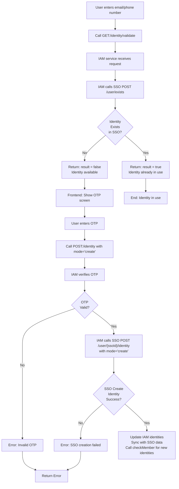
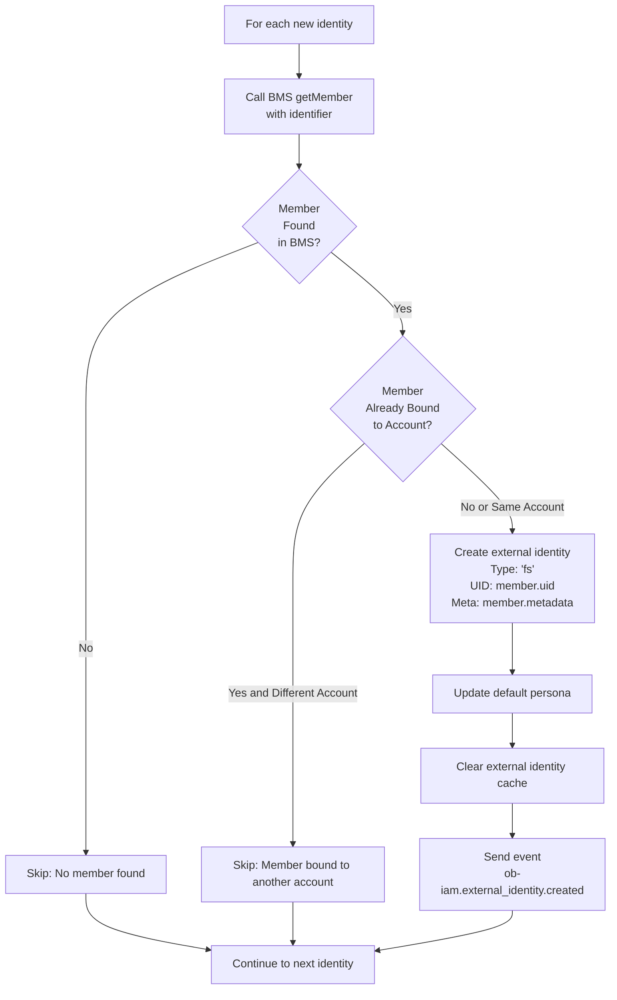
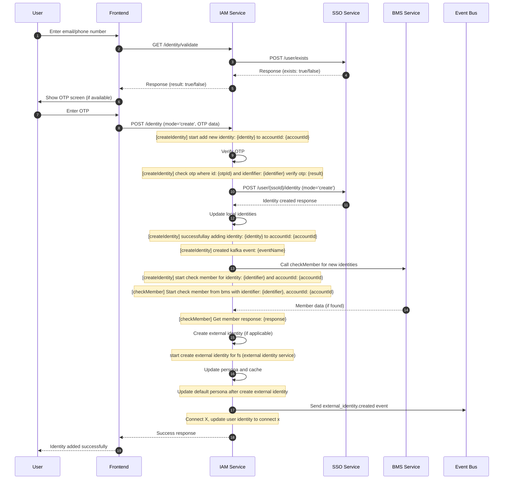

# Add Identity Flow (Create Mode)

## Overview

This flow is activated when a user wants to add a new identity (email or phone number) to their existing account in `create` mode. An identity in this context refers to a way for a user to be identified in the system, such as an email address or phone number.

The process involves several steps to ensure security and uniqueness of identities:

- User enters the new email or phone number they want to add
- IAM service validates if the identity is available (not already used by another account)
- If available, the system proceeds to OTP (One-Time Password) verification to confirm the user owns the identity
- After successful OTP verification, the identity is added to the account

This flow uses the `GET:/identity/validate` endpoint to check availability and `POST:/identity` with `mode = 'create'` to add the identity after OTP verification.

For technical implementation details, see the OperationIds `identityValidateHandler` and `identityHandler` in the ssoInterceptor middleware.

---

## Related Environment Variables

| Name                            | Example                   | Purpose                                                                                                                       |
| ------------------------------- | ------------------------- | ----------------------------------------------------------------------------------------------------------------------------- |
| `ENABLE_SSO`                    | `true`                    | Enables SSO middleware handling for `POST:/identity` when the request app version requires SSO.                               |
| `MIN_APP_VERSION`               | `2.0.0`                   | Compared with the `app-version` header to decide whether the SSO interceptor should run.                                      |
| `OB_SSO_URL`                    | `https://sso.example.com` | Base URL used by `SSOClient` for identity validation and SSO identity creation.                                                |
| `OB_SSO_CLIENT_ID`              | `iam-client`              | Client credential sent to SSO.                                                                                                |
| `OB_SSO_CLIENT_SECRET`          | `secret-value`            | Client credential secret sent to SSO. Use a safe secret value from the deployment environment.                                 |
| `ENABLE_REGISTRATION_WHITELIST` | `false`                   | When `true`, identity validation checks whether the new identifier is allowed before proceeding.                               |
| `OB_BMS_URL`                    | `https://bms.example.com` | Base URL used by the BMS SDK when `checkMember` looks for workplace/member data for the new identity.                          |
| `CNX_BASE_URL`                  | `https://cnx.example.com` | Enables Connect X account registration/update after the identity is added. If missing, Connect X registration is skipped.      |
| `CNX_USERNAME`                  | `cnx-user`                | Connect X login username used when a Connect X token must be refreshed.                                                        |
| `CNX_PASSWORD`                  | `secret-value`            | Connect X login password used when a Connect X token must be refreshed. Use a safe secret value from the deployment environment. |
| `CACHE_REDIS`                   | `true`                    | Enables Redis-backed cache operations for profile, external identity, and Connect X token cache keys.                          |
| `CACHE_REDIS_URL`               | `redis://localhost:6379`  | Redis connection URL used by the cache utility when `CACHE_REDIS=true`.                                                       |

### Environment Notes

- `ENABLE_SSO` and `MIN_APP_VERSION` are read by `ssoInterceptor` before `POST:/identity` is handled.
- `OB_SSO_URL`, `OB_SSO_CLIENT_ID`, and `OB_SSO_CLIENT_SECRET` are read by `SSOClient`.
- `OB_BMS_URL` is read by `BMSService` before calling BMS member lookup.
- Connect X variables are used by `AccountService.registerConnectX()` after the identity is created.

---

## Related Cache Keys

| Key                                                   | TTL          | Source                                      | Purpose                                                                                              |
| ----------------------------------------------------- | ------------ | ------------------------------------------- | ---------------------------------------------------------------------------------------------------- |
| `EXTERNAL_IDENTITY_CACHE_KEY_KEY_{accountId}`         | 3600 seconds | `ExternalIdentityService`                   | Stores the list of external identity cache keys for an account so they can be invalidated together.  |
| `EXTERNAL_IDENTITY_CACHE_KEY_account_id_{accountId}`  | 3600 seconds | `ExternalIdentityService.GetExternalIdentity` | Cached external identities by account ID. Deleted when external identity data changes.                |
| `EXTERNAL_IDENTITY_CACHE_KEY_identifier_{identifier}` | 3600 seconds | `ExternalIdentityService.GetExternalIdentity` | Cached external identities by identifier. Deleted through the account key registry.                   |
| `EXTERNAL_IDENTITY_CACHE_KEY_uid_{uid}`               | 3600 seconds | `ExternalIdentityService.GetExternalIdentity` | Cached external identities by external UID. Deleted through the account key registry.                 |
| `CACHE_PROFILE_{accountId}`                           | 7200 seconds | `ProfileService` via `CACHE_PROFILE_KEY`    | Cached IAM profile payload. Deleted when a new external identity changes persona/profile resolution.  |
| `CNX_ACCESS_TOKEN`                                    | 3540 seconds | `CNXClient`                                 | Cached Connect X access token used by Connect X registration/update calls.                            |

### Cache Notes

- `ExternalIdentityService.ClearExternalIdentityCache(accountId)` reads `EXTERNAL_IDENTITY_CACHE_KEY_KEY_{accountId}` and deletes each listed external identity cache key.
- `ExternalIdentityService.Upsert()` deletes `CACHE_PROFILE_{accountId}` after external identity changes so persona/profile reads are refreshed.
- `CNX_ACCESS_TOKEN` is refreshed by `CNXClient` on a `401` response and cached for 3540 seconds.

---

## Flow Diagram



## CheckMember Sub-Flow

This sub-flow is executed for each new identity added to check if it corresponds to a member in the Business Member Service (BMS) and create appropriate external identities.





### GET:/identity/validate Endpoint

- **Method**: GET
- **Path**: /identity/validate
- **OperationId**: identityValidateHandler
- **Purpose**: Validates if an identity (email/phone) is available for use

#### Request Parameters

| Name           | Type     | Required | Description                                       |
| -------------- | -------- | -------- | ------------------------------------------------- |
| `provider`     | `string` | Yes      | Identity provider type (`email`, `phone`, `sso`)  |
| `identifier`   | `string` | Yes      | Email address or phone number to validate         |
| `country_code` | `string` | No       | Country dialing code for phone numbers, e.g. `+1` |
| `scope`        | `string` | No       | Optional scope filter for validation              |
| `filter`       | `string` | No       | Optional filter for identity checking             |

#### Example Request

```http
GET /identity/validate?provider=email&identifier=user%40example.com HTTP/1.1
Host: iam.example.com
app-version: 1.0.0
```

#### Example Response

```json
{
  "data": {
    "result": false
  }
}
```

### POST:/identity Endpoint

- **Method**: POST
- **Path**: /identity
- **OperationId**: identityHandler
- **Purpose**: Adds a new identity to an existing account after OTP verification

#### Request Body

| Name                    | Type     | Required | Description                               |
| ----------------------- | -------- | -------- | ----------------------------------------- |
| `identity`              | `object` | Yes      | Identity payload to add                   |
| `identity.provider`     | `string` | Yes      | Provider type (`email`, `phone`, `sso`)   |
| `identity.identifier`   | `string` | Yes      | Email or phone number to add              |
| `identity.country_code` | `string` | No       | Country dialing code for phone identities |
| `otp`                   | `object` | Yes      | OTP verification payload                  |
| `otp.id`                | `string` | Yes      | OTP reference identifier                  |
| `mode`                  | `string` | Yes      | Operation mode (`create`)                 |

#### Example Request

```http
POST /identity HTTP/1.1
Host: iam.example.com
Content-Type: application/json
x-account-id: <account_id>
app-version: 1.0.0

{
  "identity": {
    "provider": "email",
    "identifier": "user@example.com"
  },
  "otp": {
    "id": "otp-id-1234"
  },
  "mode": "create"
}
```

#### Example Response

```json
{
  "data": {
    "result": true
  }
}
```

### SSO Integration

- **POST /user/exists**: Checks if identity exists in SSO system
- **POST /user/{ssoId}/identity**: Creates new identity in SSO and links to existing account (mode='create')

### BMS Integration (CheckMember)

- **getMember**: Queries Business Member Service to check if identity corresponds to a workplace member
- **External Identity Creation**: If member found and not bound to another account, creates external identity of type 'fs'
- **Persona Update**: Updates user's default persona after external identity creation
- **Cache Management**: Clears external identity cache to ensure data consistency
- **Event Publishing**: Sends `ob-iam.external_identity.created` event for downstream processing

### OTP Verification

- OTP is verified against stored OTP data
- Ensures the identity belongs to the requesting account

### Error Handling

| Error Code   | HTTP Status | Description          | Cause                            | Resolution                     |
| ------------ | ----------- | -------------------- | -------------------------------- | ------------------------------ |
| IAM_OTP_003  | 400         | Invalid OTP          | OTP verification failed          | Request new OTP and try again  |
| IAM_IDT_0013 | 500         | SSO creation failed  | Failed to create identity in SSO | Check SSO service status       |
| IAM_SSO_007  | 400         | Missing SSO identity | Account missing SSO external ID  | Ensure account has SSO linkage |

## Process Steps

1. **Identity Input**: User provides email or phone number in the app
2. **Validation Request**: Frontend calls `GET:/identity/validate` with the identity details
3. **SSO Check**: IAM service forwards the check to SSO `POST /user/exists` endpoint
4. **Availability Response**: If available (not in use), proceed to OTP
5. **OTP Generation**: Frontend requests OTP for the new identity
6. **OTP Verification**: User enters OTP, frontend calls `POST:/identity` with `mode='create'` and OTP data
7. **Identity Creation**: IAM verifies OTP, creates identity in SSO via `POST /user/{ssoId}/identity`, updates local database
8. **Member Check**: For each new identity, check if it corresponds to a BMS member and create external identity if applicable
9. **Completion**: Identity is successfully added to the account, external identities created if matched

## Error Response Documentation

When documenting API endpoints, always include examples of both successful and error responses. Error responses in this project follow a consistent format with specific error codes that map to HTTP status codes.

### Error Response Format

All error responses follow this structure:

```json
{
  "error": {
    "code": "ERROR_CODE",
    "message": "Human readable error message",
    "stack": "Stack trace (only in non-production environments)"
  }
}
```

### Example Error Responses

#### 400 Bad Request Error

```json
{
  "error": {
    "code": "IAM_OTP_003",
    "message": "invalid otp",
    "stack": "Error: invalid otp\n    at ..."
  }
}
```

#### 500 Internal Server Error

```json
{
  "error": {
    "code": "IAM_IDT_0013",
    "message": "SSO creation failed",
    "stack": "Error: SSO creation failed\n    at ..."
  }
}
```

#### 400 Bad Request Error (Missing SSO Identity)

```json
{
  "error": {
    "code": "IAM_SSO_007",
    "message": "missing SSO identity",
    "stack": "Error: missing SSO identity\n    at ..."
  }
}
```
