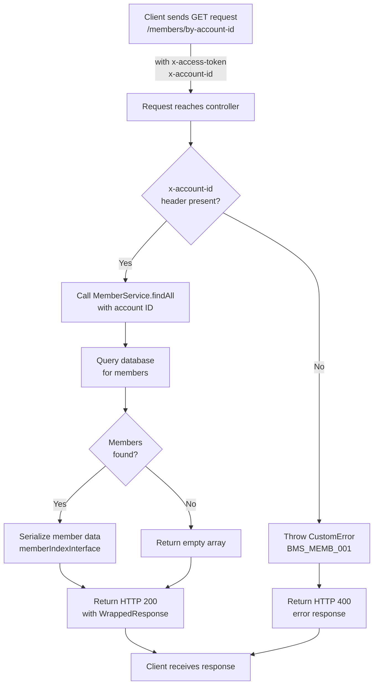
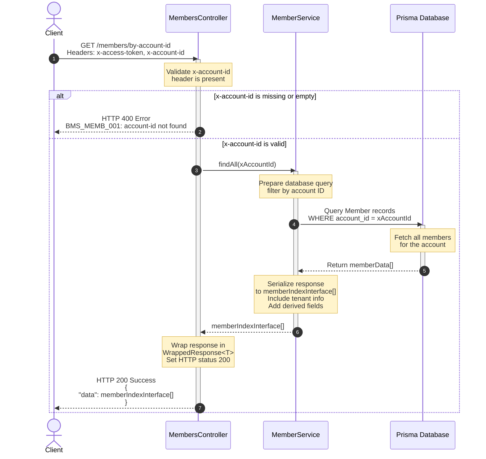

# API Documentation: GET /members/by-account-id

**Route**: `GET /members/by-account-id`  
**Operation ID**: `members.by.account_id`  
**Base Path**: `/members`  
**Controller**: [MembersController](../src/controllers/members_controller.ts)

---

## User Flow

### Success Path

1. **Client initiates request** - Sends GET request with required headers (`x-access-token` for authentication, `x-account-id` for account identifier)
2. **Authentication validation** - Middleware validates the `x-access-token` header
3. **Authorization check** - System validates the `x-account-id` header is present
4. **Fetch members** - MemberService retrieves all members associated with the account ID
5. **Serialize response** - System wraps member data in standardized response format
6. **Return success** - Returns HTTP 200 with member array

### Failure Path

1. **Client initiates request** - Sends GET request
2. **Header validation fails** - `x-account-id` header is missing or empty
3. **Error thrown** - CustomError with code `BMS_MEMB_001` is raised
4. **Error response returned** - HTTP 400 response with error details

---

## Flow Diagram



---

## Sequence Diagram



---

## API Endpoint

### Get All Members by Account ID

| Field              | Value                                                                                                                                                              |
| ------------------ | ------------------------------------------------------------------------------------------------------------------------------------------------------------------ |
| **Method**         | GET                                                                                                                                                                |
| **Path**           | `/members/by-account-id`                                                                                                                                           |
| **Description**    | Retrieve all members associated with a specific account ID. Returns a list of members with their basic information, authorized locations, and tenant associations. |
| **Authentication** | Required (`x-access-token` header)                                                                                                                                 |
| **Authorization**  | Required (`x-account-id` header)                                                                                                                                   |

#### Request

**Headers**

| Header           | Type   | Required | Description                                                                                                                |
| ---------------- | ------ | -------- | -------------------------------------------------------------------------------------------------------------------------- |
| `x-access-token` | String | Yes      | Authentication token for the request. Used to verify the client's identity and permissions.                                |
| `x-account-id`   | String | Yes      | Account identifier to filter members. Must be a valid UUID or account identifier. Returns `BMS_MEMB_001` error if missing. |
| `Content-Type`   | String | No       | Should be `application/json`                                                                                               |

**Query Parameters**

None

**Request Body**

None

#### Example Request

```bash
curl -X GET "http://api.example.com/members/by-account-id" \
  -H "x-access-token: eyJhbGciOiJIUzI1NiIsInR5cCI6IkpXVCJ9..." \
  -H "x-account-id: 550e8400-e29b-41d4-a716-446655440000" \
  -H "Content-Type: application/json"
```

#### Response

**Success Response (HTTP 200)**

```json
{
  "data": [
    {
      "id": "123e4567-e89b-12d3-a456-426614174000",
      "uid": "12345",
      "account_id": "550e8400-e29b-41d4-a716-446655440000",
      "email": "john.doe@example.com",
      "first_name": "John",
      "last_name": "Doe",
      "phone_number": "+66812345678",
      "status": "active",
      "created_at": "2026-01-15T10:30:00Z",
      "updated_at": "2026-06-10T14:22:15Z",
      "redemption_authorized": true,
      "tenant": {
        "id": "987f6543-e89b-12d3-a456-426614174111",
        "name": "Tenant Organization",
        "status": "active"
      },
      "can_preregister": true
    },
    {
      "id": "223e4567-e89b-12d3-a456-426614174001",
      "uid": "12346",
      "account_id": "550e8400-e29b-41d4-a716-446655440000",
      "email": "jane.smith@example.com",
      "first_name": "Jane",
      "last_name": "Smith",
      "phone_number": "+66887654321",
      "status": "active",
      "created_at": "2026-02-20T09:15:00Z",
      "updated_at": "2026-06-10T12:45:30Z",
      "redemption_authorized": true,
      "tenant": {
        "id": "987f6543-e89b-12d3-a456-426614174111",
        "name": "Tenant Organization",
        "status": "active"
      },
      "can_preregister": false
    }
  ]
}
```

**Response Data Meaning**

| Field                   | Type                     | Description                                                 |
| ----------------------- | ------------------------ | ----------------------------------------------------------- |
| `data`                  | `memberIndexInterface[]` | Array of member objects associated with the account         |
| `id`                    | UUID                     | Unique identifier for the member                            |
| `uid`                   | String                   | User identifier, typically a numeric ID from the system     |
| `account_id`            | UUID                     | Account identifier the member belongs to                    |
| `email`                 | String                   | Member's email address                                      |
| `first_name`            | String                   | Member's first name                                         |
| `last_name`             | String                   | Member's last name                                          |
| `phone_number`          | String                   | Member's phone number                                       |
| `status`                | String                   | Member status (e.g., 'active', 'inactive', 'suspended')     |
| `created_at`            | ISO 8601 DateTime        | Timestamp when member record was created                    |
| `updated_at`            | ISO 8601 DateTime        | Timestamp when member record was last updated               |
| `redemption_authorized` | Boolean                  | Whether the member is authorized to use redemption features |
| `tenant`                | Object                   | Tenant organization information the member belongs to       |
| `tenant.id`             | UUID                     | Unique identifier for the tenant                            |
| `tenant.name`           | String                   | Name of the tenant organization                             |
| `tenant.status`         | String                   | Status of the tenant relationship                           |
| `can_preregister`       | Boolean                  | Whether the member can pre-register for passes or events    |

---

## Error Handling

### Error Response Format

All error responses follow this standard format:

```json
{
  "error": {
    "code": "ERROR_CODE",
    "message": "Error message description",
    "stack": "Stack trace (optional, development only)"
  }
}
```

### Error Codes

| Error Code     | HTTP Status | Cause                                                        | Resolution                                                                              |
| -------------- | ----------- | ------------------------------------------------------------ | --------------------------------------------------------------------------------------- |
| `BMS_MEMB_001` | 400         | Missing or empty `x-account-id` header                       | Ensure `x-account-id` header is included in the request with a valid account identifier |
| `OB_006`       | 401         | Invalid or expired `x-access-token`                          | Re-authenticate and obtain a valid access token                                         |
| `OB_005`       | 403         | Access token is valid but lacks permission for this resource | Ensure the authenticated user has the required permissions for the account              |
| `OB_001`       | 500         | Internal server error occurred during processing             | Retry the request after a delay. Contact support if the issue persists                  |

### Error Response Examples

#### Missing Account ID Header (BMS_MEMB_001)

**Request:**

```bash
curl -X GET "http://api.example.com/members/by-account-id" \
  -H "x-access-token: eyJhbGciOiJIUzI1NiIsInR5cCI6IkpXVCJ9..." \
  -H "Content-Type: application/json"
```

**Response (HTTP 400):**

```json
{
  "error": {
    "code": "BMS_MEMB_001",
    "message": "an account-id is not found",
    "stack": "CustomError: an account-id is not found\n    at MembersController.members (...)\"
  }
}
```

#### Invalid or Expired Token (OB_006)

**Request:**

```bash
curl -X GET "http://api.example.com/members/by-account-id" \
  -H "x-access-token: invalid_token" \
  -H "x-account-id: 550e8400-e29b-41d4-a716-446655440000" \
  -H "Content-Type: application/json"
```

**Response (HTTP 401):**

```json
{
  "error": {
    "code": "OB_006",
    "message": "unauthorized",
    "stack": "Error: Token validation failed at middleware/auth.ts"
  }
}
```

#### Access Denied (OB_005)

**Response (HTTP 403):**

```json
{
  "error": {
    "code": "OB_005",
    "message": "forbidden",
    "stack": "Error: User does not have access to this account at middleware/authorization.ts"
  }
}
```

#### Server Error (OB_001)

**Response (HTTP 500):**

```json
{
  "error": {
    "code": "OB_001",
    "message": "internal server error",
    "stack": "Error: Database connection failed at services/member_service.ts"
  }
}
```

---

## Implementation Details

### Service Layer

**Service**: [MemberService](../src/services/member_service.ts)  
**Method**: `findAll(xAccountId: string): Promise<memberIndexInterface[]>`

The service method:

1. Accepts the account ID from the controller
2. Queries the database for all members associated with that account
3. Filters and serializes the results according to `memberIndexInterface`
4. Returns the array of members with computed fields like `redemption_authorized` and `can_preregister`

### Database Query

The endpoint queries the following Prisma model:

- **Primary**: `Member` table
- **Relations**:
  - `tenant_members` - Relationship to tenants
  - `authorized_locations` - Authorized access locations

### Caching

Currently, this endpoint does **not** implement caching. Consider implementing cache for frequently accessed accounts to improve performance.

### Rate Limiting

No specific rate limiting is implemented at the endpoint level. Rate limiting may be applied at the API gateway or middleware level.

---

## Related Endpoints

- `GET /members` - Get members with filtering by identifier, account_id, or uid
- `GET /members/{id}` - Get detailed information about a specific member
- `GET /members/account-id/{account_id}` - Get tenant names for a member by account ID
- `PUT /members/{id}` - Update member information (default floor)

---

## Notes

- All timestamps are in ISO 8601 format with UTC timezone
- Member data is sensitive and should only be accessible with proper authentication and authorization
- The endpoint returns members for the authenticated user's account only
- Empty arrays indicate no members found for the account (this is not an error condition)
