# PARQ Requirement Specification and Scope of Work

Owner: Molly, Assistant Product Owner

Document version: 0.3

Input files:
- `AGENTS.md`
- `MASTER_INDEX.md`
- `TASK_BOARD.md`
- `HANDOFF_LOG.md`
- `01_Source_of_Truth/Clarifications/PARQ_Clarification_Decision_Log.md`
- `01_Source_of_Truth/PARQ_User_Flow/The_PARQ_Phase_1_User_Flow_Index.xlsx`
- `01_Source_of_Truth/API_and_System_References/00_2025_Document/User Flow_20260608.pdf`
- `01_Source_of_Truth/PARQ_User_Flow/Offboarding_User_Flow.png`
- `01_Source_of_Truth/API_and_System_References/00_2025_Document/[Proposal] The PARQ integration.pdf`
- `PARQ-SOT-006` Bas Google Drive IAM / SSO technical markdown source folder, as-is technical reference only
- `02_Discovery/PARQ_UX_Stakeholder_User_Flow_Pack.md`
- `03_Architecture/PARQ_Drive_IAM_SSO_Source_Impact_Assessment.md`
- `03_Architecture/PARQ_Architecture_Dependency_Addendum_After_Bas_Confirmations.md`
- Existing architecture packs used as reference only

Output file: `02_Discovery/PARQ_Requirement_Specification_and_Scope_of_Work.md`

Status: Draft v0.3 / Ready for PARQ and Bas review

Dependencies: PARQ Phase 1 approved user-flow index, PARQ integration proposal, Bas clarification decisions, IAM/SSO as-is technical reference, FS/Iviva, BZB, BMS, Argento, CMS, Notification, Elevator, Turnstile, The PARQ concierge platform.

Downstream consumer: Business Team, Client BA/PMO/PM, internal estimation team, UX/UI, Developer/technical team, architecture owner, QA/UAT stakeholders after PARQ/Bas acceptance, repository librarian for filing and indexing.

Important boundary: This document is a business and semi-technical Requirement Specification / Scope of Work baseline. It does not define detailed architecture, API contracts, TDD, SIT scenarios, UAT scenarios, or final UI designs.

## 1. Table of Contents

1. [Document Purpose](#2-document-purpose)
2. [Project Background and Overview](#3-project-background-and-overview)
3. [Scope Summary](#4-scope-summary)
4. [Functional Requirements and User Flows](#5-functional-requirements-and-user-flows)
5. [Business Rules](#6-business-rules)
6. [Overview System Architecture](#7-overview-system-architecture)
7. [Data Ownership and System Responsibilities](#8-data-ownership-and-system-responsibilities)
8. [Roles and Responsibilities](#9-roles-and-responsibilities)
9. [Variables, Assumptions and Constraints](#10-variables-assumptions-and-constraints)
10. [Dependencies](#11-dependencies)
11. [Limitations](#12-limitations)
12. [Out of Scope](#13-out-of-scope)
13. [Deliverables](#14-deliverables)
14. [Success Metrics / Acceptance Metrics](#15-success-metrics--acceptance-metrics)
15. [Open Questions / Decisions Required](#16-open-questions--decisions-required)
16. [Acceptance / Sign-off Criteria](#17-acceptance--sign-off-criteria)
17. [Appendix / Source References](#18-appendix--source-references)
18. [Change Log / Version History](#19-change-log--version-history)

## 2. Document Purpose

This document defines the internal Requirement Specification and Scope of Work baseline for integrating The PARQ experience into the One Bangkok Application.

The document is intended to support:
- Business scope review.
- Client BA, PMO, and PM alignment.
- UX/UI flow and screen-state planning.
- Developer estimation preparation.
- QA readiness planning after PARQ/Bas acceptance.
- Future repository traceability and indexing.

This document consolidates the approved PARQ Phase 1 user-flow index, the PARQ integration proposal, Bas clarification decisions, and source/reference architecture inputs. Where information is not confirmed, the item is listed as an open question instead of being assumed.

## 3. Project Background and Overview

### Background

The PARQ currently operates with its own digital ecosystem and workplace-related capabilities. The One Bangkok Application already supports Retail, Workplace, parking, profile, identity, notification, CMS, and access-related experiences for One Bangkok users.

The project objective is to integrate The PARQ workplace and related user experiences into the existing One Bangkok Application, while keeping the existing The PARQ application available in parallel during Phase 1 where required.

### Objectives

- Provide one user account and app experience for users who interact with One Bangkok and The PARQ.
- Support migrated The PARQ workplace users in signing in to the One Bangkok Application.
- Support new PARQ workplace users through phone-first onboarding and account creation.
- Merge or link Retail/BZB persona and Workplace persona where identity matching allows.
- Display Workplace persona for The PARQ users after FS type is detected.
- Support multi-building and multi-tower context between One Bangkok and The PARQ.
- Support My Profile and My QR identity access behavior for PARQ users.
- Support parking availability, ticket scan, and QR PromptPay parking payment for The PARQ Phase 1.
- Support visitor pass, notification, CMS user visibility, and account lifecycle behavior at Phase 1 scope.
- Keep Phase 1.5 deferred scope explicit for later planning.

### Target Users

| User group | Description |
|---|---|
| Existing The PARQ workplace user | A user migrated from The PARQ who signs in to the One Bangkok Application and receives Workplace persona when FS type is detected. |
| New PARQ workplace user | A new user who registers through One Bangkok Application and may receive Workplace persona after FS detection. |
| User with existing Retail/BZB account | A user who already has Retail account data and may need Retail and Workplace personas linked or merged. |
| Retail shopper | A user who uses Retail persona for earn points, rewards, and general shopper features. |
| Visitor host | A workplace user who creates and manages visitor passes. |
| Visitor | A non-workplace visitor who uses a pass or QR to access permitted areas. |
| Parking user | A user who checks parking availability, scans parking ticket, pays by QR PromptPay, or uses parking access. |
| CMS/admin/support user | An internal user who views cross-property user metadata and supports user inquiries within Phase 1 view-only boundaries. |
| Concierge/support operator | The PARQ or One Bangkok operational support user involved in parking, redemption, or account support depending on platform ownership. |

### Success Definition

The Phase 1 baseline is successful when:
- The PARQ users can sign in or register in the One Bangkok Application.
- The system can display the correct persona experience based on identity, Retail/BZB matching, and FS type detection.
- Users with relevant permissions can access Workplace, QR, tower context, parking, visitor pass, and notification experiences at Phase 1 scope.
- Parking payment is supported through QR PromptPay, while self-redemption is not included in Phase 1.
- The PARQ CMS/concierge redemption boundary is clear and not incorrectly assigned to One Bangkok CMS.
- Phase 1.5 deferred items are separated and not estimated as Phase 1.
- Open questions and implementation dependencies are visible before team estimation.

## 4. Scope Summary

### Phase 1 Scope

Phase 1 includes the following functional scope:

| Area | Included in Phase 1 |
|---|---|
| Authentication and account integration | Existing PARQ user sign-in, phone-first identity, OTP/password login, smart redirect, SSO account lifecycle alignment, non-blocking Workplace refresh where required. |
| Sign-up and onboarding | Phone-first registration, consent capture, automatic Retail account creation for brand-new users only, and delayed Workplace persona activation when FS data is detected later. |
| Retail matching and persona merge | Phone-first identity lookup with email as secondary matching input, BZB/Retail account detection, mandatory acknowledgement screen for auto-merge. |
| Workplace persona | Workplace card and home shown when FS type is detected; pending state shown when FS type exists but company or authorization data is incomplete. |
| Multi-tower / tower context | User can retain last selected tower/building and switch eligible context where multiple building rights exist. Hardware journeys must respect active context and authorization. |
| Profile and default floor | Existing account-management capabilities remain available. Company, tower, and relevant metadata can be displayed. PARQ floor information comes from FS only and is not manually set by user. |
| My QR and access | My QR available as user identity QR for turnstile and parking gate scanning, subject to access-system validation. |
| Parking availability | User selects location first, currently One Bangkok or The PARQ, then views availability for that selected location. |
| Parking ticket and payment | User scans parking ticket. App detects whether ticket belongs to One Bangkok or The PARQ. One Bangkok follows as-is flow. The PARQ follows PARQ-specific rate/capability flow. Payment by QR PromptPay is included. |
| Visitor pass | Visitor pass creation and usage supported based on existing One Bangkok capabilities and FS access authorization. |
| Notification | Reuse existing OBK push notification mechanism and configuration. Basic login/account/system and marketing notifications may apply. |
| CMS multi-property user management | CMS/admin can view multi-property user metadata for support and management. Phase 1 is view-only for metadata. |
| Account lifecycle | Company offboarding removes Workplace persona when FS/Fineday marks user inactive. User account deletion suspends account, reactivation is available within 30 days, and hard delete occurs on Day 31. |

### Phase 1.5 / Deferred Future Phase

Phase 1.5 must be treated as Deferred / Future Phase and not included in Phase 1 estimation unless explicitly re-approved.

Deferred items include:
- Store whitelist.
- Automated E-stamp.
- OCR redemption.
- Automated gate sync.
- Organization Isolation.
- CMS sub-menu.
- Rate configuration.
- Phase 1.5 parking E-stamp and verification flows.
- Phase 1.5 CMS organization isolation for The PARQ.
- Phase 1.5 CMS sub-menu and rate configuration.

Important boundary:
- Phase 1 includes QR PromptPay parking payment.
- Phase 1 does not include user self-redemption.
- The PARQ has its own CMS/platform for concierge redemption.
- The PARQ concierge redemption platform is separate from One Bangkok concierge platform.
- Phase 1 must not assume OBK CMS manages The PARQ redemption.

### Parallel Run with Existing PARQ App

During Phase 1, the existing The PARQ application remains available for experiences that are not yet fully integrated into the One Bangkok Application.

Known Phase 1 parallel-run examples:
- Traffic, Map, and Promotion are available as webview quick actions for PARQ users.
- Building news and specific The PARQ CMS-managed campaigns are not included in Phase 1 notification integration and may remain in the existing The PARQ application.
- The PARQ concierge redemption platform remains separate.

## 5. Functional Requirements and User Flows

### Authentication and Account Integration

Related user flows: UF-001 Existing The PARQ User Sign-in, UF-004 Account Lifecycle, related existing IAM/SSO flows from `PARQ-SOT-006`.

| FR ID | Requirement |
|---|---|
| FR-AUTH-001 | The system shall allow existing The PARQ users to sign in to the One Bangkok Application using supported login methods such as phone, password, and OTP where applicable. |
| FR-AUTH-002 | When a phone and email identity conflict occurs, phone shall be treated as the primary identity matching input. |
| FR-AUTH-003 | When a user enters an identity already found in the system, the system shall show the smart redirect message: "Found your account please log-in with your password or OTP". |
| FR-AUTH-004 | Existing migrated PARQ users without Retail accounts shall not receive automatic Retail account creation during sign-in. They may activate Retail later after successful login. |
| FR-AUTH-005 | If FS-related checks fail or are unavailable during sign-in, the user shall still be allowed to enter the One Bangkok Application without Workplace access where the account itself is valid. |
| FR-AUTH-006 | When FS type is later detected, the Workplace persona shall appear based on eligible FS data and authorization. |
| FR-AUTH-007 | PARQ login-time BMS member check shall use `GET /members` with `account_id` as the confirmed business wording. Endpoint confirmation is owned by OBK BMS Service Team via PO, and timeout remains TBD. |

User flow summary:
1. User opens the One Bangkok Application.
2. User enters phone, email, password, or OTP depending on selected login method.
3. App checks account identity and SSO status.
4. If existing account is found, app directs user to login using password or OTP.
5. App completes login when account credentials are valid.
6. App syncs identity/persona status.
7. If FS type is detected, Workplace persona becomes available.
8. If FS type is not detected, user enters with available personas only.

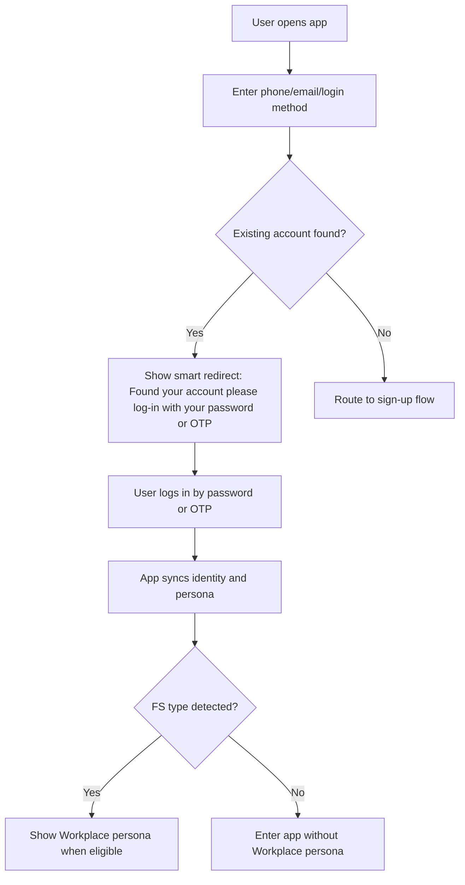

### Sign-up and Onboarding

Related user flow: UF-003 Sign-up and User Onboarding. Source flow reference: `User Flow_20260608.pdf`.

| FR ID | Requirement |
|---|---|
| FR-SIGNUP-001 | The system shall support phone-first sign-up and onboarding for new users, with Email requested after Phone is verified. |
| FR-SIGNUP-002 | The system shall request required consent from the start of the sign-up process, including consent needed for automatic Retail profile creation. |
| FR-SIGNUP-003 | Automatic Retail account creation shall apply only to brand-new registrations. |
| FR-SIGNUP-004 | Registration can complete even if FS authorization is unavailable during registration. |
| FR-SIGNUP-005 | If Retail is created but Workplace is pending, the success screen shall show only general account creation success text. |
| FR-SIGNUP-006 | PARQ invitation links do not need to deep-link directly to the phone gate for Phase 1. |
| FR-SIGNUP-007 | Social login, guest persona, invitation/service-code paths, and Add New Email/Phone behavior shall work consistently with the existing One Bangkok Application where applicable. |
| FR-SIGNUP-008 | If a newly added phone or email is found with FS type, the user shall receive Workplace persona rights according to FS sync and authorization. |

User flow summary:
1. New user starts registration.
2. User enters phone number.
3. Phone is verified by OTP.
4. App asks for Email next, based on Bas's `User Flow_20260608.pdf`.
5. User enters Email / completes the email-related step required by the source flow.
6. User reviews and accepts required consent.
7. App validates whether the identity already exists.
8. If brand-new, app creates the account and Retail profile.
9. App checks FS-related data if available.
10. App completes onboarding and displays available persona cards.
11. Workplace persona appears later if FS type is detected after onboarding.

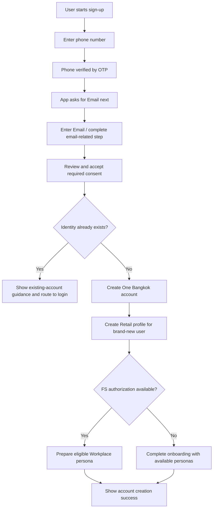

### Retail Account Matching and Persona Merge

Related user flow: UF-002 Retail Account Matching and Persona Merge.

| FR ID | Requirement |
|---|---|
| FR-MERGE-001 | The system shall check whether a PARQ Workplace user already has a Retail/BZB account during login or identity matching. |
| FR-MERGE-002 | Matching shall use both phone and email where available, with phone used first because all BZB accounts are expected to have a phone number. |
| FR-MERGE-003 | When a Retail/BZB account is matched, the system shall show an auto-merge acknowledgement screen. |
| FR-MERGE-004 | User consent is not required to deny or approve the merge. The screen is for acknowledgement only. |
| FR-MERGE-005 | Manual operational identity consolidation remains the fallback for conflict cases that cannot be auto-merged. |
| FR-MERGE-006 | Automatic Retail creation shall not be applied to migrated PARQ users without Retail account. It applies only to brand-new users. |

User flow summary:
1. User signs in using phone.
2. App checks identity against One Bangkok and BZB/Retail identity.
3. If matching Retail account exists, app prepares persona merge.
4. App displays auto-merge acknowledgement screen.
5. User acknowledges and continues.
6. App displays combined Retail and Workplace persona where eligible.
7. If conflict cannot be resolved, manual operational consolidation is required.

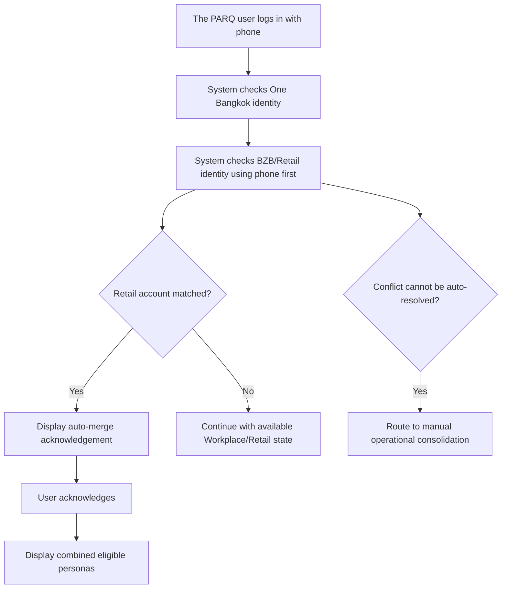

### Workplace Persona Experience

Related user flows: UF-005 Workplace Persona UI Integration, UF-011 Traffic Monitoring, UF-014 Notification, UF-015 Elevator Integration, UF-016 Turnstile Access.

| FR ID | Requirement |
|---|---|
| FR-WP-001 | The system shall show Workplace persona card as soon as FS type is detected. |
| FR-WP-002 | If FS type is not found, Workplace persona/home shall not be shown. |
| FR-WP-003 | If FS type is found but company or authorization data is incomplete, the system shall show Workplace card/home with pending information. |
| FR-WP-004 | Users with both Retail and Workplace personas shall land on the as-is Retail persona homepage first unless they set a different default persona in settings. |
| FR-WP-005 | Users shall be able to swipe or switch to Workplace persona home according to the existing persona UX model. |
| FR-WP-006 | Phase 1 quick actions for The PARQ shall include webview access for Traffic, Map, and Promotion. |
| FR-WP-007 | Parking shall be integrated with One Bangkok Application logic, using existing UI where possible and PARQ building logic where needed. |

User flow summary:
1. User logs in and app detects available personas.
2. Retail home remains the first landing context by default.
3. User can swipe or switch to Workplace persona.
4. Workplace home shows available PARQ actions.
5. Traffic, Map, and Promotion open as webview quick actions.
6. Parking opens integrated app flow.
7. Pending state appears if FS type exists but company/authorization is incomplete.

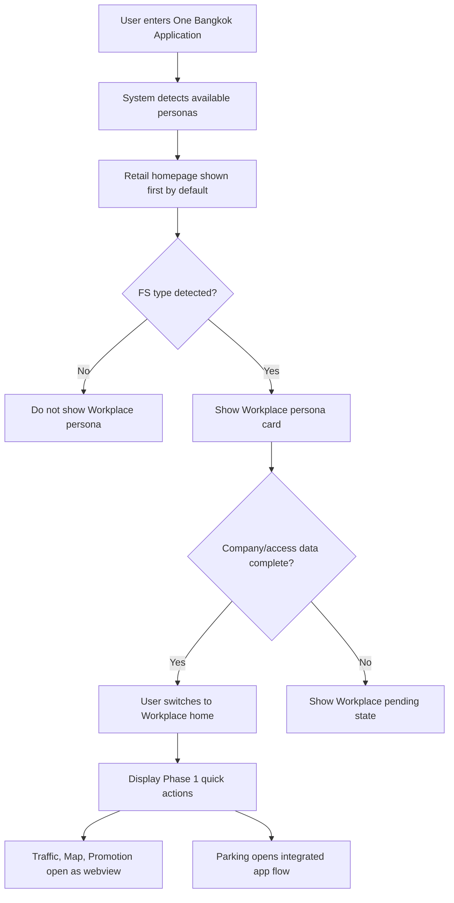

### Multi-Tower / Tower Context

Related user flow: UF-006 Multi-Tower Support.

| FR ID | Requirement |
|---|---|
| FR-TOWER-001 | The system shall support users with access to multiple buildings or towers, including One Bangkok towers and The PARQ. |
| FR-TOWER-002 | The system shall remember the user's last selected tower/building context after logout and login where supported. |
| FR-TOWER-003 | Users with multiple building rights, including cases under the same company, shall be able to choose which eligible tower/building context to use. |
| FR-TOWER-004 | Tower switching shall not be allowed during active hardware journeys where context impacts floor or access permission. |
| FR-TOWER-005 | If FS returns multiple towers but missing floor data, only authorized data from FS shall be displayed. Empty metadata shall be filtered out to avoid broken UX. |
| FR-TOWER-006 | The PARQ shall be displayed visually as another building/tower context with its own name. |

User flow summary:
1. User opens Workplace persona.
2. System loads the last selected building/tower context where available.
3. App displays the selected building/tower context on the Persona Card.
4. User can select another eligible context before starting a hardware-related journey.
5. After the Persona Card context is displayed or selected, the system authorizes permissions for that selected context.
6. App remembers the selected context for the next login where supported.
7. During elevator, turnstile, or other hardware-sensitive journeys, switching is blocked and the selected context is logged/used until the journey ends.

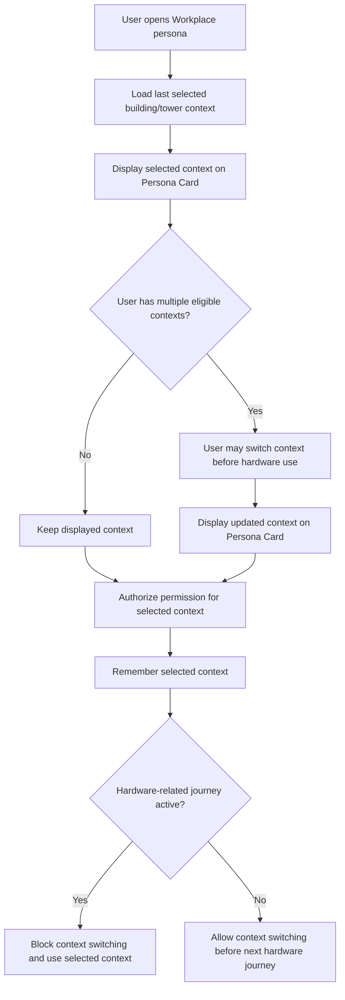

### My Profile / Default Floor

Related user flow: UF-008 User Profile Management.

| FR ID | Requirement |
|---|---|
| FR-PROFILE-001 | PARQ users shall be able to use existing account-management features such as adding new phone or email, according to existing One Bangkok logic. |
| FR-PROFILE-002 | Profile shall display relevant company and tower metadata where available. |
| FR-PROFILE-003 | Default floor selection shall be allowed for One Bangkok tower users according to existing logic. |
| FR-PROFILE-004 | PARQ tower users shall not manually set default floor in Phase 1. PARQ floor data is received from FS only. |
| FR-PROFILE-005 | If FS returns multiple authorized floors, user may still access authorized floors according to FS authorization, but PARQ default floor remains FS-driven. |
| FR-PROFILE-006 | If FS type is detected but floor authorization is missing, the system shall show a "something went wrong" state and direct the user to the correct concierge/contact based on the missing floor/property context. |

User flow summary:
1. User opens My Profile.
2. App displays account, identity, company, tower, and relevant metadata.
3. User can manage phone/email according to existing app logic.
4. If user is in One Bangkok context, default floor selection follows existing rules.
5. If user is in PARQ context, default floor is view-only and sourced from FS.
6. Missing floor authorization shows error and contact guidance.

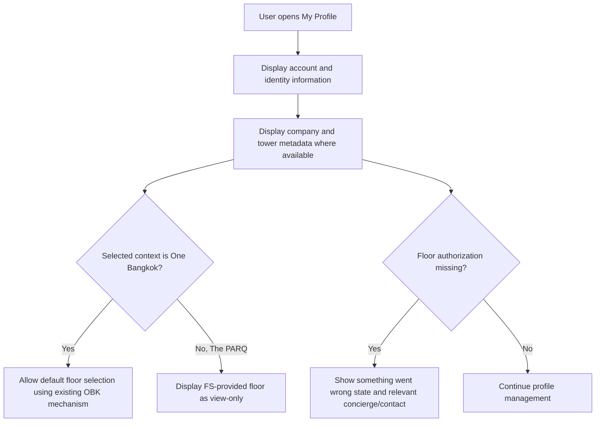

### QR Identity and Access

Related user flows: UF-009 My QR, UF-015 Elevator Integration, UF-016 Turnstile Access.

| FR ID | Requirement |
|---|---|
| FR-QR-001 | The system shall provide My QR as a user identity QR for eligible users. |
| FR-QR-002 | My QR shall be available before full company/floor authorization is loaded, based on Bas confirmation that pending FS authorization should not block My QR availability. |
| FR-QR-003 | My QR may be used for turnstile access and parking gate scanning where supported by access systems. |
| FR-QR-004 | QR should not be property-specific for The PARQ versus One Bangkok unless future technical design requires it. Business expectation is that QR can be based on account identity. |
| FR-QR-005 | QR validity duration, refresh timer, and auto-refresh behavior remain open for technical confirmation. |
| FR-QR-006 | Turnstile and elevator access shall validate user access through the appropriate FS/access authorization layer. |
| FR-QR-007 | If turnstile or elevator access is denied or times out, the system shall show a user-visible denial, retry, or support path according to final hardware error rules. |

User flow summary:
1. User opens My QR.
2. App displays the user's QR identity.
3. User scans QR at supported turnstile or parking gate.
4. Access system validates identity and authorization.
5. If approved, user proceeds.
6. If denied or timed out, user receives error/support state.

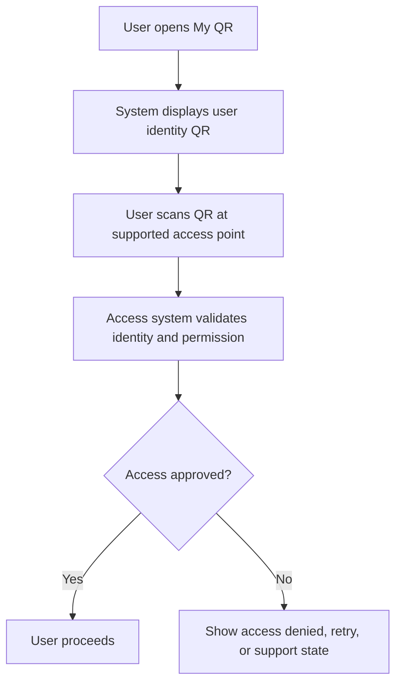

### Parking Availability

Related user flow: UF-010 Parking Availability.

| FR ID | Requirement |
|---|---|
| FR-PARK-001 | Parking Availability shall start with a location selection screen. |
| FR-PARK-002 | Phase 1 location options shall be One Bangkok and The PARQ. |
| FR-PARK-003 | The location-selection model shall allow future scaling to additional Frasers Property buildings if approved later. |
| FR-PARK-004 | After location is selected, the system shall request and display availability data for the selected location only. |
| FR-PARK-005 | If availability data is available, the system shall display available parking information using the applicable location data. |
| FR-PARK-006 | If availability data is unavailable, stale, or incomplete, the system shall show an appropriate error or unavailable state and allow retry where applicable. |

User flow summary:
1. User opens Parking Availability.
2. App displays location options: One Bangkok, The PARQ.
3. User selects location.
4. App loads availability data for selected location.
5. App displays parking availability.
6. If data is unavailable, app shows retry/unavailable state.

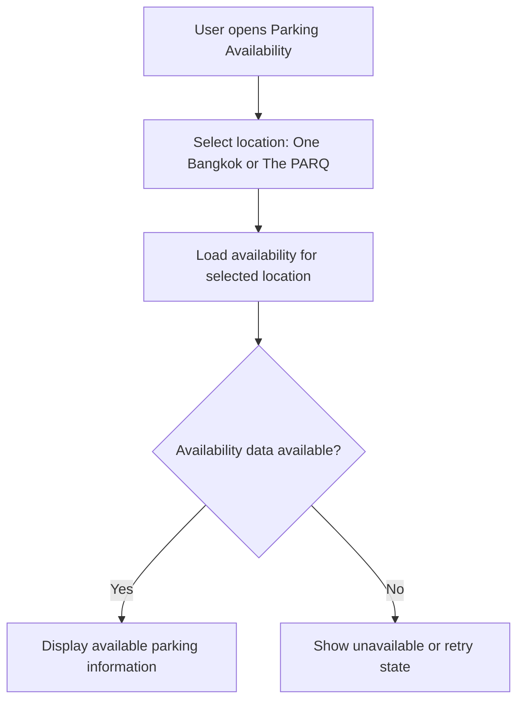

### Parking Ticket and QR PromptPay Payment

Related user flow: UF-012 Parking Payment and Ticket.

| FR ID | Requirement |
|---|---|
| FR-PARK-007 | The system shall allow user to scan a parking ticket. |
| FR-PARK-008 | After scan, the system shall determine whether the ticket belongs to One Bangkok or The PARQ. |
| FR-PARK-009 | If the ticket belongs to One Bangkok, the system shall route the user to the as-is One Bangkok parking flow. |
| FR-PARK-010 | If the ticket belongs to The PARQ, the system shall route the user to The PARQ parking flow with The PARQ rate and capability rules. |
| FR-PARK-011 | The PARQ parking flow shall hide unsupported One Bangkok-only features, including VIP Parking where not applicable. |
| FR-PARK-012 | Phase 1 shall support QR PromptPay parking payment so users can pay themselves through QR Code. |
| FR-PARK-013 | Payment confirmation and payment status shall be supported at business flow level through the applicable parking/payment integration. |
| FR-PARK-014 | If ticket property cannot be detected, the system shall show scan error and allow the user to scan again. If the issue continues, user shall contact concierge/support. |
| FR-PARK-015 | User self-redemption is not included in Phase 1. Concierge redemption remains on The PARQ separate platform. |

User flow summary:
1. User opens Parking Ticket or Payment.
2. User scans parking ticket.
3. App/system detects ticket property.
4. One Bangkok ticket routes to existing One Bangkok flow.
5. The PARQ ticket routes to PARQ-specific rate/capability flow.
6. User reviews parking fee.
7. User taps Payment.
8. App routes to Argento QR Payment.
9. User completes QR PromptPay.
10. App receives or checks payment status.
11. If successful, app shows payment success/paid state.
12. If failed, user retries payment or contacts support according to final payment error rules.

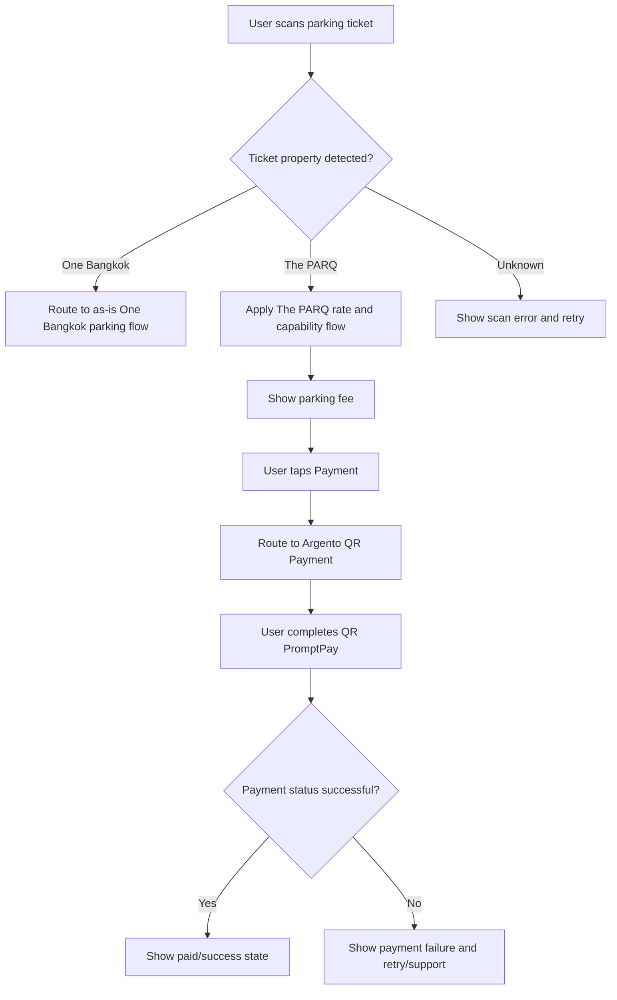

### Visitor Pass Management

Related user flow: UF-013 Visitor Pass.

| FR ID | Requirement |
|---|---|
| FR-VISITOR-001 | Eligible host users shall be able to create visitor passes through the app where existing visitor-pass logic and FS authorization support it. |
| FR-VISITOR-002 | Visitor pass shall use the relevant host identity, property, tower/building context, visitor details, and validity period. |
| FR-VISITOR-003 | Visitor pass access shall be validated by the relevant access system when visitor uses the pass. |
| FR-VISITOR-004 | Visitor pass and parking ticket behavior shall not be cancelled automatically by company offboarding when the user still has an active account and the common feature remains valid. |
| FR-VISITOR-005 | Visitor pass usage shall follow existing One Bangkok behavior unless a confirmed PARQ-specific exception is recorded. |

User flow summary:
1. Host opens Visitor Pass.
2. Host enters visitor and visit details.
3. App validates host eligibility and relevant property/tower context.
4. App creates visitor pass.
5. Visitor receives or uses pass according to supported channel.
6. Visitor scans or presents pass at access point.
7. Access system validates pass and permits or denies access.

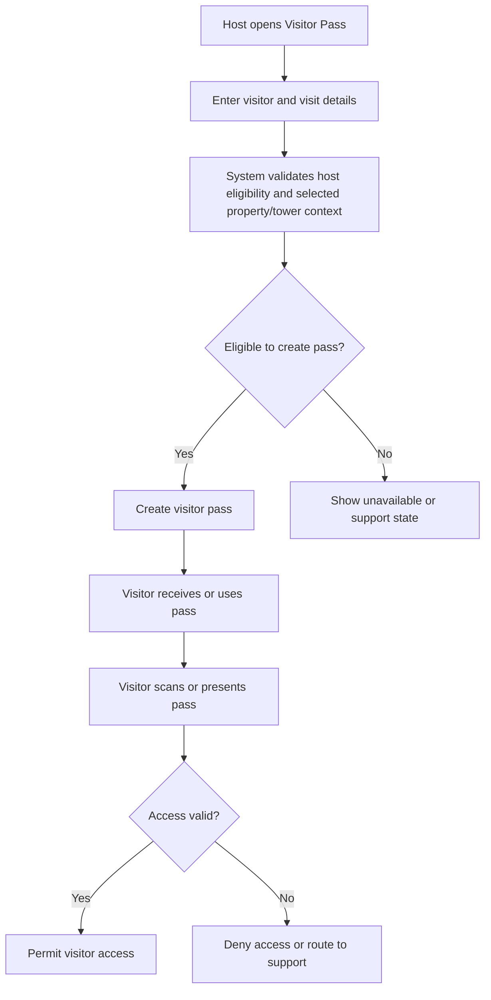

### Notification

Related user flow: UF-014 Support OBK Notification for The PARQ User.

| FR ID | Requirement |
|---|---|
| FR-NOTIF-001 | Phase 1 shall reuse existing OBK push notification mechanism and configuration. |
| FR-NOTIF-002 | Phase 1 shall not implement an additional notification platform for The PARQ. |
| FR-NOTIF-003 | Migrated PARQ users may receive basic notifications such as login/account/system and marketing notifications where existing OBK rules allow. |
| FR-NOTIF-004 | Notification content and campaign management from The PARQ CMS are not included in Phase 1. |
| FR-NOTIF-005 | The PARQ building news and specific CMS campaigns shall remain outside Phase 1 and may be viewed from the existing The PARQ application during initial phase. |

User flow summary:
1. User logs in or uses app.
2. Existing OBK notification mechanism evaluates eligible notification.
3. User receives supported basic/account/system/marketing notification where allowed.
4. The PARQ CMS campaign or building-news notification is not sent through One Bangkok Phase 1 scope.

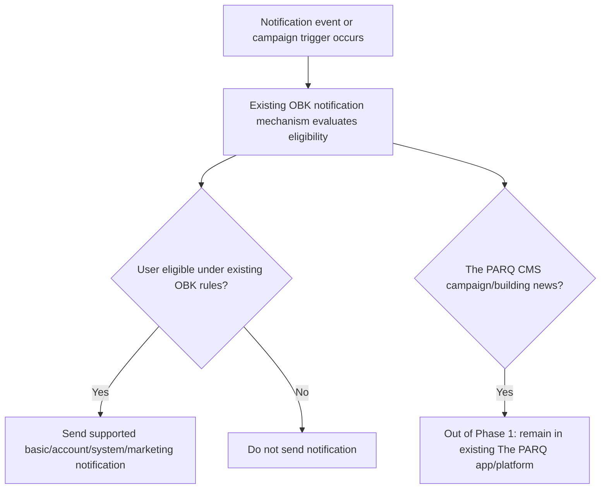

### CMS Multi-Property User Management

Related user flow: UF-007 [CMS] Multi-Property User Management.

| FR ID | Requirement |
|---|---|
| FR-CMS-001 | CMS/admin users shall be able to view multi-property user information relevant to support and management. |
| FR-CMS-002 | Phase 1 CMS user metadata is view-only. Admin shall not edit persona metadata in Phase 1. |
| FR-CMS-003 | CMS should allow admin/support users to see relevant company, tower/building, property, persona, and status metadata where available. |
| FR-CMS-004 | If a Workplace persona is inactive after Fineday/FS offboarding, it shall disappear from the user-facing app; CMS display requirements for inactive Workplace history remain an open decision if not already available as existing behavior. |
| FR-CMS-005 | All CMS admins can view cross-property user details for Phase 1 unless a later role-based restriction is confirmed. |
| FR-CMS-006 | CMS filters such as property, persona, company, status, and tower are design candidates and require UX/UI and business confirmation. |

User flow summary:
1. Admin opens CMS user management.
2. Admin searches or filters user records.
3. CMS displays user profile and associated persona/property metadata.
4. Admin uses information for support or operational visibility.
5. Admin does not edit persona metadata in Phase 1.

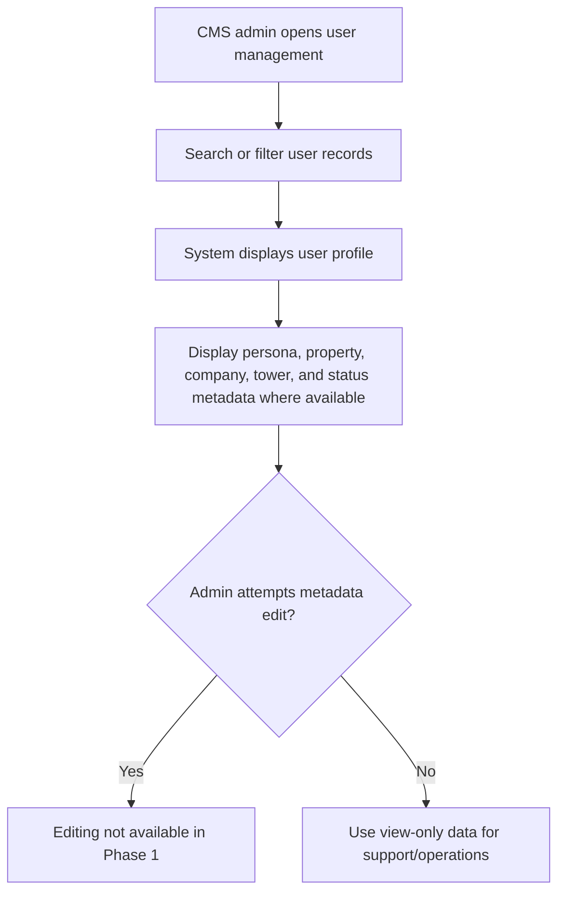

### Account Lifecycle / Delete / Reactivate

Related user flow: UF-004 Offboarding and Account Lifecycle, `Offboarding_User_Flow.png`, existing IAM/SSO as-is account lifecycle references.

| FR ID | Requirement |
|---|---|
| FR-LIFE-001 | Company offboarding shall be separate from user account deletion. |
| FR-LIFE-002 | When user resigns from company, FS/Fineday marks the user inactive. After app sync, Workplace persona shall disappear if FS type is no longer detected or authorized. |
| FR-LIFE-003 | A company-offboarded user may continue using Retail persona if the account remains active and Retail persona exists. |
| FR-LIFE-004 | User account deletion from SSO shall apply to all personas. |
| FR-LIFE-005 | After user confirms account deletion, the system shall mark the account as suspended or equivalent internal status. Exact status label remains open where source wording uses `Suspens`. |
| FR-LIFE-006 | User may reactivate account within 30 days if the account is still in soft-delete/suspended period. |
| FR-LIFE-007 | On Day 31, SSO owns hard delete execution. |
| FR-LIFE-008 | After hard delete, SSO shall use API delete to inform BZB where required. |
| FR-LIFE-009 | If user attempts reactivation after Day 31, app shall show cannot-found-account or equivalent state according to existing account lifecycle behavior. |
| FR-LIFE-010 | Visitor passes or parking tickets shall not be automatically cancelled by Workplace offboarding alone if the user still has an active account and the feature remains common/valid. |

User flow summary:
1. Company offboarding: company or FS/Fineday inactivates user.
2. User opens app and app syncs FS.
3. If FS type is no longer detected, Workplace persona disappears.
4. Retail persona remains if account is active and Retail persona exists.
5. User delete account: user requests account deletion.
6. User confirms deletion.
7. System marks account suspended/soft deleted.
8. User can reactivate within 30 days.
9. On Day 31, SSO hard deletes account and informs BZB where required.

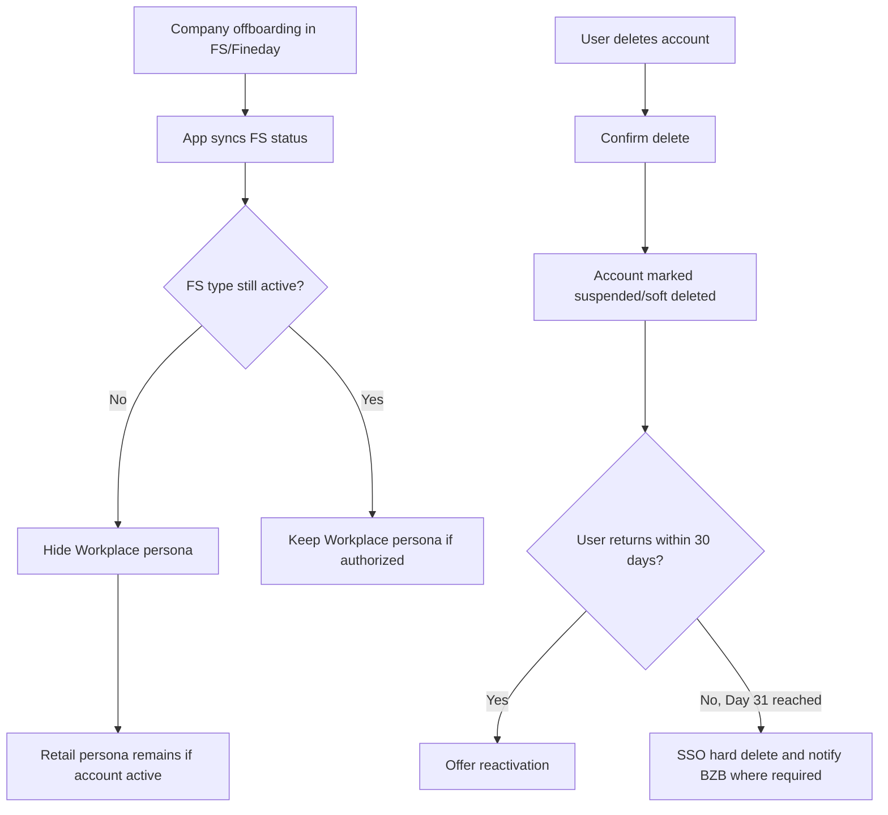

## 6. Business Rules

| Rule ID | Business rule |
|---|---|
| BR-001 | Phone identity wins over email when phone and email conflict. |
| BR-002 | Phone is the first matching rule for BZB/Retail lookup; email may be used as an additional match input. |
| BR-003 | Existing migrated PARQ users do not receive automatic Retail account creation during login. |
| BR-004 | Automatic Retail account creation applies only to brand-new registrations. |
| BR-005 | Retail and Workplace merge acknowledgement is mandatory display only; user cannot deny the linking flow in Phase 1. |
| BR-006 | If FS fails during valid login, app entry is allowed without Workplace access. |
| BR-007 | Workplace persona appears as soon as FS type is detected. |
| BR-008 | If FS type is missing, Workplace persona is not displayed. |
| BR-009 | If FS type exists but company/floor authorization is incomplete, show pending or error state as defined by flow context. |
| BR-010 | Default landing remains Retail homepage first for users with Retail and Workplace, unless user sets default persona in settings. |
| BR-011 | PARQ floor data is FS-driven and not manually set by user in Phase 1. |
| BR-012 | One Bangkok default floor behavior remains as-is. |
| BR-013 | User-selected parking availability location is required before showing availability data. |
| BR-014 | Phase 1 parking locations are One Bangkok and The PARQ. |
| BR-015 | Parking ticket flow must detect ticket property and route One Bangkok as-is or The PARQ-specific flow. |
| BR-016 | The PARQ parking flow must hide unsupported OBK-only features such as VIP Parking. |
| BR-017 | Phase 1 supports QR PromptPay parking payment. |
| BR-018 | User self-redemption is excluded from Phase 1. |
| BR-019 | The PARQ concierge redemption platform remains separate from One Bangkok concierge platform. |
| BR-020 | OBK CMS must not be assumed to manage The PARQ redemption in Phase 1. |
| BR-021 | Notification uses existing OBK mechanism only in Phase 1. |
| BR-022 | The PARQ CMS campaign and building-news notifications are excluded from Phase 1. |
| BR-023 | CMS persona metadata is view-only in Phase 1. |
| BR-024 | Company offboarding removes Workplace persona but does not delete the whole user account. |
| BR-025 | User account deletion applies to all personas. |
| BR-026 | Account reactivation is available within 30 days. |
| BR-027 | Day 31 is the business wording for hard delete. |
| BR-028 | SSO owns hard delete execution and downstream BZB delete notification where required. |
| BR-029 | Visitor passes and parking tickets are not automatically cancelled by Workplace offboarding alone if the user still has an active account and the feature remains valid. |
| BR-030 | Phase 1.5 items are Deferred / Future Phase unless Bas/PARQ explicitly changes scope. |

## 7. Overview System Architecture

This section is a business-readable overview only. Detailed architecture, sequence diagrams, API contracts, technical dependency controls, and implementation decisions remain in architecture-owned artifacts.

| System / platform | Business-readable role in this scope |
|---|---|
| One Bangkok Application | Main mobile app experience for login, persona, profile, QR, parking, visitor pass, notification, and CMS-supported journeys. |
| IAM / SSO | Owns account authentication, account identity, delete/reactivate lifecycle, and SSO account status behavior. |
| BMS | Supports member lookup and related member/default-floor information. PARQ login-time business wording uses `GET /members` with `account_id`; timeout remains TBD. |
| FS / Iviva | Owns Workplace authorization data, FS type, company/tower/floor metadata, parking availability/ticket-related building data, elevator and turnstile authorization, and visitor-access authorization. |
| BZB | Owns Retail account/loyalty identity, Retail persona linkage, and downstream delete handling where required. |
| Argento | Supports parking payment through QR PromptPay at Phase 1 scope. |
| OBK CMS | Supports Phase 1 multi-property user visibility as view-only metadata. Does not manage The PARQ redemption in Phase 1. |
| The PARQ concierge platform | Owns The PARQ concierge redemption operation separately from One Bangkok concierge platform. |
| Notification platform | Existing OBK push notification mechanism and configuration reused in Phase 1. |
| Elevator / Turnstile systems | Validate access based on FS/access-system authorization and selected building/tower context. |
| Existing The PARQ application | Continues in parallel for selected webview/legacy experiences and content not included in Phase 1 integration. |

## 8. Data Ownership and System Responsibilities

| Data / responsibility | Owner system | Phase 1 responsibility |
|---|---|---|
| Account ID and SSO account status | IAM / SSO | Authenticate user, manage delete/reactivate lifecycle, execute Day 31 hard delete. |
| Phone and email identity | IAM / SSO with related identity services | Support login, sign-up, add identity, and phone-first matching behavior. |
| Retail account and loyalty identity | BZB | Provide Retail persona identity and support matched/merged account behavior. |
| Workplace FS type | FS / Iviva | Determine whether Workplace persona should appear. |
| Company, tower, floor authorization | FS / Iviva | Provide authorized workplace metadata and floor/tower rights. |
| One Bangkok default floor | BMS / existing OBK logic | Existing default floor behavior remains for OBK tower users. |
| PARQ floor authorization | FS / Iviva | PARQ floor data is FS-driven and not manually set in Phase 1. |
| Parking availability | FS / Iviva or related parking source | Provide availability for selected location. |
| Parking ticket property and ticket data | FS / Iviva / parking integration | Support property detection and ticket lookup for routing. |
| Parking payment | Argento and OBK parking integration | Support QR PromptPay payment, payment status, and confirmation at Phase 1 flow level. |
| Redemption operation | The PARQ concierge platform | Handle The PARQ concierge redemption outside OBK CMS in Phase 1. |
| CMS user metadata | OBK CMS / integrated data sources | View-only multi-property user visibility for Phase 1. |
| Notifications | Existing OBK notification mechanism | Basic account/system/marketing notification delivery where existing configuration allows. |
| Access validation | FS / Elevator / Turnstile systems | Validate access at physical access points. |
| Delete event cleanup | IAM / SSO and related event/API integrations | Use source-referenced delete account behavior only; do not assume undocumented runtime controls. |

## 9. Roles and Responsibilities

| Role / team | Responsibility |
|---|---|
| Mtel (Thailand) Co., Ltd. | Provide implementation planning, delivery coordination, estimation support, and technical execution support for the agreed scope. |
| T.C.C. Technology / One Bangkok Application owner | Own the One Bangkok Application platform, app release readiness, existing OBK mechanism reuse, and business acceptance coordination. |
| Frasers Property / The PARQ / FS-Iviva owner | Own The PARQ business input, FS/Iviva authorization data, Workplace access metadata, parking/access integration readiness, and site coordination. |
| OBK Backend / IAM / SSO owner | Own account authentication, identity, account lifecycle, delete/reactivate behavior, and related backend service readiness. |
| OBK BMS Service Team via PO | Confirm BMS member lookup behavior, endpoint details, timeout, and escalation path for login-time checks. |
| BZB / Buzzebee | Own Retail account/loyalty identity behavior, account matching support, and delete notification handling where required. |
| Argento Payment Gateway | Own QR PromptPay payment processing, payment status behavior, and payment-related support alignment. |
| OBK CMS owner | Own Phase 1 CMS user visibility, view-only metadata behavior, and admin access constraints. |
| OBK Notification owner | Own reuse of existing OBK push notification mechanism and notification configuration. |
| The PARQ concierge/platform owner | Own The PARQ separate concierge redemption platform, operational support, access control, and redemption boundary from OBK CMS. |
| QA/UAT stakeholders | Review readiness inputs and prepare validation planning after Requirement/SOW baseline acceptance and approved handoff. |
| UX/UI stakeholders | Use the agreed functional requirements and user-flow displays to prepare screen and state design without changing approved scope. |

## 10. Variables, Assumptions and Constraints

### Variables

| Variable | Current position |
|---|---|
| Parking location list | Phase 1 options are One Bangkok and The PARQ. Future Frasers Property buildings may be added later. |
| Ticket property detection fields | Architecture references selected UI Location plus FS/Iviva fields such as `park_syscode` and `park_name`; exact field contract remains for technical confirmation. |
| BMS login-time timeout | TBD. |
| QR validity and refresh behavior | TBD. |
| PARQ parking rate source | TBD. |
| CMS filters | Candidate filters include property, persona, company, status, and tower; UX/business confirmation still required. |
| Hardware test window | TBD. |

### Assumptions

- One Bangkok Application remains the main app surface for Phase 1 integration.
- Existing One Bangkok app logic will be reused where applicable.
- FS/Iviva remains the source for Workplace authorization and The PARQ access-related metadata.
- BZB remains the source for Retail persona and loyalty account behavior.
- QR PromptPay is the only Phase 1 parking payment method in this SOW.
- The PARQ existing application continues in parallel until a later sunset strategy is approved.
- The PARQ concierge redemption platform remains separate from One Bangkok concierge platform during Phase 1.

### Constraints

- Phase 1 must not include Phase 1.5 deferred items unless scope is explicitly changed.
- Missing technical contract details must remain open questions.
- This document must not create architecture decisions outside the Requirement/SOW boundary.
- This document must not create QA/UAT scenarios.
- Implementation estimation should reference this SOW together with architecture-owned technical artifacts.

## 11. Dependencies

| Dependency ID | Dependency | Impact |
|---|---|---|
| DEP-001 | Bas/PARQ acceptance of this SOW baseline | Required before QA/UAT stakeholders can proceed with QA readiness updates. |
| DEP-002 | OBK BMS Service Team confirmation for `GET /members` with `account_id` and timeout | Impacts login-time Workplace refresh and failure handling. |
| DEP-003 | FS/Iviva confirmation of FS type, company/tower/floor metadata, and empty metadata filtering | Impacts Workplace persona, tower context, profile, QR access, elevator, and turnstile. |
| DEP-004 | FS/Iviva confirmation of parking availability and ticket property fields | Impacts Parking Availability and Parking Ticket routing. |
| DEP-005 | Argento confirmation of QR PromptPay payment behavior | Impacts payment success/failure, status check, and reconciliation approach. |
| DEP-006 | BZB confirmation of Retail matching/merge/delete handling | Impacts Retail persona merge and lifecycle cleanup. |
| DEP-007 | CMS owner confirmation of view-only access, filters, and admin role visibility | Impacts CMS Multi-Property User Management. |
| DEP-008 | The PARQ concierge/platform owner confirmation | Impacts redemption boundary and support communication. |
| DEP-009 | Hardware/site contact and test schedule for The PARQ elevator and turnstile | Impacts readiness for physical access journeys. |
| DEP-010 | Existing OBK notification configuration and consent behavior | Impacts basic/account/system/marketing notifications. |
| DEP-011 | Existing One Bangkok app behavior for social login, guest persona, invitation/service-code, add identity, profile, and visitor pass | Impacts reuse scope and estimation. |

## 12. Limitations

- This document does not replace detailed solution architecture.
- This document does not define API request/response contracts.
- This document does not define SIT/UAT/negative/regression scenarios.
- This document does not define final UI layouts or final screen copy except where Bas has already confirmed exact wording.
- Some source inputs are reference-only and not approved PARQ source of truth, especially `PARQ-SOT-006`.
- Several technical fields, timeouts, platform owners, and hardware readiness items remain open.
- Portal content remains a derived view and must not introduce new requirements.

## 13. Out of Scope

The following items are out of scope for Phase 1 unless explicitly re-approved:

- New mobile application development outside the existing One Bangkok Application.
- PARQ backend infrastructure changes not explicitly required for integration.
- Hardware procurement, installation, gate hardware change, loop detector change, or physical parking hardware change.
- New design system.
- New payment gateway implementation beyond current QR PromptPay approach.
- User self-redemption.
- OBK CMS management of The PARQ redemption.
- The PARQ CMS campaign management and building-news notification through OBK notification in Phase 1.
- The PARQ FAQ integration into One Bangkok Phase 1.
- Lighting control, retail directory, map CMS content, and broader Building Experience/CMS enhancements not listed in Phase 1.
- Broad One Bangkok app regression testing outside the PARQ integration impact area.
- Fixing or developing the legacy The PARQ application.
- Dynamic CMS role customization / RBAC UI.
- Ongoing post-launch support beyond agreed PVT scope.
- Unlisted parking sub-menus.
- Store whitelist, automated E-stamp, OCR redemption, automated gate sync, Organization Isolation, CMS sub-menu, and rate configuration. These are Phase 1.5 Deferred / Future Phase.

## 14. Deliverables

| Deliverable ID | Deliverable | Phase |
|---|---|---|
| DLV-001 | Requirement Specification / Scope of Work baseline | Phase 1 preparation |
| DLV-002 | Authentication and account integration updates | Phase 1 |
| DLV-003 | Sign-up, onboarding, Retail matching, and persona merge flow support | Phase 1 |
| DLV-004 | Workplace persona and multi-tower/tower-context support | Phase 1 |
| DLV-005 | My Profile/default floor and My QR/access support | Phase 1 |
| DLV-006 | Parking availability by selected location | Phase 1 |
| DLV-007 | Parking ticket property detection and QR PromptPay payment | Phase 1 |
| DLV-008 | Visitor pass management support | Phase 1 |
| DLV-009 | Existing OBK notification support for PARQ users | Phase 1 |
| DLV-010 | CMS multi-property user management view-only support | Phase 1 |
| DLV-011 | Account lifecycle/delete/reactivate support | Phase 1 |
| DLV-012 | User manual and training material, where assigned | Phase 1 delivery support |
| DLV-013 | Technical documentation by architecture/development owners | Phase 1 delivery support |
| DLV-014 | Store whitelist, automated E-stamp, OCR redemption, automated gate sync, Organization Isolation, CMS sub-menu, and rate configuration | Phase 1.5 Deferred / Future Phase |

## 15. Success Metrics / Acceptance Metrics

These are business acceptance metrics for scope readiness and delivery alignment. They are not QA test scenarios.

| Metric ID | Acceptance metric |
|---|---|
| MET-001 | Business and technical stakeholders can use this document to estimate Phase 1 scope without mixing in Phase 1.5 deferred work. |
| MET-002 | Phase 1 parking payment is clearly understood as QR PromptPay self-payment. |
| MET-003 | Phase 1 excludes user self-redemption and does not assign The PARQ redemption management to OBK CMS. |
| MET-004 | Existing PARQ user sign-in and new user onboarding flows are documented with identity, Retail, and Workplace persona boundaries. |
| MET-005 | Retail/BZB matching rule is clear: phone first, email additional where available. |
| MET-006 | Workplace persona behavior is clear: show when FS type is detected, hide when not detected, pending/error state when authorization data is incomplete. |
| MET-007 | Multi-tower and parking location selection behavior is visible for UX/UI and estimation. |
| MET-008 | Account lifecycle is clearly split between company offboarding and full account deletion. |
| MET-009 | Open questions are visible and assigned to likely owner groups instead of being treated as hidden assumptions. |
| MET-010 | QA/UAT stakeholders can use the accepted SOW as input for QA readiness planning after PARQ/Bas acceptance and handoff. |

## 16. Open Questions / Decisions Required

| OQ ID | Open question / decision required | Likely owner | Impact |
|---|---|---|---|
| OQ-BMS-001 | What timeout, retry, fallback, and support behavior applies to PARQ login-time `GET /members` with `account_id`? | OBK BMS Service Team via PO / architecture owner | Login-time Workplace refresh and error handling. |
| OQ-BMS-002 | What exact user/support copy should be shown if BMS member data is unavailable or conflicts with current account state? | Product / UX / BMS owner | User-visible sign-in and support state. |
| OQ-FS-001 | What are the final FS/Iviva values and contract fields for FS type, company, tower, floor, parking availability, and parking ticket property? | FS/Iviva / architecture owner | Persona, profile, parking, elevator, turnstile, visitor pass. |
| OQ-FS-002 | What is the exact handling when FS type exists but company or floor authorization is incomplete? | Product / UX / FS/Iviva | Pending state versus error state consistency. |
| OQ-QR-001 | What is My QR validity duration and should the app show refresh timer or auto-refresh? | Product / UX / Technical owner | My QR UX and access reliability. |
| OQ-PARK-001 | What is the authoritative source for The PARQ parking rates and payment fee calculation? | Parking owner / FS/Iviva / Argento | Parking payment accuracy. |
| OQ-PARK-002 | Which exact One Bangkok-only parking features must be hidden in The PARQ flow besides VIP Parking? | Product / Parking owner | Parking UI scope and estimation. |
| OQ-PARK-003 | What is the exact support path and screen copy after repeated ticket property detection failure? | Product / UX / Support | Error handling and concierge/support handoff. |
| OQ-PARK-004 | What payment callback, status check, reconciliation, and refund/support process applies for Argento QR PromptPay? | Argento / architecture owner / Finance Ops | Payment reliability and operational support. |
| OQ-NOTIF-001 | Which basic/account/system/marketing notification categories are enabled for migrated PARQ users, and how does consent apply? | Product / Notification owner | Notification scope and compliance. |
| OQ-CMS-001 | Which CMS filters are required for Phase 1: property, persona, company, status, tower, or others? | Product / UX / CMS owner | CMS screen design and estimation. |
| OQ-CMS-002 | Who owns manual/Seed Account governance and audit for accepted Phase 1 CMS cross-property visibility risk? | CMS owner / Security / PARQ | Admin governance and support risk. |
| OQ-LIFE-001 | What is the exact internal and user-facing wording for the soft-delete/suspended account status where source flow uses `Suspens`? | Product / IAM / UX | Account lifecycle copy and support language. |
| OQ-LIFE-002 | What exact downstream systems must receive delete or cleanup events, beyond BZB where required by confirmed business flow? | IAM / architecture owner | Lifecycle completion and compliance. |
| OQ-HW-001 | Who is the named The PARQ hardware/site key contact and what is the test schedule/window for elevator and turnstile? | PARQ / Site Operations / FS/Iviva | Hardware readiness and QA planning. |
| OQ-CONTACT-001 | Who are named human escalation contacts for IAM, BMS, FS/Iviva, BZB, Argento, CMS, Notification, Elevator, and Turnstile? | PARQ / PMO | SIT/UAT escalation readiness. |
| OQ-REDEMPTION-001 | What are the operational details, support owner, access control, and audit model for The PARQ separate concierge redemption platform? | The PARQ concierge/platform owner | Payment/redemption boundary and support communication. |

## 17. Acceptance / Sign-off Criteria

This SOW baseline can be accepted when:

- Bas/PARQ confirms that Phase 1 and Phase 1.5 boundaries are correctly represented.
- Bas/PARQ confirms that QR PromptPay parking payment is included in Phase 1.
- Bas/PARQ confirms that user self-redemption, store whitelist, automated E-stamp, OCR redemption, automated gate sync, Organization Isolation, CMS sub-menu, and rate configuration remain Phase 1.5 Deferred / Future Phase.
- Bas/PARQ confirms that The PARQ redemption platform is separate from One Bangkok concierge platform and is not managed by OBK CMS in Phase 1.
- The Business Team, Client BA/PMO/PM, UX/UI, Developer, and QA owners can use the document for preparation without treating open questions as confirmed requirements.
- Architecture owner can reference this document for architecture alignment without treating it as a technical design contract.
- QA/UAT stakeholders can use this document as input for QA readiness planning after PARQ/Bas acceptance and handoff.
- Repository librarian can index the artifact and update traceability after PARQ confirms filing.

## 18. Appendix / Source References

| Source ID | Source | How used |
|---|---|---|
| PARQ-SOT-001 | Approved PARQ Phase 1 User Flow Google Sheet | Primary Phase 1 user-flow and feature list. |
| PARQ-SOT-002 | `PARQ_Clarification_Decision_Log.md` | Bas decisions, scope boundaries, source precedence, open questions. |
| PARQ-SOT-003 | `User Flow_20260608.pdf` | PARQ to-be flow reference created by Bas before AI refinement. |
| PARQ-SOT-004 | `Offboarding_User_Flow.png` | Lifecycle split for company offboarding, delete, hard delete, and reactivation. |
| PARQ-SOT-005 | `[Proposal] The PARQ integration.pdf` | Proposal scope, assumptions, out-of-scope, deliverables, and success metrics. |
| PARQ-SOT-006 | Bas Google Drive IAM / SSO technical markdown source folder | As-is technical reference only, not approved PARQ source of truth. |
| PARQ-UX-001 | `PARQ_UX_Stakeholder_User_Flow_Pack.md` | UX-friendly flow summaries and latest Bas-reviewed flow updates. |
| PARQ-ARCH-010 | `PARQ_Architecture_Dependency_Addendum_After_Bas_Confirmations.md` | Architecture reference for latest dependency addendum; used at summary level only. |
| PARQ-ARCH-011 | `PARQ_Drive_IAM_SSO_Source_Impact_Assessment.md` | IAM/SSO source impact reference; used at summary level only. |
| AGENTS.md | Project governance and role boundaries | Ensured the document stayed within requirement and user-flow ownership. |

## 19. Change Log / Version History

| Version | Date | Owner | Change summary | Status |
|---|---|---|---|---|
| 0.1 | 2026-06-12 | Molly | Created internal Requirement Specification / Scope of Work baseline from approved user-flow index, proposal, Bas decisions, UX flow pack, and architecture references. | Draft / Ready for PARQ and Bas review |
| 0.2 | 2026-06-12 | Molly | Applied Bas/PARQ review comments: aligned wording closer to SOW/proposal style, added clearer business-readable visual user-flow blocks, corrected Multi-Tower context order, corrected Parking Payment flow, and revised Roles and Responsibilities to company/stakeholder-level roles. | Draft v0.2 / Ready for PARQ and Bas review |
| 0.3 | 2026-06-12 | Molly | Applied focused Bas/PARQ correction to Sign-up and Onboarding: after Phone is verified, the system asks for Email next, referencing Bas's `User Flow_20260608.pdf`. | Draft v0.3 / Ready for PARQ and Bas review |
