# PARQ UX Stakeholder User Flow Pack

Owner: Molly / Assistant PO

Input files:
- `AGENTS.md`
- `MASTER_INDEX.md`
- `TASK_BOARD.md`
- `HANDOFF_LOG.md`
- `01_Source_of_Truth/PARQ_User_Flow/The_PARQ_Phase_1_User_Flow_Index.xlsx`
- `01_Source_of_Truth/API_and_System_References/00_2025_Document/User Flow_20260608.pdf`
- `01_Source_of_Truth/PARQ_User_Flow/Offboarding_User_Flow.png`
- `03_Architecture/PARQ_User_Flow_Integration_Architecture.md`
- `03_Architecture/PARQ_Visual_Architecture_and_Flow_Pack.md`
- `03_Architecture/PARQ_Technical_Dependency_Control_Pack.md`
- `01_Source_of_Truth/Clarifications/PARQ_Clarification_Decision_Log.md`

Output file path: `02_Discovery/PARQ_UX_Stakeholder_User_Flow_Pack.md`

Status: Draft / UX stakeholder flow pack with open questions

Downstream consumer:
- UX/UI designers for screen-state discovery and flow alignment
- PARQ / Orchestrator for stakeholder review and decision tracking
- Libra / Project Librarian for indexing and traceability
- Quinn / QA Lead for later scenario planning

Rules applied:
- No final UI designs are created.
- Missing information is listed as open questions.
- Repository files are treated as the source of truth.
- Technical system names are shown only where they affect user-visible behavior.

## Source Traceability Note

`MASTER_INDEX.md` records `[Proposal] The PARQ integration.pdf` as missing from the repository. The local workbook is available at `01_Source_of_Truth/PARQ_User_Flow/The_PARQ_Phase_1_User_Flow_Index.xlsx`, and the architecture packs contain later derived decisions and open questions. Bas confirmed on 2026-06-11 that `User Flow_20260608.pdf` is a PARQ to-be flowboard created before AI refinement, and `Offboarding_User_Flow.png` clarifies the account lifecycle split. This pack uses the repository artifacts listed above and does not invent missing decisions.

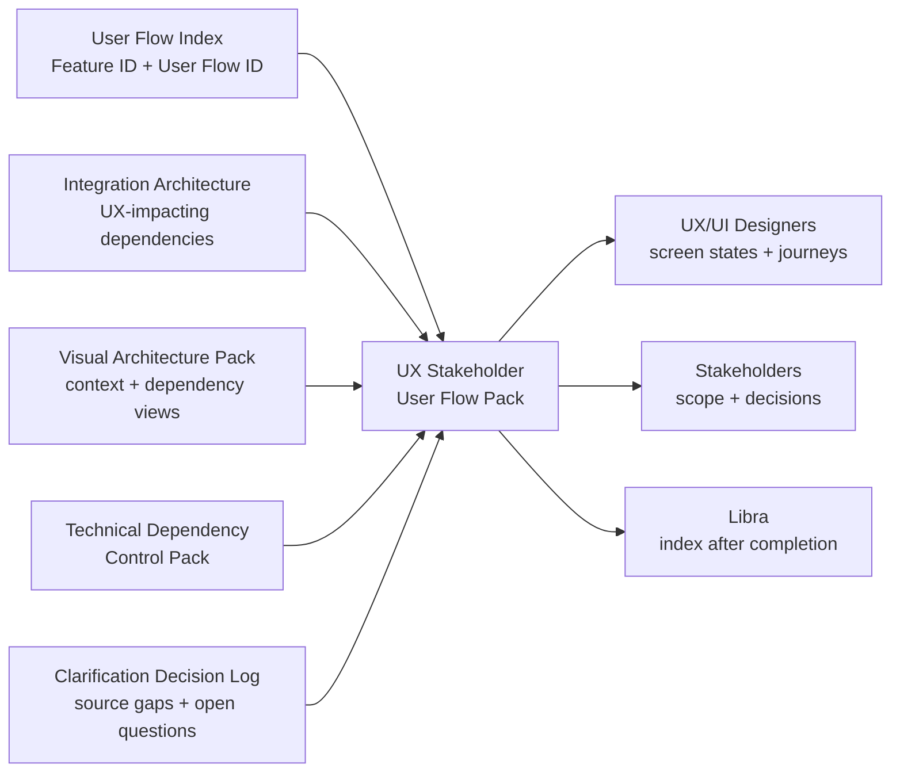
```mermaid
flowchart LR
    IDX["User Flow Index\nFeature ID + User Flow ID"] --> UX["UX Stakeholder\nUser Flow Pack"]
    ARCH["Integration Architecture\nUX-impacting dependencies"] --> UX
    VIS["Visual Architecture Pack\ncontext + dependency views"] --> UX
    CTRL["Technical Dependency\nControl Pack"] --> UX
    CLAR["Clarification Decision Log\nsource gaps + open questions"] --> UX
    UX --> DESIGN["UX/UI Designers\nscreen states + journeys"]
    UX --> STAKE["Stakeholders\nscope + decisions"]
    UX --> LIBRA["Libra\nindex after completion"]
```

## 1. Persona Journey Map

### 1.1 Existing PARQ Workplace User

User goal: enter One Bangkok App, access PARQ workplace services, and continue Retail activation later if needed.

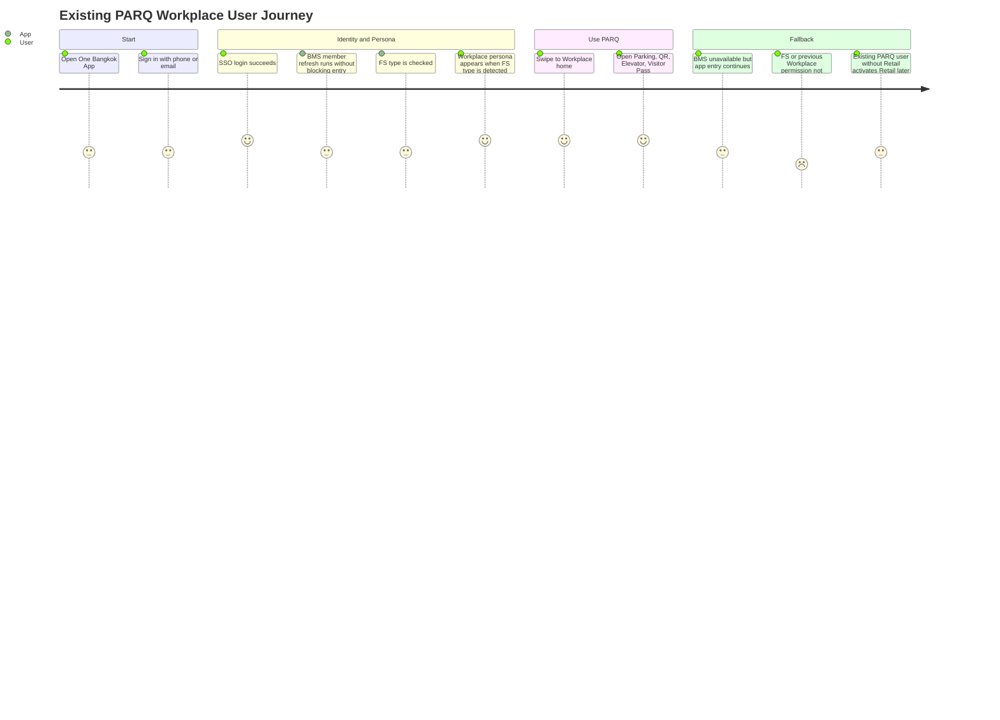
```mermaid
journey
    title Existing PARQ Workplace User Journey
    section Start
      Open One Bangkok App: 3: User
      Sign in with phone or email: 3: User
    section Identity and Persona
      SSO login succeeds: 4: User
      BMS member refresh runs without blocking entry: 3: App
      FS type is checked: 3: App
      Workplace persona appears when FS type is detected: 4: User
    section Use PARQ
      Swipe to Workplace home: 4: User
      Open Parking, QR, Elevator, Visitor Pass: 4: User
    section Fallback
      BMS unavailable but app entry continues: 3: User
      FS or previous Workplace permission not detected yet means Workplace home is not shown: 2: User
      Existing PARQ user without Retail activates Retail later: 3: User
```

Key screen/state candidates:
- Login
- Smart redirect from registration
- Retail home first
- Workplace home
- Workplace pending card
- Feature quick actions

Open UX/business questions:
- Final pending Workplace state when login succeeds but FS type is still pending.
- Final pending/degraded Workplace state when BMS refresh is unavailable but login succeeds.
- Support state if rare BMS member-bound-to-another-account is detected during login.
- Final quick action placement and visual hierarchy.

### 1.2 New PARQ Workplace User

User goal: register with phone-first onboarding, receive Retail account creation, and receive Workplace persona when FS is ready.

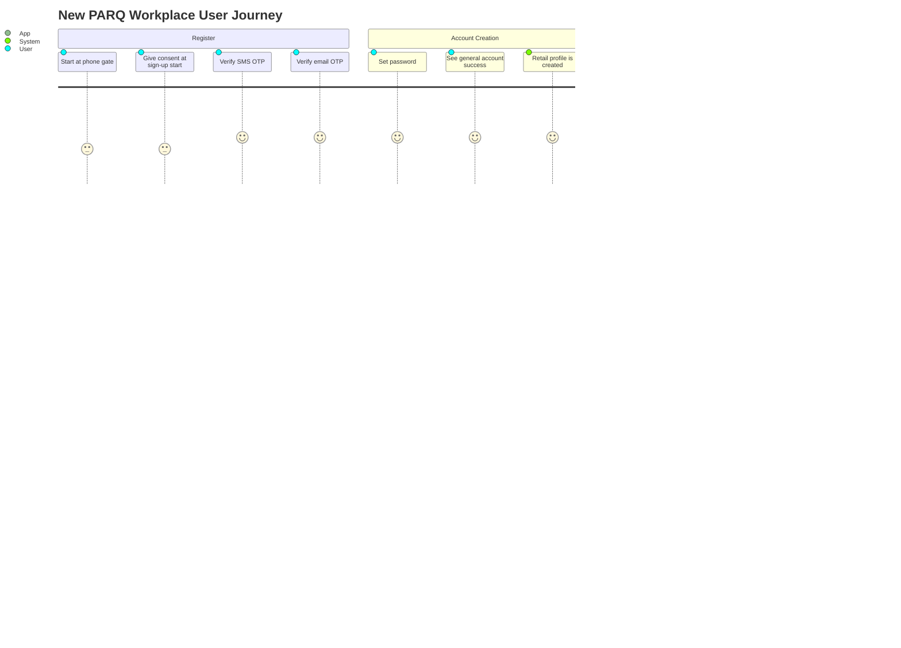
```mermaid
journey
    title New PARQ Workplace User Journey
    section Register
      Start at phone gate: 3: User
      Give consent at sign-up start: 3: User
      Verify SMS OTP: 4: User
      Verify email OTP: 4: User
    section Account Creation
      Set password: 4: User
      See general account success: 4: User
      Retail profile is created: 4: System
    section Workplace
      FS type is detected now or later: 3: App
      Workplace persona appears after FS detection: 4: User
    section Fallback
      Existing phone or email redirects to login: 3: User
```

Key screen/state candidates:
- Phone input gate
- SMS OTP
- Email input gate
- Email OTP
- Password setup
- General account success
- Existing account redirect
- Workplace pending state

Open UX/business questions:
- Final consent wording and version.
- Exact content on success screen if Workplace is pending.

### 1.3 User With Existing Retail / BZB Account

User goal: combine existing Retail and PARQ access without creating duplicates.

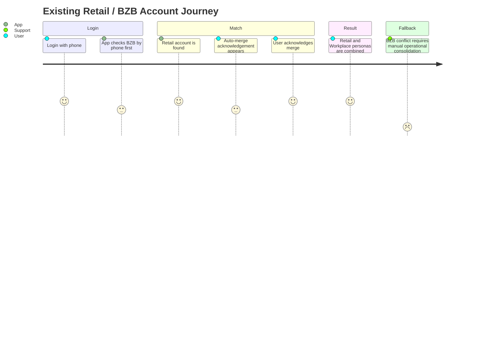
```mermaid
journey
    title Existing Retail / BZB Account Journey
    section Login
      Login with phone: 4: User
      App checks BZB by phone first: 3: App
    section Match
      Retail account is found: 4: App
      Auto-merge acknowledgement appears: 3: User
      User acknowledges merge: 4: User
    section Result
      Retail and Workplace personas are combined: 4: User
    section Fallback
      BZB conflict requires manual operational consolidation: 1: Support
```

Key screen/state candidates:
- Auto-merge acknowledgement
- BZB conflict / support-needed state
- Combined persona state

Open UX/business questions:
- Final Auto-merge acknowledgement copy and layout.
- Conflict handling copy when manual operational effort is required.

### 1.4 Visitor Host

User goal: invite visitor and manage pass validity.

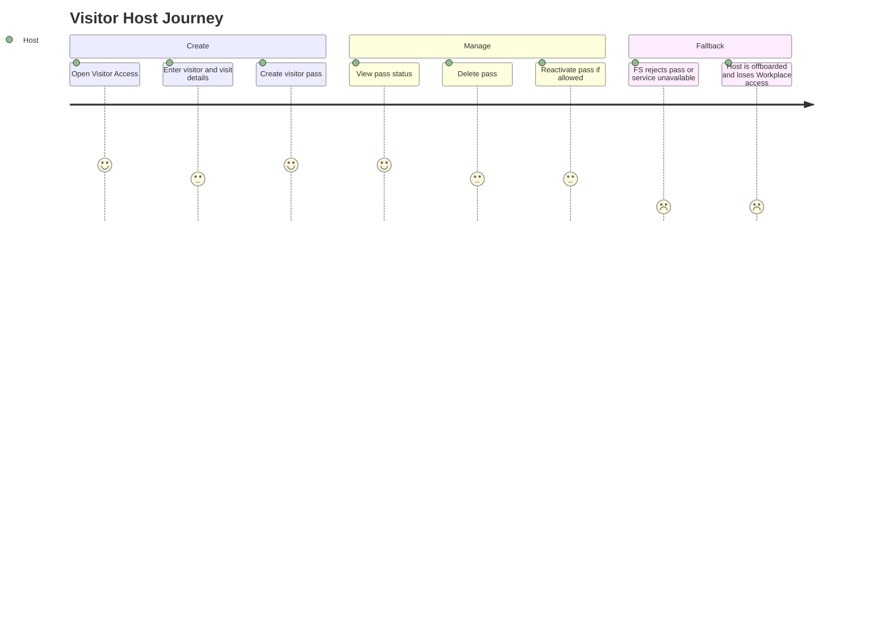
```mermaid
journey
    title Visitor Host Journey
    section Create
      Open Visitor Access: 4: Host
      Enter visitor and visit details: 3: Host
      Create visitor pass: 4: Host
    section Manage
      View pass status: 4: Host
      Delete pass: 3: Host
      Reactivate pass if allowed: 3: Host
    section Fallback
      FS rejects pass or service unavailable: 1: Host
      Host is offboarded and loses Workplace access: 1: Host
```

Key screen/state candidates:
- Visitor pass form
- Visitor pass detail
- Active/deleted/expired/reactivated states
- FS unavailable/error state

Open UX/business questions:
- Required visitor fields.
- Pass delivery method.
- Reactivation window.
- Floor-specific visitor access.

### 1.5 Visitor

User goal: use a valid pass to enter the building.

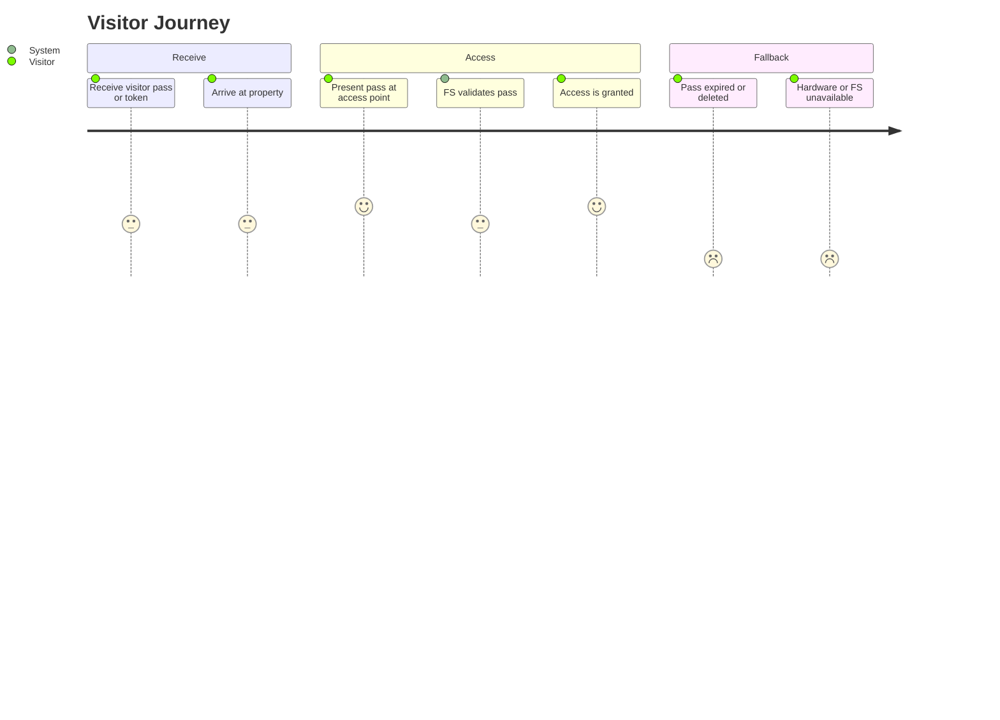
```mermaid
journey
    title Visitor Journey
    section Receive
      Receive visitor pass or token: 3: Visitor
      Arrive at property: 3: Visitor
    section Access
      Present pass at access point: 4: Visitor
      FS validates pass: 3: System
      Access is granted: 4: Visitor
    section Fallback
      Pass expired or deleted: 1: Visitor
      Hardware or FS unavailable: 1: Visitor
```

Key screen/state candidates:
- Visitor pass/token display or handoff
- Access denied state
- Expired/deleted pass state

Open UX/business questions:
- Whether visitor receives QR/token through app, SMS, email, or host sharing.
- Site fallback process when access hardware is unavailable.

### 1.6 Parking User

User goal: check availability, monitor traffic, retrieve/import ticket, and pay if needed.

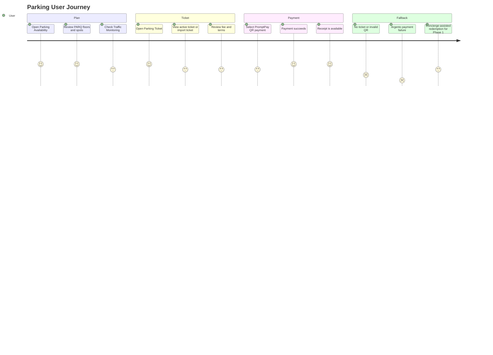
```mermaid
journey
    title Parking User Journey
    section Plan
      Open Parking Availability: 4: User
      Review PARQ floors and spots: 4: User
      Check Traffic Monitoring: 3: User
    section Ticket
      Open Parking Ticket: 4: User
      View active ticket or import ticket: 3: User
      Review fee and terms: 3: User
    section Payment
      Select PromptPay QR payment: 3: User
      Payment succeeds: 4: User
      Receipt is available: 4: User
    section Fallback
      No ticket or invalid QR: 2: User
      Argento payment failure: 1: User
      Concierge-assisted redemption for Phase 1: 3: User
```

Key screen/state candidates:
- Parking Availability
- Traffic Monitoring
- Parking Ticket
- Import ticket
- Confirm Parking Ticket
- Payment Method
- QR Payment
- Payment Success
- Payment Error
- Receipt

Open UX/business questions:
- PARQ rate source and floor mapping.
- My QR behavior at PARQ parking gate.
- Concierge redemption handoff message.
- Payment reconciliation fallback.

### 1.7 CMS / Admin / Support User

User goal: identify user persona, company, tower, and support state where relevant.

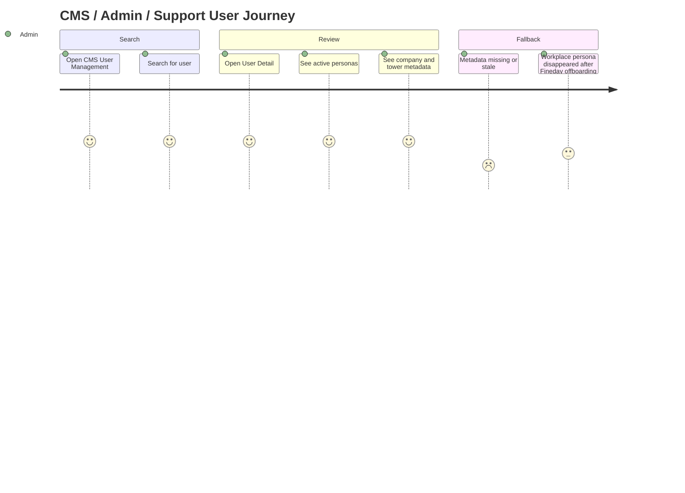
```mermaid
journey
    title CMS / Admin / Support User Journey
    section Search
      Open CMS User Management: 4: Admin
      Search for user: 4: Admin
    section Review
      Open User Detail: 4: Admin
      See active personas: 4: Admin
      See company and tower metadata: 4: Admin
    section Fallback
      Metadata missing or stale: 2: Admin
      Workplace persona disappeared after Fineday offboarding: 3: Admin
```

Key screen/state candidates:
- CMS User Management list
- CMS User Detail metadata section
- View-only persona/company/tower metadata
- Missing/stale metadata state

Open UX/business questions:
- Whether CMS filters are needed for Phase 1.
- Whether all admins can view cross-property data in production.

## 2. UX Flow Diagrams

### 2.1 Existing PARQ User Sign-In

User goal: sign in with existing PARQ identity and access OBK/PARQ services.

Entry point: OBK App Login or smart redirect from registration.

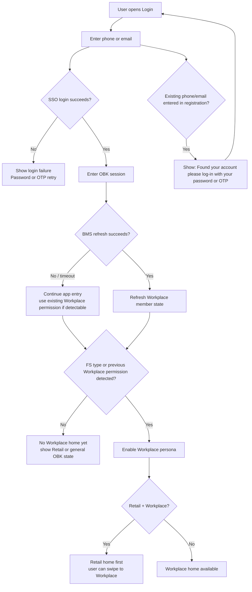
```mermaid
flowchart TD
    A["User opens Login"] --> B["Enter phone or email"]
    B --> C{"SSO login succeeds?"}
    C -- "No" --> E1["Show login failure\nPassword or OTP retry"]
    C -- "Yes" --> D["Enter OBK session"]
    D --> BMS{"BMS refresh succeeds?"}
    BMS -- "No / timeout" --> BMSF["Continue app entry\nuse existing Workplace permission if detectable"]
    BMS -- "Yes" --> BMSU["Refresh Workplace member state"]
    BMSF --> F{"FS type or previous Workplace permission detected?"}
    BMSU --> F
    F -- "No" --> P["No Workplace home yet\nshow Retail or general OBK state"]
    F -- "Yes" --> G["Enable Workplace persona"]
    G --> H{"Retail + Workplace?"}
    H -- "Yes" --> I["Retail home first\nuser can swipe to Workplace"]
    H -- "No" --> J["Workplace home available"]
    B --> K{"Existing phone/email entered in registration?"}
    K -- "Yes" --> L["Show: Found your account please log-in with your password or OTP"]
    L --> A
```

UX screen/state candidates:
- Login
- OTP retry
- Forgot password
- Smart redirect message
- Retail home first
- Workplace home
- Workplace not-yet-detected state
- BMS refresh unavailable but login succeeds
- Rare BMS member-bound-to-another-account support state

Open UX/business questions:
- Exact UI for login success with FS pending.
- Exact UI for login success with BMS refresh unavailable.
- Exact support copy/path for rare BMS member-bound-to-another-account.

### 2.2 New User Onboarding

User goal: create a new OBK account through phone-first registration and receive Retail profile automatically.

Entry point: Register > Phone input gate.

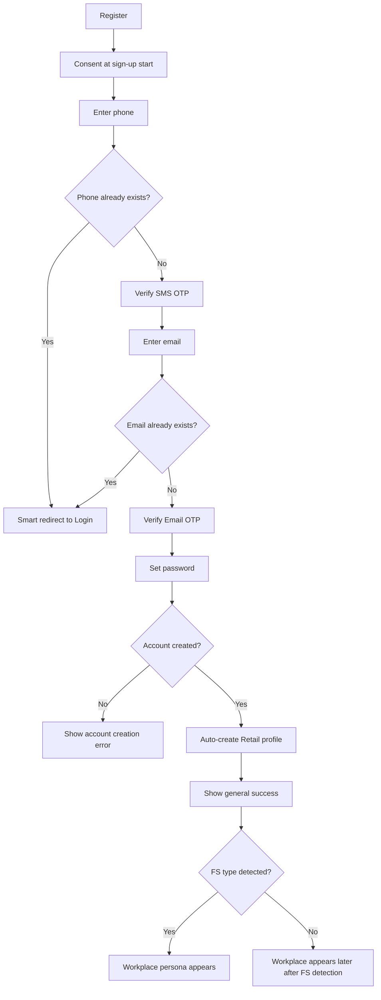
```mermaid
flowchart TD
    A["Register"] --> B["Consent at sign-up start"]
    B --> C["Enter phone"]
    C --> D{"Phone already exists?"}
    D -- "Yes" --> R["Smart redirect to Login"]
    D -- "No" --> E["Verify SMS OTP"]
    E --> F["Enter email"]
    F --> G{"Email already exists?"}
    G -- "Yes" --> R
    G -- "No" --> H["Verify Email OTP"]
    H --> I["Set password"]
    I --> J{"Account created?"}
    J -- "No" --> E1["Show account creation error"]
    J -- "Yes" --> K["Auto-create Retail profile"]
    K --> L["Show general success"]
    L --> M{"FS type detected?"}
    M -- "Yes" --> N["Workplace persona appears"]
    M -- "No" --> O["Workplace appears later after FS detection"]
```

UX screen/state candidates:
- Consent
- Phone gate
- SMS OTP
- Email gate
- Email OTP
- Password setup
- Existing account redirect
- General success
- Workplace pending after registration

Open UX/business questions:
- Final consent wording/version.

### 2.3 Retail Account Matching / Conflict

User goal: combine Retail and PARQ access if a matching BZB account exists.

Entry point: Post-login identity check.

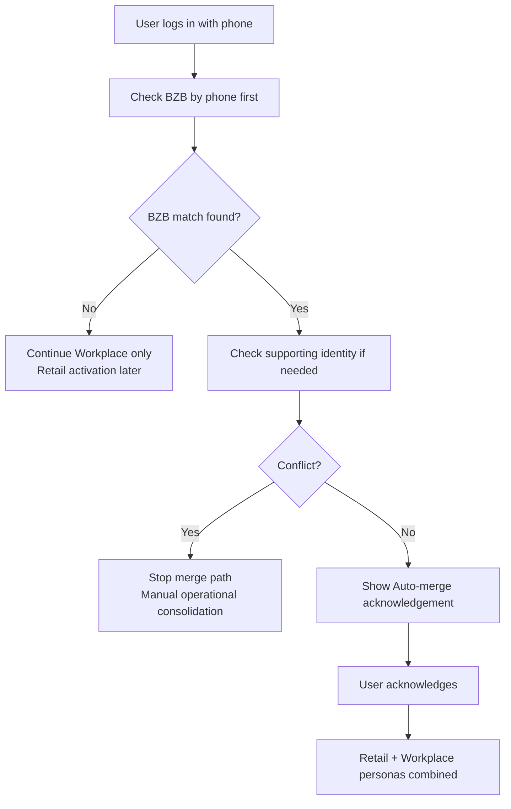
```mermaid
flowchart TD
    A["User logs in with phone"] --> B["Check BZB by phone first"]
    B --> C{"BZB match found?"}
    C -- "No" --> D["Continue Workplace only\nRetail activation later"]
    C -- "Yes" --> E["Check supporting identity if needed"]
    E --> F{"Conflict?"}
    F -- "Yes" --> G["Stop merge path\nManual operational consolidation"]
    F -- "No" --> H["Show Auto-merge acknowledgement"]
    H --> I["User acknowledges"]
    I --> J["Retail + Workplace personas combined"]
```

UX screen/state candidates:
- Auto-merge acknowledgement
- Conflict/support-needed state
- Workplace only with later Retail activation

Open UX/business questions:
- Final Auto-merge acknowledgement copy/design.
- Conflict support wording.

### 2.4 Workplace Persona Activation

User goal: access PARQ Workplace home and relevant quick actions.

Entry point: App home / persona swipe.

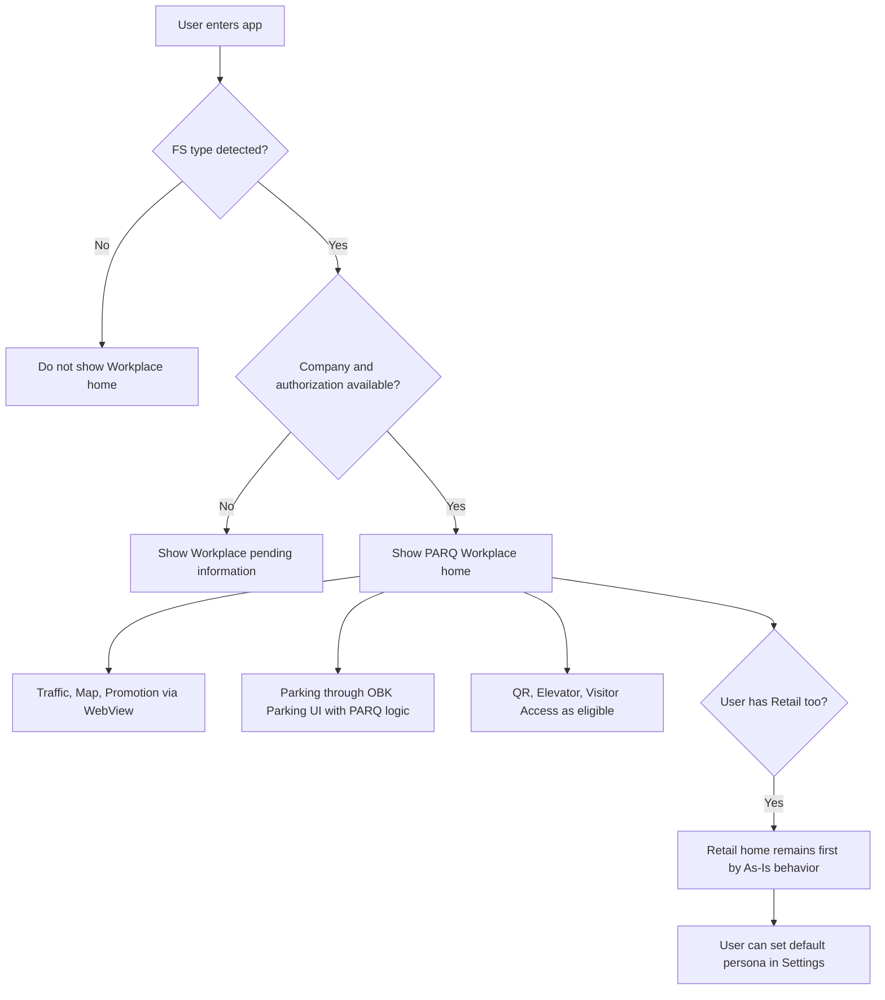
```mermaid
flowchart TD
    A["User enters app"] --> B{"FS type detected?"}
    B -- "No" --> C["Do not show Workplace home"]
    B -- "Yes" --> D{"Company and authorization available?"}
    D -- "No" --> E["Show Workplace pending information"]
    D -- "Yes" --> F["Show PARQ Workplace home"]
    F --> G["Traffic, Map, Promotion via WebView"]
    F --> H["Parking through OBK Parking UI with PARQ logic"]
    F --> I["QR, Elevator, Visitor Access as eligible"]
    F --> J{"User has Retail too?"}
    J -- "Yes" --> K["Retail home remains first by As-Is behavior"]
    K --> L["User can set default persona in Settings"]
```

UX screen/state candidates:
- Workplace home/card
- Workplace pending state
- Default persona setting
- Quick action grid
- WebView loading/error state

Open UX/business questions:
- Pending card design and quick action placement.
- WebView URLs/content owner.

### 2.5 My QR / Turnstile Access

User goal: use account QR as identity for physical access.

Entry point: My QR and turnstile scanner.

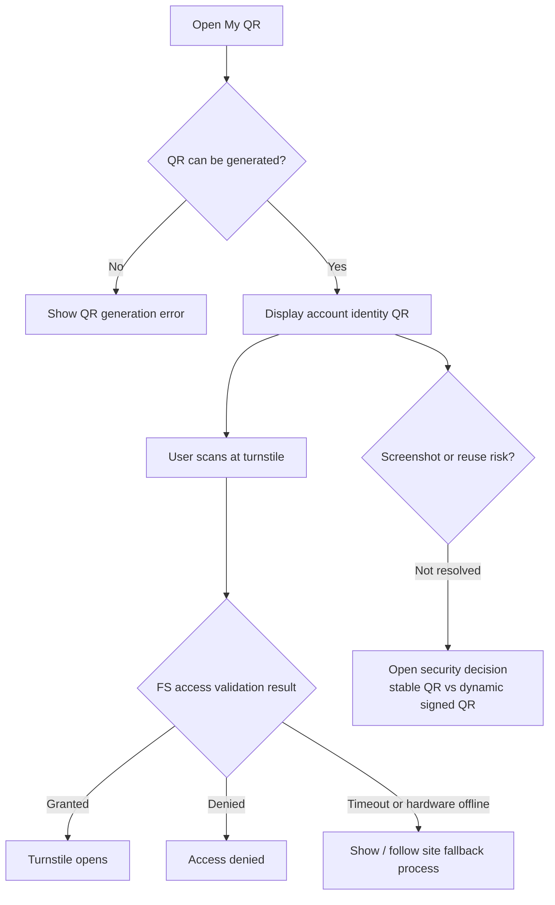
```mermaid
flowchart TD
    A["Open My QR"] --> B{"QR can be generated?"}
    B -- "No" --> E1["Show QR generation error"]
    B -- "Yes" --> C["Display account identity QR"]
    C --> D["User scans at turnstile"]
    D --> E{"FS access validation result"}
    E -- "Granted" --> F["Turnstile opens"]
    E -- "Denied" --> G["Access denied"]
    E -- "Timeout or hardware offline" --> H["Show / follow site fallback process"]
    C --> I{"Screenshot or reuse risk?"}
    I -- "Not resolved" --> Q["Open security decision\nstable QR vs dynamic signed QR"]
```

UX screen/state candidates:
- My QR
- QR generation error
- Access denied
- Hardware unavailable/site fallback

Open UX/business questions:
- QR validity and refresh behavior.
- Turnstile outage/fallback process.

### 2.6 Elevator Access

User goal: call elevator to an authorized floor.

Entry point: PARQ Workplace home > Elevator.

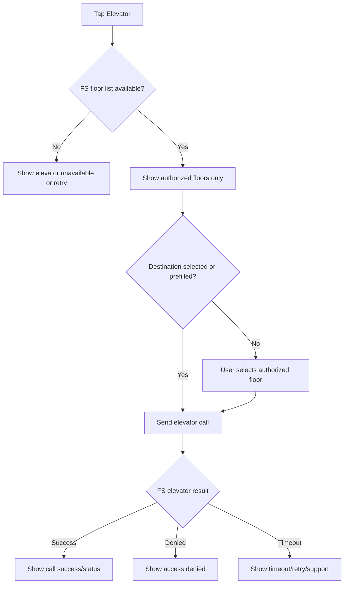
```mermaid
flowchart TD
    A["Tap Elevator"] --> B{"FS floor list available?"}
    B -- "No" --> E1["Show elevator unavailable or retry"]
    B -- "Yes" --> C["Show authorized floors only"]
    C --> D{"Destination selected or prefilled?"}
    D -- "No" --> E["User selects authorized floor"]
    D -- "Yes" --> F["Send elevator call"]
    E --> F
    F --> G{"FS elevator result"}
    G -- "Success" --> H["Show call success/status"]
    G -- "Denied" --> I["Show access denied"]
    G -- "Timeout" --> J["Show timeout/retry/support"]
```

UX screen/state candidates:
- Elevator quick action
- Floor selector
- Call success/status
- Access denied
- Timeout/retry/support state

Open UX/business questions:
- Exact elevator UX and whether destination selection is required.
- FS response codes and hardware test schedule.

### 2.7 Parking Availability

User goal: check parking capacity before deciding where to park.

Entry point: Parking Availability quick action or Parking Ticket shortcut.

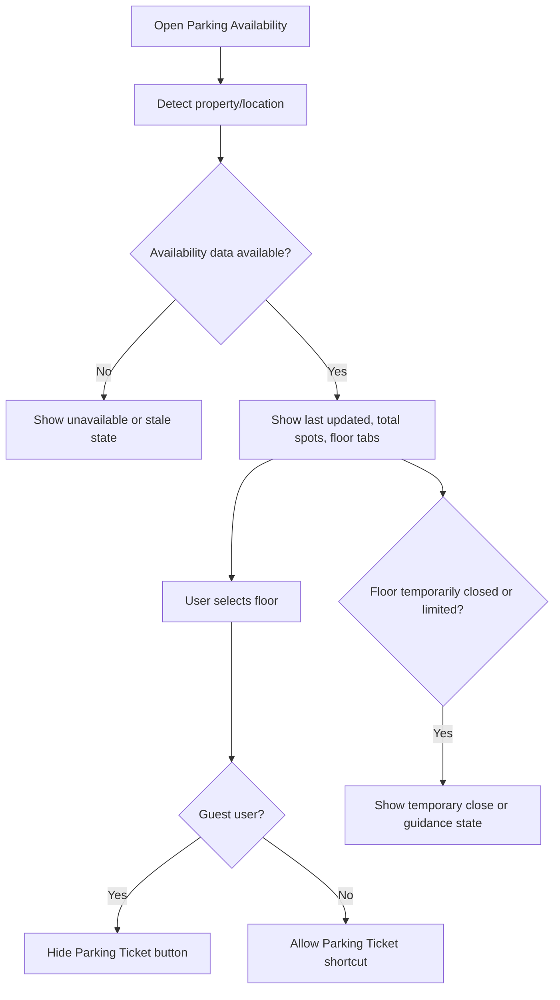
```mermaid
flowchart TD
    A["Open Parking Availability"] --> B["Detect property/location"]
    B --> C{"Availability data available?"}
    C -- "No" --> E1["Show unavailable or stale state"]
    C -- "Yes" --> D["Show last updated, total spots, floor tabs"]
    D --> E["User selects floor"]
    E --> F{"Guest user?"}
    F -- "Yes" --> G["Hide Parking Ticket button"]
    F -- "No" --> H["Allow Parking Ticket shortcut"]
    D --> I{"Floor temporarily closed or limited?"}
    I -- "Yes" --> J["Show temporary close or guidance state"]
```

UX screen/state candidates:
- Parking Availability
- Floor tabs
- Last updated/stale state
- Temporary close state
- Guest view without Parking Ticket

Open UX/business questions:
- PARQ floor labels, default tab, refresh interval, and weekday guidance.

### 2.8 Parking Ticket and Payment

User goal: view/import ticket, understand fee, pay if needed, and receive receipt.

Entry point: Parking Ticket, My QR at gate, or ticket import.

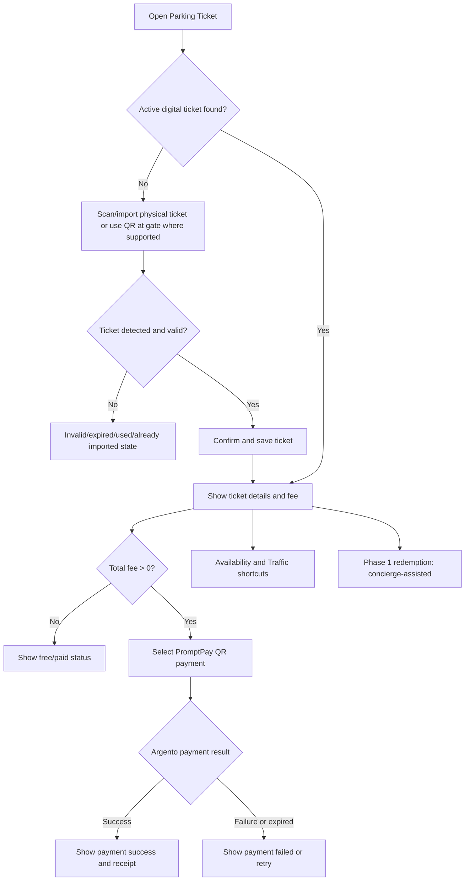
```mermaid
flowchart TD
    A["Open Parking Ticket"] --> B{"Active digital ticket found?"}
    B -- "No" --> C["Scan/import physical ticket or use QR at gate where supported"]
    C --> D{"Ticket detected and valid?"}
    D -- "No" --> E1["Invalid/expired/used/already imported state"]
    D -- "Yes" --> E["Confirm and save ticket"]
    B -- "Yes" --> F["Show ticket details and fee"]
    E --> F
    F --> G{"Total fee > 0?"}
    G -- "No" --> H["Show free/paid status"]
    G -- "Yes" --> I["Select PromptPay QR payment"]
    I --> J{"Argento payment result"}
    J -- "Success" --> K["Show payment success and receipt"]
    J -- "Failure or expired" --> L["Show payment failed or retry"]
    F --> M["Availability and Traffic shortcuts"]
    F --> N["Phase 1 redemption: concierge-assisted"]
```

UX screen/state candidates:
- Parking Ticket
- Import Physical Ticket
- Confirm Parking Ticket
- Invalid QR
- Payment Method
- QR Payment
- Payment Success
- Payment Failed
- Receipt
- Concierge redemption message

Open UX/business questions:
- PARQ rate table/source.
- Park/floor mapping.
- My QR gate behavior.
- Concierge handoff message.
- Payment reconciliation fallback.

### 2.9 Visitor Pass Creation and Usage

User goal: host creates a visitor pass and visitor uses it according to FS authorization.

Entry point: Workplace home > Visitor Access.

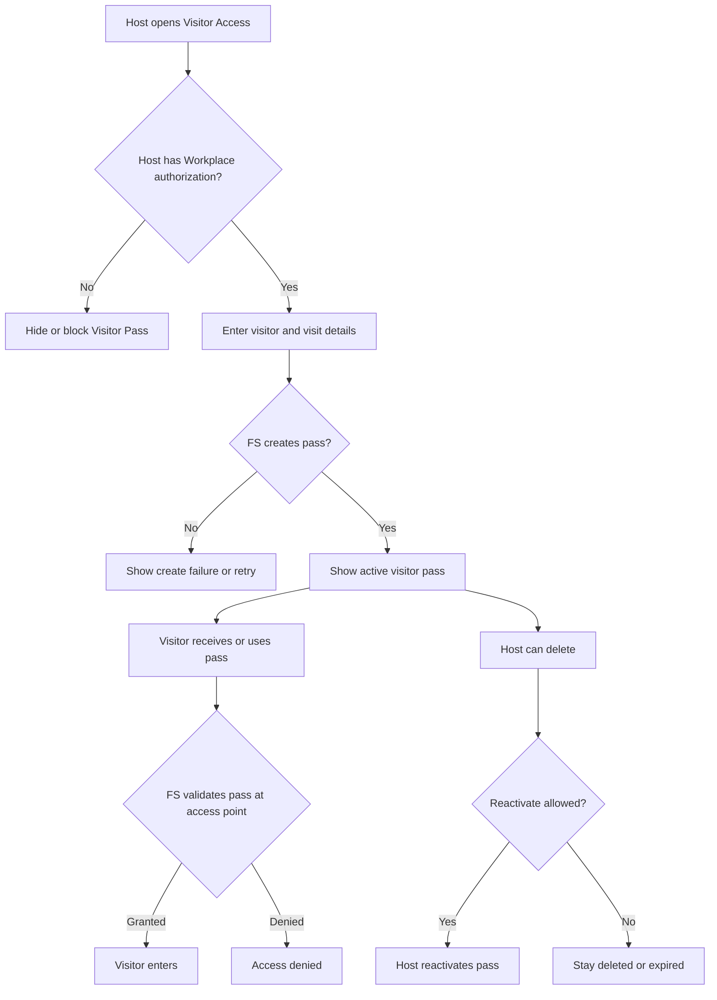
```mermaid
flowchart TD
    A["Host opens Visitor Access"] --> B{"Host has Workplace authorization?"}
    B -- "No" --> E1["Hide or block Visitor Pass"]
    B -- "Yes" --> C["Enter visitor and visit details"]
    C --> D{"FS creates pass?"}
    D -- "No" --> E["Show create failure or retry"]
    D -- "Yes" --> F["Show active visitor pass"]
    F --> G["Visitor receives or uses pass"]
    G --> H{"FS validates pass at access point"}
    H -- "Granted" --> I["Visitor enters"]
    H -- "Denied" --> J["Access denied"]
    F --> K["Host can delete"]
    K --> L{"Reactivate allowed?"}
    L -- "Yes" --> M["Host reactivates pass"]
    L -- "No" --> N["Stay deleted or expired"]
```

UX screen/state candidates:
- Visitor Pass create form
- Visitor Pass detail/status
- Delete confirmation
- Reactivate state
- Expired/deleted state
- Access denied state

Open UX/business questions:
- Visitor fields.
- Pass delivery method.
- Reactivation window.
- Floor-specific access.

### 2.10 Notification Receiving

User goal: receive relevant OBK notifications for PARQ audience.

Entry point: Push notification or OBK notification center.

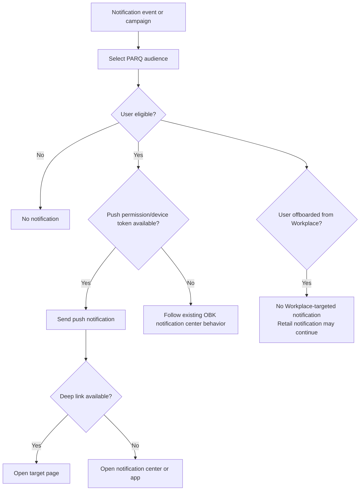
```mermaid
flowchart TD
    A["Notification event or campaign"] --> B["Select PARQ audience"]
    B --> C{"User eligible?"}
    C -- "No" --> D["No notification"]
    C -- "Yes" --> E{"Push permission/device token available?"}
    E -- "Yes" --> F["Send push notification"]
    E -- "No" --> G["Follow existing OBK notification center behavior"]
    F --> H{"Deep link available?"}
    H -- "Yes" --> I["Open target page"]
    H -- "No" --> J["Open notification center or app"]
    C --> K{"User offboarded from Workplace?"}
    K -- "Yes" --> L["No Workplace-targeted notification\nRetail notification may continue"]
```

UX screen/state candidates:
- Push notification
- Notification center item
- Deep link target
- Permission off state

Open UX/business questions:
- PARQ audience source.
- In-app inbox requirement.
- Campaign owner.
- Final notification types.

### 2.11 Account Lifecycle: Offboarding, Delete, Hard Delete, Reactivation

User goal: keep the right persona state after company offboarding, delete an account when requested, and reactivate within the allowed period.

Entry point: Account Settings for deletion; FS/Fineday for company offboarding.

```mermaid
flowchart TD
    subgraph OFF["Company Offboarding / Workplace Persona Removal"]
        A1["Employee resigns from company"] --> A2["Forward system marks FS inactive"]
        A3["User opens app"] --> A4["App syncs FS"]
        A2 --> A4
        A4 --> A5{"Detect FS type?"}
        A5 -- "No" --> A6["Display account persona without Workplace"]
        A5 -- "Yes" --> A7["Display persona card with Workplace"]
    end

    subgraph DEL["User Delete Account"]
        B1["User selects Delete Account"] --> B2["User confirms delete"]
        B2 --> B3["System marks account as Suspens"]
        B3 --> B4["Display delete successful"]
    end

    subgraph HARD["System Hard Delete"]
        C1["Suspens status with timestamp"] --> C2["Daily cronjob checks account"]
        C2 --> C3{"Deleted over 30 days?"}
        C3 -- "Yes" --> C4["Hard delete user account"]
        C3 -- "No" --> C5["Keep stored in DB"]
        C5 --> C2
    end

    subgraph REACT["User Reactivate Account"]
        D1["User logs in"] --> D2{"Account marked Suspens?"}
        D2 -- "No" --> D7["Go to login process"]
        D2 -- "Yes" --> D3{"Deleted over 30 days?"}
        D3 -- "Yes" --> D4["Display cannot found account"]
        D3 -- "No" --> D5["Display option to reactivate account"]
        D5 --> D6{"Confirm reactivation?"}
        D6 -- "Yes" --> D8["System clears Suspens status"]
        D8 --> D7
        D6 -- "No" --> D1
    end
```

UX screen/state candidates:
- Account persona without Workplace
- Persona card with Workplace
- Delete account confirmation
- Delete successful
- Suspended account / reactivation option
- Cannot find account after over 30 days
- Hard-deleted account state
- Workplace removed after FS/Fineday offboarding state

Open UX/business questions:
- Confirm exact system status naming and user-facing copy for `Suspens`.
- Confirm whether "deleted over 30 days" should be shown as Day 31, after 30 full days, or another exact timestamp rule.
- Confirm sync timing/SLA for FS/Fineday offboarding and daily hard-delete job.

## 3. UX Flow to Feature / User Flow Mapping

| UX Flow | Related Feature ID | User Flow ID | Primary persona | Main dependency visible to user |
|---|---:|---|---|---|
| Existing PARQ user sign-in | 1.1 | UF-001 | Existing PARQ workplace user | SSO failure, FS delayed Workplace persona, BZB lookup |
| New user onboarding | 1.3 | UF-003 | New PARQ workplace user | OTP, consent, BZB Retail creation, FS pending Workplace |
| Retail account matching / conflict | 1.2 | UF-002 | User with existing Retail/BZB account | BZB match, BZB conflict, Auto-merge acknowledgement |
| Workplace persona activation | 2.1 | UF-005 | PARQ workplace user | FS type detection, WebView availability, pending state |
| Multi-tower context support | 2.2 | UF-006 | Multi-property workplace user | FS tower/floor data, saved tower validity, hardware lock |
| CMS user support visibility | 2.3 | UF-007 | CMS/admin/support user | CMS view-only metadata, FS/BZB sync state |
| Profile management | 3.1 | UF-008 | PARQ workplace user | FS company/tower/floor data, property contact fallback |
| My QR / turnstile access | 4.1 and 8.2 | UF-009 and UF-016 | PARQ workplace user | QR generation, FS access denial, turnstile timeout |
| Elevator access | 8.1 | UF-015 | Authorized PARQ workplace user | FS floor authorization, elevator timeout |
| Parking availability | 5.1 | UF-010 | Parking user | FS availability, stale data, guest hidden ticket action |
| Traffic monitoring | 5.2 | UF-011 | Parking user | Traffic content source, wrong-property fallback |
| Parking ticket and payment | 5.3 | UF-012 | Parking user | FS ticket lookup, Argento payment failure, receipt |
| Visitor pass creation and usage | 6.1 | UF-013 | Visitor host and visitor | FS visitor authorization, pass validity, access denial |
| Notification receiving | 7.1 | UF-014 | PARQ workplace user | Audience segmentation, permission off, deep link |
| Account lifecycle: company offboarding, delete, hard delete, reactivation | 1.4 | UF-004 | Retail + Workplace user | FS/Fineday offboarding, Suspens status, daily hard-delete job, SSO/BZB cleanup |

## 4. Consolidated Screen-State Needs

| Screen / State Candidate | Related flows | Why UX should care | Open decision |
|---|---|---|---|
| Workplace pending state | Sign-in, onboarding, persona activation | User may have successful login but no Workplace home yet | Copy and visual treatment |
| BMS non-blocking refresh unavailable | Sign-in, persona activation | User can enter app but Workplace persona may be stale or pending refresh | Copy, retry visibility, and whether to show pending state |
| Rare BMS member bound to another account | Sign-in, onboarding, identity update | User can enter app but Workplace entitlement may need support/manual correction | Support copy and escalation route |
| Auto-merge acknowledgement | Retail matching | User cannot deny merge; screen must be clear and low-friction | Final copy and design |
| BZB conflict / support state | Retail matching | User cannot continue affected journey | Conflict copy and support route |
| Consent at sign-up start | New onboarding | Legal/compliance acceptance and user trust | Final consent wording/version |
| Smart redirect message | Sign-in and onboarding | Prevent duplicate account creation | Copy is working-confirmed but should be placed in UI spec |
| Missing floor/contact concierge | Profile | Prevent broken profile data from becoming support confusion | Property contact mapping and copy |
| QR unavailable / access denied | My QR, turnstile, parking gate | QR display does not guarantee access | QR validity and denial copy |
| Elevator timeout/retry | Elevator | Hardware failure is user-visible and time-sensitive | Timeout, retry, support fallback |
| Parking unavailable/stale | Parking availability | User needs trust in capacity data | Freshness threshold and stale display |
| Parking payment failed/expired | Parking payment | Money flow must be reassuring and recoverable | Payment reconciliation and retry language |
| Concierge-assisted redemption | Parking payment | Avoid Phase 1 vs Phase 1.5 confusion | Exact handoff message |
| Visitor pass denied/expired/deleted | Visitor | Host and visitor need clear next step | Pass delivery and status copy |
| Notification permission off | Notification | User may not receive push | Existing OBK behavior confirmation |
| Company offboarding / Workplace removal | Account lifecycle | User may keep account but lose Workplace persona after FS/Fineday offboarding | FS sync timing and fallback copy |
| Account delete / Suspens state | Account lifecycle | User must understand deletion request and temporary suspended state | Confirm exact status naming and user-facing copy |
| Account reactivation | Account lifecycle | User can recover only within the allowed window | Confirm over-30-days timing wording |

## 5. Open UX / Business Questions

These questions are intentionally separated from confirmed flows.

| Area | Open question | Impact |
|---|---|---|
| Sign-in | What exact UI state appears when login succeeds but FS type is pending? | Workplace access may look missing. |
| Sign-in | What exact UI state appears when login succeeds but BMS refresh is unavailable? | User can enter the app, but Workplace persona freshness may be unclear. |
| Sign-in | What support copy appears if rare BMS member-bound-to-another-account is detected? | User should not be asked to solve a backend identity conflict without support. |
| Retail merge | What is the final Auto-merge acknowledgement copy/design? | User cannot deny merge, so wording matters. |
| Registration | What is the final consent wording/version? | Legal/compliance and UAT are blocked. |
| Workplace home | What is the final pending Workplace card state and quick action placement? | UX cannot finalize home behavior. |
| WebView | What are final Traffic, Map, and Promotion URLs/content owners? | Feature routes may point to wrong content. |
| Multi-tower | What happens when saved tower is no longer authorized? | User may see stale context. |
| CMS | Are property/persona/company/status/tower filters in Phase 1? | CMS scope may expand. |
| Profile | What is final missing-floor error copy and property contact mapping? | User support routing is unclear. |
| QR | Is QR stable account identity or dynamic signed QR with refresh? | Security and UX behavior are blocked. |
| Parking availability | What are PARQ floor labels, default tab, refresh interval, and weekday guidance? | UI and test expected results are unclear. |
| Traffic | What is the PARQ traffic source and entrance/exit label set? | Wrong-property traffic is possible. |
| Parking payment | What are PARQ rate source, park/floor mapping, and payment reconciliation rules? | Incorrect fee/payment state risk. |
| Parking gate | Does My QR at PARQ parking gate create/import ticket automatically? | Entry-to-ticket journey is unclear. |
| Visitor pass | What visitor fields, pass delivery method, reactivation window, and floor-specific access rules apply? | Form and pass status states are blocked. |
| Notification | What are PARQ audience source, inbox requirement, campaign owner, and notification types? | Wrong audience risk. |
| Elevator | What is exact elevator UX, floor selection rule, response code set, and hardware UAT schedule? | Hardware path cannot be finalized. |
| Turnstile | What is QR timeout/fallback behavior and access log requirement? | Security and site operations need alignment. |
| Lifecycle | What exact system status value and user-facing wording should be used for `Suspens`? | Implementation, UX copy, and UAT expected results need the same term. |
| Lifecycle | Should "deleted over 30 days" be described as Day 31, after 30 full days, or another exact timestamp rule? | Reactivation and hard-delete expectations need precise timing. |
| Lifecycle | What is the SLA for FS/Fineday sync and the daily hard-delete job? | Offboarding/deletion expectations and support handling need timing. |

## 6. Stakeholder Review Guide

Recommended review sequence:

1. Review persona journeys first to validate the story by user type.
2. Review UX flow diagrams to confirm screen states and decision points.
3. Review mapping table to confirm Feature ID / User Flow ID traceability.
4. Review open questions and assign owners before UX/UI finalizes wireframes.
5. Send this artifact to Libra for indexing once stakeholder review is accepted.

## 7. Handoff Notes

Owner: Molly / Assistant PO

Input files:
- `AGENTS.md`
- `MASTER_INDEX.md`
- `TASK_BOARD.md`
- `HANDOFF_LOG.md`
- `01_Source_of_Truth/PARQ_User_Flow/The_PARQ_Phase_1_User_Flow_Index.xlsx`
- `01_Source_of_Truth/API_and_System_References/00_2025_Document/User Flow_20260608.pdf`
- `01_Source_of_Truth/PARQ_User_Flow/Offboarding_User_Flow.png`
- `03_Architecture/PARQ_User_Flow_Integration_Architecture.md`
- `03_Architecture/PARQ_Visual_Architecture_and_Flow_Pack.md`
- `03_Architecture/PARQ_Technical_Dependency_Control_Pack.md`
- `01_Source_of_Truth/Clarifications/PARQ_Clarification_Decision_Log.md`

Output file path: `02_Discovery/PARQ_UX_Stakeholder_User_Flow_Pack.md`

Status: Draft / ready for stakeholder review and Libra indexing

Downstream consumer:
- UX/UI designers
- PARQ / Orchestrator
- Libra / Project Librarian
- Quinn / QA Lead
