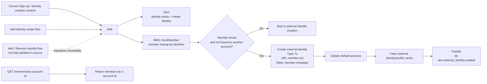
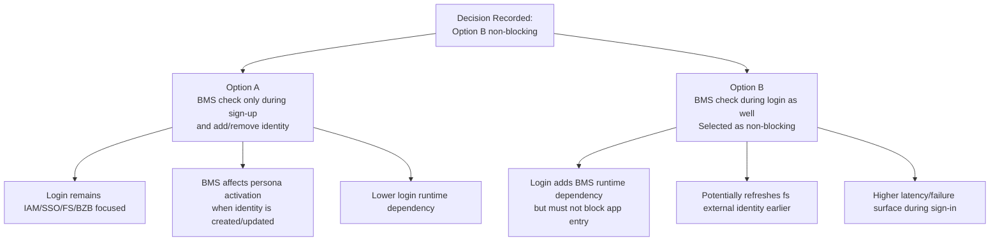
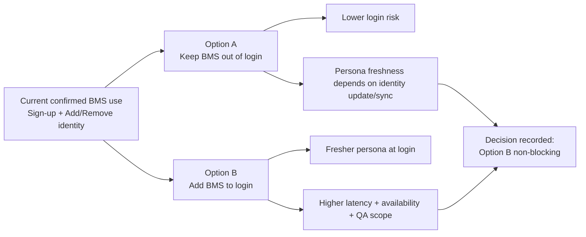

# PARQ BMS Identity Flow Impact Assessment

Owner: Simon / Senior Solution Architect

Input files:
- `AGENTS.md`
- `MASTER_INDEX.md`
- `TASK_BOARD.md`
- `HANDOFF_LOG.md`
- `01_Source_of_Truth/API_and_System_References/00_2025_Document/api-members-by-account-id.md`
- `01_Source_of_Truth/API_and_System_References/00_2025_Document/add_identity_flow.md`
- `03_Architecture/PARQ_User_Flow_Integration_Architecture.md`
- `03_Architecture/PARQ_Data_API_Context_Boundary_Vendor_Matrix.md`
- `03_Architecture/PARQ_Technical_Dependency_Control_Pack.md`
- `03_Architecture/PARQ_Visual_Architecture_and_Flow_Pack.md`
- `02_Discovery/PARQ_UX_Stakeholder_User_Flow_Pack.md`

Output file path: `03_Architecture/PARQ_BMS_Identity_Flow_Impact_Assessment.md`

Status: Draft / Decision recorded: Option B non-blocking with open questions

Downstream consumer:
- PARQ / Orchestrator for decision tracking
- Simon / Senior Solution Architect for architecture update planning
- Molly / Assistant PO for UX/user-flow impact review after decision
- Quinn / QA Lead for SIT/UAT planning after decision
- Libra / Project Librarian for indexing and traceability

Decision recorded: PARQ will check BMS member during login using Option B as a non-blocking refresh.

Rule applied: This assessment records the approved direction from PARQ clarification, but does not invent missing API details, owners, SLAs, timeout values, environments, or support copy.

## 1. Current-State BMS Usage Summary

Current confirmed BMS behavior from repository artifacts:

| Confirmed Item | Repository Evidence | Impact |
|---|---|---|
| BMS is more than account-deletion cleanup. | `add_identity_flow.md`, `api-members-by-account-id.md`, `PARQ_Clarification_Decision_Log.md` | BMS must be considered in identity/persona activation flows. |
| Current app checks BMS member in Sign-up and Add / Remove identity flow. | `PARQ_Clarification_Decision_Log.md` records `SF-BMS-001`. | Current behavior is identity-flow related, not login-flow confirmed. |
| Add Identity create flow runs `checkMember` for new identities. | `add_identity_flow.md` | New email/phone can trigger BMS member lookup after OTP and SSO identity creation. |
| `checkMember` can create external identity type `fs`. | `add_identity_flow.md` | BMS member discovery can activate workplace persona data through IAM external identity state. |
| `checkMember` skips member creation if no BMS member is found. | `add_identity_flow.md` | No BMS match should not automatically be treated as fatal in the current Add Identity flow. |
| `checkMember` skips member creation if the member is already bound to a different account. | `add_identity_flow.md` | Bound-to-other-account behavior is a conflict/skip condition that must be visible in PARQ impact analysis. |
| `GET /members/by-account-id` returns members for an account ID. | `api-members-by-account-id.md` | BMS supports account-scoped member retrieval with `x-access-token` and `x-account-id`. |
| `GET /members/by-account-id` has documented errors. | `api-members-by-account-id.md` | `BMS_MEMB_001`, `OB_006`, `OB_005`, and `OB_001` should be included in error planning. |

Current BMS API details evidenced in repository:

| API / Flow | Provider | Consumer | Evidence | Known Inputs | Known Outputs | Known Errors |
|---|---|---|---|---|---|---|
| `checkMember` sub-flow | BMS via IAM BMS service | IAM | `add_identity_flow.md` | New identity identifier, account ID | Member data if found; creates `fs` external identity when eligible | Exact BMS timeout/error catalog not documented in source file. |
| `GET /members/by-account-id` | BMS | Client / backend consumer | `api-members-by-account-id.md` | `x-access-token`, `x-account-id` | Member array with member ID, UID, account ID, email, name, phone, status, tenant, `redemption_authorized`, `can_preregister` | `BMS_MEMB_001`, `OB_006`, `OB_005`, `OB_001` |

Open questions from current state:
- Where is the detailed Remove Identity BMS behavior documented?
- Is `checkMember` backed by the same BMS API family as `GET /members/by-account-id`, or a separate member lookup endpoint not documented here?
- What BMS records are removed or retained after permanent account deletion?

## 2. To-Be Options

Option A: BMS check only during sign-up and add/remove identity.

Option B: BMS check during login as well.

PARQ clarification on 2026-06-10 selects Option B as a non-blocking login refresh:
- If BMS is unavailable during login, the user can still enter the app.
- If the user previously had Workplace permission and the app/IAM can detect it, the user should continue with the existing Workplace permission as appropriate.
- Login-time BMS check uses the same BMS member-check API family as `checkMember` / `GET /members/by-account-id`; the exact endpoint/payload contract remains open for IAM/BMS technical confirmation.
- IAM owns the login-time check/orchestration point. BMS owns member source/sync behavior.

## 3. Impact Analysis

### Option A: BMS Check Only During Sign-Up and Add/Remove Identity

| Impact Area | Assessment |
|---|---|
| UX impact | Login UX remains simpler because sign-in does not wait for BMS. Workplace persona activation depends on prior sign-up or identity-update member discovery. Users whose BMS membership changes after initial setup may not see workplace persona until an identity update or another refresh process exists. |
| IAM/persona impact | IAM external identity type `fs` continues to be created through existing identity flows when `checkMember` finds an eligible BMS member. Persona activation remains tied to identity creation/update behavior. |
| API/runtime dependency impact | BMS remains runtime dependency for sign-up/add-remove identity, not for every login. Login remains less coupled to BMS availability. |
| Error/fallback impact | BMS failure during identity update can follow current-style behavior: no member found or bound-to-other-account skips external identity creation; transient BMS failures still need explicit retry/support behavior. Login fallback is not affected by BMS. |
| QA/SIT/UAT impact | Quinn should prepare coverage around sign-up, add identity, remove identity if documented, BMS member found, no member, member bound to another account, BMS auth/error responses, and external identity/cache/persona update. Login BMS coverage is not needed unless the decision changes. |
| Performance and availability risk | Lower sign-in latency and lower login outage blast radius. BMS performance affects identity flows only. Risk remains that persona may not reflect BMS membership changes until an identity flow or separate sync occurs. |

Option A decision pressure:
- Best fit if PARQ prioritizes stable login and wants to avoid adding BMS to the critical sign-in path.
- Requires a clear mechanism for keeping BMS-derived `fs` external identity current outside login, or an accepted delay/stale-persona risk.

### Option B: BMS Check During Login as Well

| Impact Area | Assessment |
|---|---|
| UX impact | Login becomes more dynamic because BMS member changes can be detected during sign-in. BMS refresh must not block app entry. If BMS is unavailable, the user enters the app and uses existing detectable Workplace permission where available; missing refresh state should be handled as pending/degraded persona state, not authentication failure. |
| IAM/persona impact | IAM may need to create/update `fs` external identity during login, not only during identity creation/update. This changes login from authentication/persona read into a possible mutation flow. Cache invalidation, default persona update, event publishing, and conflict handling must be defined. |
| API/runtime dependency impact | BMS becomes a login runtime dependency for persona refresh, but not a hard authentication dependency. Login path uses the BMS member-check capability described as the same family as `checkMember` / `GET /members/by-account-id`; exact endpoint/payload must be confirmed by IAM/BMS owners. |
| Error/fallback impact | BMS timeout/unavailable is non-blocking for login. Existing Workplace permission may be used if detectable. Need handling for `BMS_MEMB_001`, `OB_006`, `OB_005`, `OB_001`, no member, and rare member-bound-to-another-account. |
| QA/SIT/UAT impact | Quinn should prepare login-path coverage for BMS found/not found/bound-to-other-account, BMS unavailable, BMS unauthorized, BMS internal error, persona mutation during login, cache invalidation, event publishing, and non-blocking fallback. This expands SIT/UAT dependency setup. |
| Performance and availability risk | Higher sign-in latency and higher sign-in failure surface unless timeout/circuit-breaker is controlled. Because the selected pattern is non-blocking, BMS outage should affect persona freshness, not app entry. Login-time mutation also raises race-condition and idempotency concerns. |

Option B decision implication:
- Selected because PARQ wants The PARQ Workplace users to enter the app normally with Workplace permission when that permission is known/detectable.
- Requires explicit technical design for BMS fallback behavior, mutation safety, idempotency, audit, support escalation, and performance budget.

## 4. Option Comparison Summary

| Dimension | Option A: Sign-Up / Identity Update Only | Option B: Include Login |
|---|---|---|
| Login dependency on BMS | No | Yes, but non-blocking for app entry |
| Login latency risk | Lower | Higher |
| BMS outage impact on sign-in | Lower / none if not called | Low for app entry; medium for persona freshness |
| Persona freshness at login | Lower unless separate sync exists | Higher if BMS check succeeds |
| IAM mutation during login | No new mutation implied | Likely yes if `fs` external identity can be created/updated during login |
| Implementation complexity | Lower | Higher |
| QA/SIT/UAT scope | Moderate | Larger |
| Operational support complexity | Lower | Higher |
| Recommended architectural stance after decision | Not selected for PARQ to-be login | Selected as non-blocking; design details still open |

## 5. Decision Path and Remaining Questions

Decision path:

1. Proceed with Option B as a non-blocking login-time BMS refresh.
2. Keep authentication success owned by IAM/SSO; BMS failure must not block app entry.
3. Use existing detectable Workplace permission when BMS is unavailable and the user already has Workplace permission.
4. Treat member-bound-to-another-account as a rare exception, not a normal user decision path. It can occur through duplicate accounts, migration residue, test data mismatch, or a historical OBK/PARQ binding to another Account ID. The user-facing support path and audit marker remain open.
5. Update architecture, visual, dependency, and UX artifacts to show BMS as non-blocking login dependency.

Decision guardrail:
- BMS can refresh Workplace/persona state at login, but must not become a hard authentication dependency.

Remaining open questions:

| ID | Open Question | Needed For | Owner |
|---|---|---|---|
| OQ-BMS-001 | What is the exact endpoint, payload, and response mapping for the login-time member-check capability if `checkMember` and `GET /members/by-account-id` are treated as the same API family? | API design | IAM / BMS owner TBD |
| OQ-BMS-002 | Can login-time BMS check create/update `fs` external identity, update default persona, clear cache, and publish `ob-iam.external_identity.created`? | IAM/persona mutation design | IAM owner TBD |
| OQ-BMS-003 | What is the idempotency rule if login-time BMS check runs repeatedly? | Runtime safety | IAM / BMS owner TBD |
| OQ-BMS-004 | How should rare member-bound-to-another-account behave during login, including support message, audit marker, and manual correction path? | UX and support escalation | PARQ / IAM / Support TBD |
| OQ-BMS-005 | What is the timeout, retry, and circuit-breaker behavior for non-blocking BMS login refresh? | Availability/performance | BMS / IAM owner TBD |
| OQ-BMS-006 | What cache/source detects previous Workplace permission while BMS is unavailable, and what freshness or expiry rule applies? | Workplace continuity | IAM / FS owner TBD |
| OQ-BMS-007 | What exact BMS member data is PII, and what consent/retention applies? | Compliance | Security/privacy owner TBD |
| OQ-BMS-008 | Where is Remove Identity BMS behavior documented? | Current-state completeness | Libra / IAM owner TBD |
| OQ-BMS-009 | What BMS cleanup is required after permanent account deletion, and how is success audited? | Compliance and event processing | BMS / Kafka owner TBD |

## 6. Architecture Artifacts That Need Updates After the Decision

Decision has been made for Option B non-blocking. The artifacts below should align to that decision while preserving remaining open questions.

| Artifact | Update If Option A Is Confirmed | Update If Option B Is Approved |
|---|---|---|
| `03_Architecture/PARQ_User_Flow_Integration_Architecture.md` | Clarify that BMS is not part of login path; keep BMS in sign-up/add-remove identity and cleanup scope. | Add BMS to UF-001 login systems involved, dependencies, failure cases, open questions, and sequence diagram. |
| `03_Architecture/PARQ_Data_API_Context_Boundary_Vendor_Matrix.md` | Mark BMS login usage as explicitly excluded or deferred; keep current BMS identity-flow row. | Add login-time BMS API dependency, data ownership, runtime dependency, error/fallback, and environment readiness impacts. |
| `03_Architecture/PARQ_Technical_Dependency_Control_Pack.md` | Close the BMS login open question as Option A; keep BMS environment readiness for sign-up/identity update and cleanup. | Reclassify BMS as login runtime dependency; add login-time error/fallback, performance, PII, and SIT/UAT readiness needs. |
| `03_Architecture/PARQ_Visual_Architecture_and_Flow_Pack.md` | Show BMS only on sign-up/identity update and cleanup diagrams. | Add BMS to sign-in sequence and dependency diagrams with explicit fallback path. |
| `MASTER_INDEX.md` | Not applicable. | Register decision status and link this assessment; mark affected architecture artifacts for update. |
| `TASK_BOARD.md` / `HANDOFF_LOG.md` | Not applicable. | Record BMS Option B non-blocking decision and handoff impact to Molly/Quinn/Libra. |

## 7. UX / User-Flow Artifacts That Need Updates After the Decision

| UX / User-Flow Artifact | Update If Option A Is Confirmed | Update If Option B Is Approved |
|---|---|---|
| `02_Discovery/PARQ_UX_Stakeholder_User_Flow_Pack.md` | Add note that Workplace persona from BMS is discovered during sign-up/identity update, not login; define pending Workplace copy if no `fs` identity exists. | Add login states for BMS checking, BMS unavailable, member found, no member, and member bound to another account. |
| Sign-in stakeholder journey | Keep current login focused on IAM/SSO/FS/BZB as already modeled; BMS not shown in sign-in. | Add BMS member check step and failure/pending states after authentication. |
| New user onboarding journey | Keep BMS checkMember in identity creation/registration path. | Keep onboarding behavior and align login behavior to avoid duplicate/conflicting persona creation. |
| Add / Remove identity journey | Ensure BMS member found/no member/bound-to-other-account states are clear. | Same as Option A, plus ensure login-time update does not confuse identity-update messaging. |
| Workplace pending state | Explain that pending may remain until identity update or separate sync. | Explain whether pending resolves during login if BMS succeeds. |
| Support escalation copy | Focus on identity update / member binding support. | Add login support state if BMS conflict or unavailable affects persona activation. |

Open UX questions:
- What should the user see if rare BMS lookup finds a member bound to another account?
- What should the user see if login succeeds but Workplace persona remains unavailable or pending refresh?
- Should BMS lookup be visible as a step, or only reflected in final persona state?

## 8. QA Scenario Areas Quinn Should Prepare After the Decision

This section lists scenario areas only. It does not define QA test cases or UAT scripts.

| Scenario Area | Option A Scope | Option B Additional Scope |
|---|---|---|
| Sign-up with BMS member found | Required | Required |
| Sign-up with no BMS member found | Required | Required |
| Sign-up with BMS member bound to another account | Required | Required |
| Add identity with BMS member found | Required | Required |
| Add identity with no BMS member found | Required | Required |
| Add identity with BMS member bound to another account | Required | Required |
| Remove identity BMS behavior | Required if source behavior is confirmed | Required if source behavior is confirmed |
| `fs` external identity creation | Required | Required |
| Default persona update after `fs` identity creation | Required | Required |
| External identity/profile cache invalidation | Required | Required |
| `ob-iam.external_identity.created` event publishing | Required | Required |
| `GET /members/by-account-id` success and empty array | Required if used by implementation | Required if used by login implementation |
| `BMS_MEMB_001` missing account ID | Required if API is used by implementation | Required if API is used by login implementation |
| `OB_006`, `OB_005`, `OB_001` from BMS member API | Required if API is used by implementation | Required if API is used by login implementation |
| Login with BMS member found | Not applicable unless Option B approved | Required |
| Login with no BMS member found | Not applicable unless Option B approved | Required |
| Login with member bound to another account | Not applicable unless Option B approved | Required |
| Login with BMS timeout/unavailable | Not applicable unless Option B approved | Required |
| Login BMS non-blocking fallback | Not applicable | Required |
| Login BMS blocking failure | Not applicable | Not selected; verify BMS does not block app entry |
| Permanent account deletion BMS cleanup | Required if BMS cleanup is in scope | Required |

Open QA planning questions:
- Which BMS environments and test accounts are available for member found/no-match/bound-to-other-account?
- Does Quinn have access to observe IAM external identity creation, cache invalidation, and event publication?
- What source/cache proves previous Workplace permission during a BMS outage?

## 9. Impact Summary for Decision Makers

Recommendation: proceed with Option B non-blocking. BMS should refresh Workplace/member state during login, but authentication/app entry must continue if BMS is unavailable. Remaining endpoint, timeout, retry, cache, support, PII, and audit details must stay as open questions until owners confirm them.
