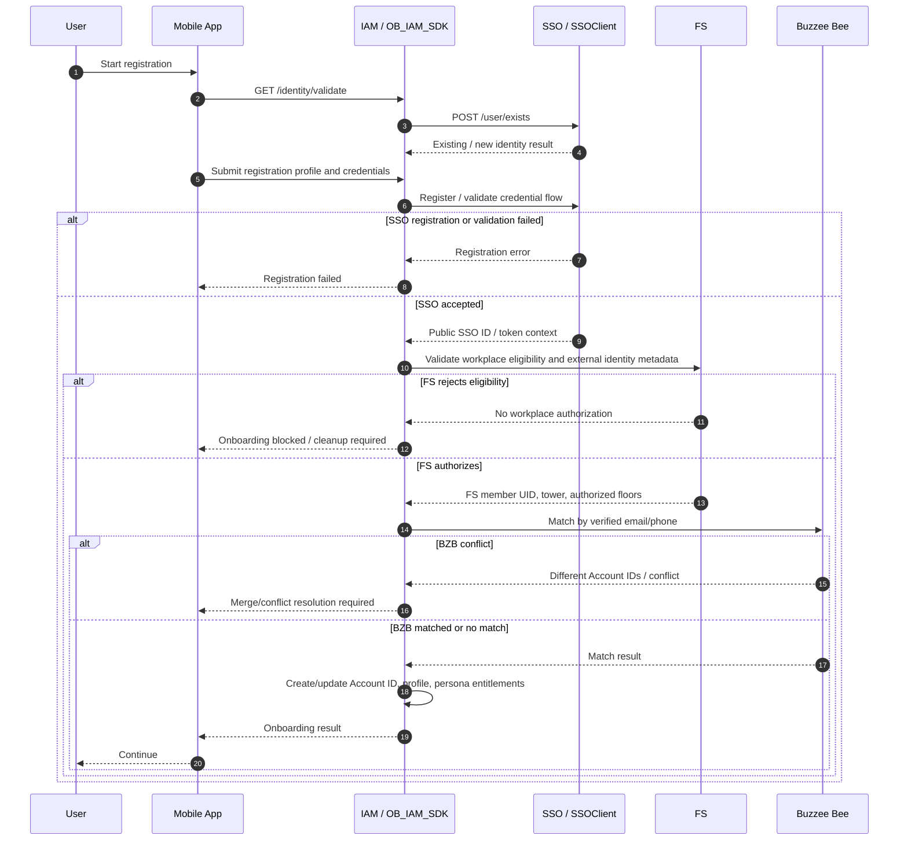
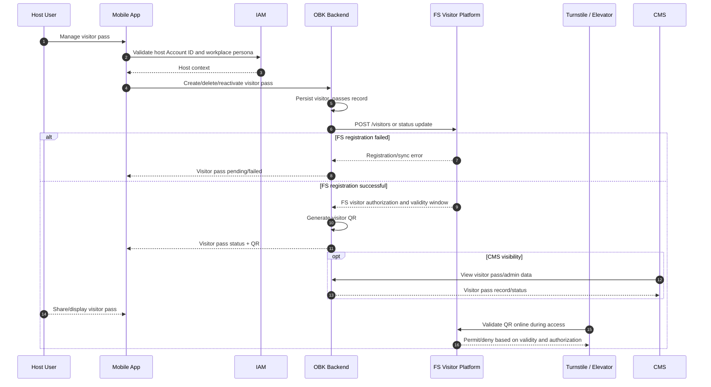
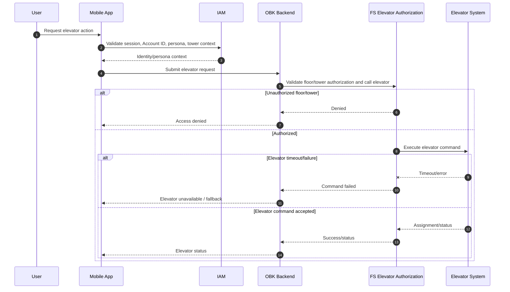
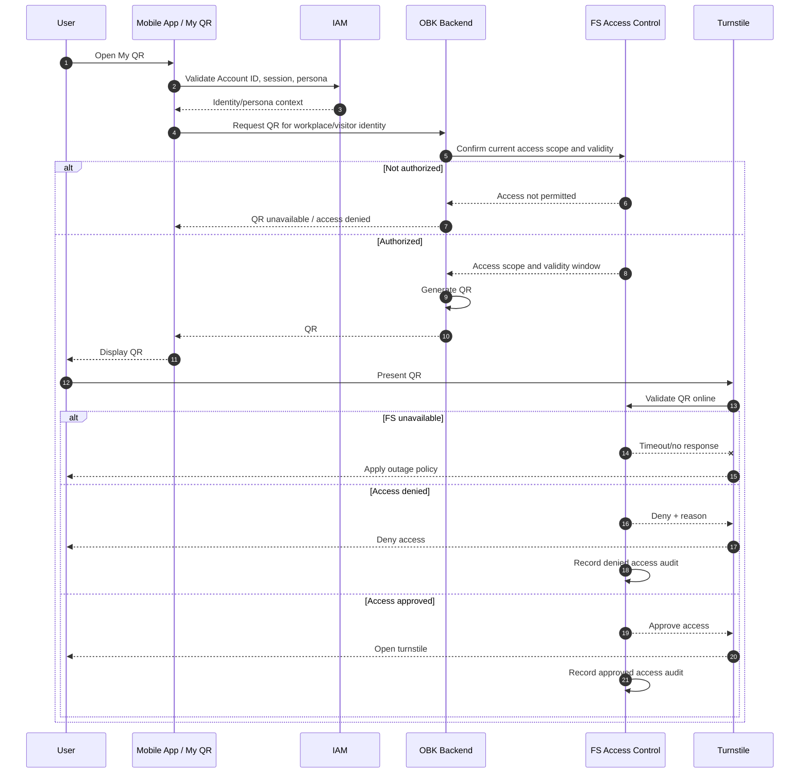

# PARQ User Flow Integration Architecture

Source of truth: `outputs/parq_user_flow_index/The_PARQ_Phase_1_User_Flow_Index.xlsx`

Clarification source: conversation clarifications and attached clarification note.

Scope focus: SSO, IAM, FS, BZB, CMS, Argento, with OBK Backend and Kafka/Event Bus shown where they are required for the integration to be accurate.

Constraint: This document does not rewrite user flows and does not create user stories. It maps integration responsibility, candidate sequence diagrams, dependencies, failure cases, and remaining open points by Feature ID / User Flow ID.

## BMS Source Traceability Note

Owner: Libra  
Input files: `01_Source_of_Truth/API_and_System_References/00_2025_Document/api-members-by-account-id.md`, `01_Source_of_Truth/API_and_System_References/00_2025_Document/add_identity_flow.md`  
Output file path: `03_Architecture/PARQ_User_Flow_Integration_Architecture.md`  
Status: Source traceability note / BMS Option B non-blocking decision recorded  
Downstream consumer: Simon, PARQ, Quinn, Molly

Current confirmed behavior from source/reference files:
- Current app checks member from BMS in Sign-up and Add / Remove identity flow.
- `add_identity_flow.md` confirms BMS `checkMember` runs for new identities and can create external identity type `fs` when a member is found and not bound to another account.
- `api-members-by-account-id.md` documents BMS `GET /members/by-account-id` for retrieving members associated with an account ID.

Decision recorded:
- PARQ to-be login uses BMS member check during login as a non-blocking refresh. If BMS is unavailable, the user can still enter the app. If previous Workplace permission is detectable, the app/IAM should allow the existing Workplace permission as appropriate.
- Login-time BMS check uses the same BMS member-check API family as `checkMember` / `GET /members/by-account-id`; exact endpoint/payload, timeout, retry, and audit details remain open.

## Confirmed Architecture Decisions

| Area | Confirmed Decision |
|---|---|
| Login responsibility | Mobile App calls IAM SDK first. IAM validates identity, bridges to SSO for credential validation, then resolves local Account ID and persona entitlements. |
| SSO role | SSO is the authentication and broader identity orchestration layer. SSO validates credentials and supports merge orchestration. |
| IAM role | IAM is the source of truth for local member profile and persona entitlements. |
| Primary identifiers | Public SSO ID is used for ecosystem orchestration. Account ID is the core OBK internal identifier. |
| Existing PARQ migration | No simple bulk pre-migration assumption. Existing PARQ users use OBK SSO with real-time validation/matching across SSO, IAM, and BZB. |
| Account merge | SSO owns orchestration; OBK Backend/IAM executes data migration and surviving account mapping. FS and BZB are queried/synced sources. |
| BZB matching | Email/phone match can trigger merge. User cannot continue the affected journey without resolving merge/conflict. |
| BZB conflict rule | All matched records must resolve to the same Account ID. Different Account IDs trigger conflict error through `throwOnConflict: true`. |
| Profile overwrite | Newly entered registration data can overwrite existing core profile/contact data. PDPA and marketing consent follow existing OBK standards. |
| FS role | FS is the authority for workplace entitlement, tower/floor authorization, parking gate authorization, parking availability/ticket service, visitor authorization, elevator authorization, and turnstile access policy. |
| FS API shape | FS exposes separate APIs/services for parking availability, parking ticket, visitor authorization, elevator, turnstile, and access rules; not one unified entitlement API. |
| Workplace persona trigger | Workplace persona requires external identity type `fs` with non-empty metadata such as company/tenant, authorized floor list, tower ID, and FS user/member UID. |
| Parking payment callback | Argento callbacks go to OBK Backend. OBK Backend records payment state and synchronizes payment status to FS. |
| Parking payment source of truth | FS/Iviva is final source of truth for ticket and exit authorization. OBK Backend owns payment records/logs. Argento owns financial processing. |
| Parking refund ownership | Argento handles financial refund operation. OBK Backend initiates/tracks refund records. FS remains source of truth for ticket/exit status. |
| Visitor pass storage | Visitor pass is stored in OBK backend database and registered with FS. CMS visibility exists technically, but CMS management/content is largely out of Phase 1 scope. |
| Visitor access | Visitor pass can grant direct physical turnstile/building/elevator access once authorized by FS. |
| QR generation | OBK Backend generates workplace and visitor identity QR codes. Hardware validates QR online with FS. |
| QR expiry/replay | Validity follows FS authorization rules and visitor date-time window. Real-time FS validation provides replay/invalidation control; single-use behavior is not explicitly confirmed. |
| Elevator authority | FS performs the final authorization check and returns success/failure for elevator call command. |
| Turnstile validation | Turnstile validates QR online against FS in real time. |
| CMS seed account | Phase 1 RBAC is not included. Seed admin account is used, with known data-isolation risk if org filtering is not enforced. |
| Traffic monitoring | UF-011 traffic monitoring is owned by and integrated with FS. |
| Notification segmentation | PARQ users are segmented through IAM/persona logic plus existing OBK audience/target group infrastructure. PARQ CMS campaign management is out of Phase 1. |
| Permanent delete cleanup | Kafka/Event Bus dependency exists via `ob-iam.account.permanent-deleted` for notification and BMS cleanup. |
| BMS login refresh | BMS is used during PARQ login as a non-blocking member/persona refresh. IAM owns the login-time check/orchestration point; BMS owns member source/sync behavior. |
| Test environments | SSO, FS, BZB, CMS, Argento, elevator, and turnstile are required for SIT/UAT/PVT coverage. |

## 1. Integration Matrix by Feature ID / User Flow ID

| Feature ID | User Flow ID | Feature | Systems Involved | Main API / Data Dependency | Failure Case | Remaining Open / Challenge |
|---|---|---|---|---|---|---|
| 1.1 | UF-001 | Existing The PARQ User Sign-in | Mobile App, IAM, SSO, FS, BMS, BZB | `GET /identity/validate`, SSO `POST /user/exists`, IAM `POST /auth/login`, SSO `POST /oauth/token`, BMS non-blocking member check, FS external identity metadata, BZB lookup | SSO authenticates but IAM cannot resolve Account ID/persona; BMS refresh unavailable; previous Workplace permission not detectable; FS has no `fs` identity metadata; BZB conflict | Confirm exact BMS/FS/BZB timeout behavior, cache/source for previous Workplace permission, and whether retail lookup can be deferred without blocking workplace login. |
| 1.2 | UF-002 | Retail Account Matching & Persona Merge | Mobile App, IAM, SSO, BZB, FS | Email/phone match, Account ID constraint, `throwOnConflict: true`, surviving account mapping, FS workplace permission migration | Email and phone resolve to different Account IDs; merge partially updates IAM but not FS/BZB | Need backend correction runbook for incorrect completed merge. |
| 1.3 | UF-003 | Sign-up & User Onboarding | Mobile App, IAM, SSO, FS, BZB | IAM identity pre-check, SSO registration/token validation, FS eligibility, BZB identity matching, Account ID creation | SSO account created but FS eligibility fails; new profile overwrites old BZB/IAM data unexpectedly | Need field-level overwrite policy and consent overwrite guardrails. |
| 1.4 | UF-004 | Offboarding & Account Lifecycle | Mobile App, IAM, SSO, FS, BZB, Kafka/Event Bus, Notification Service, BMS | Account status, soft/hard delete state, `ob-iam.account.permanent-deleted`, entitlement/data cleanup | Account deleted in IAM but tokens, FS authorization, notification records, or BZB linkage remain active | Need exact deletion orchestration order and retry/dead-letter policy. |
| 2.1 | UF-005 | Workplace Persona UI Integration | Mobile App, IAM, FS, OBK Backend/CMS config | IAM persona entitlement, FS external identity type `fs`, metadata for company/tower/floors/member UID | Persona card renders from stale entitlement or incomplete FS metadata | Need cache TTL and refresh triggers for persona entitlement. |
| 2.2 | UF-006 | Multi-Tower Support | Mobile App, IAM, FS, OBK Backend | FS tower/floor authorization APIs, tower context, floor list, parking/elevator access rules | User switches tower but previous tower permissions remain available | Need confirm if each FS service uses same tower ID and floor ID coding scheme. |
| 2.3 | UF-007 | [CMS] Multi-Property User Management | CMS, IAM, OBK Backend DB, FS, BZB | Account profile, persona/org metadata, FS identity metadata, BZB linkage | Seed admin sees broader OBK data because Phase 1 RBAC/org filtering is limited | Known risk: Phase 1 RBAC not included; decide compensating controls. |
| 3.1 | UF-008 | User Profile Management | Mobile App, IAM, FS, OBK Backend | IAM local member profile, FS authorized floor list, default floor setting | Profile stores a default floor that FS later no longer authorizes | Need define invalidation when FS floor authorization changes. |
| 4.1 | UF-009 | My QR | Mobile App, OBK Backend, IAM, FS, Turnstile | OBK-generated QR, IAM identity/persona, FS online validation, FS expiry/access rules | QR generated but FS denies access; replay accepted within valid time window if FS does not mark usage | Single-use versus reusable-within-window behavior remains unconfirmed. |
| 5.1 | UF-010 | Parking Availability | Mobile App, OBK Backend, FS | FS parking availability API by property/location | FS timeout or stale capacity shown | Need refresh interval, cache behavior, and stale-data display rule. |
| 5.2 | UF-011 | Traffic Monitoring | Mobile App, OBK Backend, FS | FS traffic monitoring integration/feed | FS traffic data unavailable or delayed | Need FS traffic SLA and timestamp/quality indicator in response. |
| 5.3 | UF-012 | Parking Payment & Ticket | Mobile App, OBK Backend, IAM, FS/Iviva, Argento | FS parking ticket service, Argento payment initiation/callback, `car_park_payments`, `car_park_payment_fs_logs`, FS status sync | Payment succeeds in Argento but FS/Iviva ticket status is not updated; duplicate callback/payment | Need idempotency key, reconciliation schedule, refund API contract, and manual support flow. |
| 6.1 | UF-013 | Visitor Pass | Mobile App, OBK Backend, IAM, FS, CMS, Turnstile/Elevator | `visitor_passes`, `POST /visitors`, FS visitor authorization, OBK-generated QR, online FS validation | OBK creates visitor pass but FS registration/access sync fails; CMS state differs from FS | CMS management is technically possible but Phase 1 scope is Mobile journey plus hardware sync. |
| 7.1 | UF-014 | Support OBK Notification for The PARQ User | Mobile App, IAM, OBK Notification Infrastructure, CMS audience tooling, Kafka/Event Bus | IAM/persona segment, target group members, inbox tables, device tokens, `ob-iam.account.permanent-deleted` cleanup | Wrong audience receives PARQ notification; deleted account retains inbox/token data | PARQ CMS campaign management remains out of Phase 1. Need exact segment creation owner. |
| 8.1 | UF-015 | Elevator Integration | Mobile App, OBK Backend, IAM, FS, Elevator System | IAM persona/tower context, FS authorized floors, FS elevator command/response, FS final decision | Elevator command times out; FS denies after app shows action; hardware unavailable in test | Need site fallback and exact timeout/retry policy. |
| 8.2 | UF-016 | Turnstile Access | Mobile App, OBK Backend, IAM, FS, Turnstile System | OBK-generated QR, IAM identity, FS online access validation, FS audit/access decision | FS unavailable at gate; authorized user denied; denied/approved audit missing | Need outage policy and audit log ownership/retention. |
| 9.1 | UF-017 | Security & Compliance | SSO, IAM, FS, BZB, CMS, Argento, OBK Backend, Kafka/Event Bus | Encrypted channels, token validation, Account ID/Public SSO ID, PDPA/marketing consent, audit logs | PII shared without field-level consent/retention mapping | Need PII inventory by system/API and audit centralization plan. |
| 10.1 | UF-018 | Testing & Deployment | Mobile App, SSO, IAM, FS, BZB, CMS, Argento, Elevator, Turnstile | SIT/UAT/PVT environments, hardware access, test data, gateway sandbox | Critical vendor/hardware environment unavailable for PVT | All listed integrations are required; need environment readiness dates and data owners. |
| 13 | UF-019 | Project Documentation | Project repository, technical owners | Approved technical inputs | Documentation does not match actual integration contracts | Need named approvers per external system. |
| 14 | UF-020 | User Manual | Documentation artifact | Final UI and operational process | Manual describes Phase 1.5 or CMS features as Phase 1 | Need explicit Phase 1/Phase 1.5 content boundary. |
| 15 | UF-021 | Technical Documentation | FS, BZB, Argento, CMS, SSO, IAM, OBK Backend | Final API specs, sequence diagrams, deployment notes, error catalogs | Missing API contract blocks handover/support | Need vendor API specs and error catalog baseline. |
| 16 | UF-022 | Load Testing | Mobile App, OBK Backend, SSO, IAM, FS, BZB, Argento, CMS | Critical workflow load profile, external dependency limits, mocks/test endpoints | Load test excludes FS/Argento latency and gives false confidence | Need external load-test permission, rate limits, and mock strategy. |

## 2. Sequence Diagram Candidate List

| Priority | User Flow ID | Feature | Systems Involved | Main API / Data Dependency | Failure Case to Model | Remaining Open / Challenge |
|---|---|---|---|---|---|---|
| P1 | UF-001 | Existing PARQ User Sign-in | Mobile App, IAM, SSO, BMS, FS, BZB | IAM validate/login, SSO token, BMS non-blocking member check, FS `fs` identity metadata, BZB lookup | Auth success but no Account ID/persona; BMS unavailable; previous Workplace permission not detectable; FS metadata missing; BZB conflict | Define timeout/fallback for BMS, BZB, and FS lookup. |
| P1 | UF-002 | Retail Account Matching & Persona Merge | Mobile App, IAM, SSO, BZB, FS | Account ID constraint, `throwOnConflict: true`, merge prompt, surviving account | Different Account IDs found; incorrect merge completed | Define manual backend correction process. |
| P1 | UF-003 | Sign-up & User Onboarding | Mobile App, IAM, SSO, FS, BZB | Identity pre-check, SSO token, FS eligibility, BZB match, profile overwrite | SSO created but FS rejected; overwrite of sensitive profile/consent | Confirm field-level overwrite rules. |
| P1 | UF-012 | Parking Payment & Ticket | Mobile App, OBK Backend, IAM, FS/Iviva, Argento | Ticket lookup, PromptPay, Argento callback, OBK payment tables, FS sync | Paid in Argento but not synced to FS; duplicate callback | Define idempotency/reconciliation/refund runbook. |
| P1 | UF-013 | Visitor Pass | Mobile App, OBK Backend, IAM, FS, CMS, Turnstile/Elevator | `visitor_passes`, `POST /visitors`, FS access validity, OBK QR | Pass created locally but FS registration/access sync fails | Clarify CMS operational scope in Phase 1 support model. |
| P1 | UF-015 | Elevator Integration | Mobile App, OBK Backend, IAM, FS, Elevator System | FS authorized floor and elevator command result | FS/elevator timeout; unauthorized floor attempted | Define fallback and hardware error mapping. |
| P1 | UF-016 | Turnstile Access | Mobile App, OBK Backend, IAM, FS, Turnstile | OBK QR, online FS validation, access audit | FS outage, replay within window, missing audit | Define outage policy and single-use behavior if required. |
| P2 | UF-004 | Offboarding & Account Lifecycle | Mobile App, IAM, SSO, FS, BZB, Kafka/Event Bus, Notification Service, BMS | Soft/hard delete state, permanent delete event cleanup | Partial deletion or entitlement leak | Define retry/dead-letter handling. |
| P2 | UF-005 | Workplace Persona UI Integration | Mobile App, IAM, FS, OBK Backend/CMS config | FS external identity metadata, persona entitlement | Stale/overexposed quick action | Define cache invalidation. |
| P2 | UF-006 | Multi-Tower Support | Mobile App, IAM, FS, OBK Backend | Tower/floor-scoped FS permissions | Wrong tower permissions persist | Confirm common ID taxonomy. |
| P2 | UF-007 | CMS Multi-Property User Management | CMS, IAM, OBK Backend DB, FS, BZB | Consolidated user/persona/org data | Seed admin data leakage | Known risk due Phase 1 RBAC exclusion. |
| P2 | UF-009 | My QR | Mobile App, OBK Backend, IAM, FS, Turnstile | QR generation, FS online validation | Expired/replayed QR accepted | Confirm single-use/reuse rule. |
| P2 | UF-010 | Parking Availability | Mobile App, OBK Backend, FS | Availability API | Stale capacity or timeout | Define freshness threshold. |
| P2 | UF-011 | Traffic Monitoring | Mobile App, OBK Backend, FS | FS traffic feed | FS unavailable/late update | Define traffic SLA/fallback. |
| P2 | UF-014 | Notifications | Notification infra, IAM, Mobile App, CMS audience tooling, Kafka/Event Bus | Persona segment, target group, inbox/device token cleanup | Wrong target audience or stale tokens after delete | Define segment ownership. |
| P2 | UF-017 | Security & Compliance | All systems | Token, PII, audit, encryption, deletion event | Non-compliant PII sharing | Build field-level PII matrix. |
| P2 | UF-018 | Testing & Deployment | All integrated systems | Environment/test data readiness | PVT blocked by vendor/hardware environment | Track readiness per system. |

## 3. Mermaid Sequence Diagrams

### UF-001 Existing PARQ User Sign-in

Systems involved: Mobile App, IAM, SSO, BMS, FS, BZB.

Main API/data dependency: IAM `GET /identity/validate`, SSO `POST /user/exists`, IAM `POST /auth/login`, SSO `POST /oauth/token`, local Account ID, BMS non-blocking member check, FS external identity metadata, BZB lookup.

Failure case: SSO validates credentials but IAM cannot resolve Account ID/persona, BMS refresh is unavailable, previous Workplace permission is not detectable, FS metadata is missing, or BZB returns a conflict.

Remaining open questions:
- What exact BMS timeout/circuit-breaker and cache/source proves previous Workplace permission during login?
- What support/audit path is used for rare BMS member-bound-to-another-account?
- Can BZB failure be deferred while allowing workplace login?
- What is the exact timeout/retry behavior for FS and BZB during login?

```mermaid
sequenceDiagram
    autonumber
    participant U as User
    participant App as Mobile App
    participant IAM as IAM / OB_IAM_SDK
    participant SSO as SSO / SSOClient
    participant BMS as BMS
    participant FS as FS
    participant BZB as Buzzee Bee

    U->>App: Start sign-in
    App->>IAM: GET /identity/validate
    IAM->>SSO: POST /user/exists
    SSO-->>IAM: Identity exists / not exists
    App->>IAM: POST /auth/login
    IAM->>SSO: POST /oauth/token with credentials
    alt Credential validation failed
        SSO-->>IAM: Auth error
        IAM-->>App: Login failed
        App-->>U: Show sign-in failure
    else Credential validation successful
        SSO-->>IAM: Token + Public SSO ID
        IAM->>IAM: Resolve Account ID and local profile
        IAM->>BMS: Non-blocking member check / Workplace refresh
        alt BMS unavailable or timeout
            BMS-->>IAM: No refresh result
            IAM->>IAM: Continue login; use existing Workplace permission if detectable
        else Member found and eligible
            BMS-->>IAM: Member data / fs identity metadata candidate
            IAM->>IAM: Create/update fs external identity and persona if allowed
        else No member or rare bound-to-other-account
            BMS-->>IAM: No member / conflict-like state
            IAM->>IAM: Continue login; mark support/audit path if conflict-like
        end
        IAM->>FS: Resolve external identity type fs + metadata
        alt FS metadata missing
            FS-->>IAM: No valid workplace entitlement
            IAM-->>App: Login allowed only if non-workplace persona exists / otherwise blocked
        else FS metadata valid
            FS-->>IAM: Company, tower, floors, FS member UID
            IAM->>BZB: Lookup retail identity by verified email/phone
            alt BZB conflict
                BZB-->>IAM: Conflict / different Account ID
                IAM-->>App: Conflict resolution required
            else BZB matched or no match
                BZB-->>IAM: Retail match result
                IAM-->>App: Auth response with Account ID and persona entitlements
                App-->>U: Continue authenticated session
            end
        end
    end
```

### UF-002 Retail Account Matching & Persona Merge

Systems involved: Mobile App, IAM, SSO, BZB, FS.

Main API/data dependency: BZB lookup by email/phone, Account ID equality rule, SSO `throwOnConflict: true`, IAM Account Merge Flow, FS workplace permission migration to surviving account.

Failure case: Email and phone matches point to different Account IDs; incorrect merge requires backend manual correction.

Remaining open questions:
- What is the operational runbook and approval path for manual correction after incorrect merge?
- Which exact profile fields are protected from overwrite despite the general overwrite rule?

```mermaid
sequenceDiagram
    autonumber
    participant U as User
    participant App as Mobile App
    participant IAM as IAM / Account Merge
    participant SSO as SSO
    participant BZB as Buzzee Bee
    participant FS as FS

    App->>IAM: Request account matching / merge evaluation
    IAM->>SSO: POST /oauth/token with throwOnConflict: true
    SSO-->>IAM: Conflict state or token result
    IAM->>BZB: Match by verified email/phone
    alt Matches point to different Account IDs
        BZB-->>IAM: Conflicting identity result
        IAM-->>App: Conflict error; user must resolve to proceed
        App-->>U: Show warning / merge resolution screen
    else Matches share same Account ID
        BZB-->>IAM: Matching BZB identity
        IAM-->>App: Merge prompt / informational screen
        U->>App: Proceed with merge path
        App->>IAM: Confirm merge path
        IAM->>FS: Migrate/sync workplace permissions to surviving account
        IAM->>BZB: Sync surviving Account ID / retail linkage
        IAM->>IAM: Persist surviving Account ID and persona entitlements
        alt Merge persistence failed
            IAM-->>App: Merge failed / support required
        else Merge complete
            IAM-->>App: Updated Account ID and personas
        end
    end
```

### UF-003 Sign-up & User Onboarding

Systems involved: Mobile App, IAM, SSO, FS, BZB.

Main API/data dependency: IAM identity pre-check, SSO credential/token validation, FS workplace eligibility, BZB identity matching, Account ID creation, profile overwrite rules.

Failure case: New SSO/authentication state is created but FS authorization fails, or new registration data overwrites existing BZB/IAM data unexpectedly.

Remaining open questions:
- Confirm field-level overwrite policy for DOB, gender, email, phone, PDPA consent, and marketing consent.
- Confirm cleanup behavior for incomplete registration/account creation states.



### UF-012 Parking Payment & Ticket

Systems involved: Mobile App, OBK Backend, IAM, FS/Iviva, Argento.

Main API/data dependency: FS parking ticket service, Argento PromptPay initiation/callback, `car_park_payments`, `car_park_payment_fs_logs`, FS ticket/exit authorization status.

Failure case: Argento payment succeeds but OBK Backend cannot synchronize payment status with FS/Iviva.

Remaining open questions:
- Define idempotency key for payment initiation and callback.
- Define reconciliation schedule, refund API contract, and support operation when FS sync fails.

```mermaid
sequenceDiagram
    autonumber
    participant U as User
    participant App as Mobile App
    participant IAM as IAM
    participant BE as OBK Backend / Payment Handler
    participant FS as FS / Iviva Parking
    participant Pay as Argento

    U->>App: Open parking ticket/payment
    App->>IAM: Validate Account ID and session
    IAM-->>App: Valid identity context
    App->>BE: Request parking ticket/payment context
    BE->>FS: Retrieve ticket and payable amount
    alt Ticket not found or not payable
        FS-->>BE: Ticket error
        BE-->>App: Ticket/payment unavailable
    else Ticket payable
        FS-->>BE: Ticket ID, amount, exit status context
        BE->>BE: Create car_park_payments record
        BE->>Pay: Initiate PromptPay payment
        alt Argento initiation failed
            Pay-->>BE: Payment initiation error
            BE-->>App: Payment unavailable
        else Payment initiated
            Pay-->>BE: QR/payment reference
            BE-->>App: Payment QR/reference
            App-->>U: Display PromptPay QR
            Pay-->>BE: Payment callback/status
            BE->>BE: Validate callback + idempotency; update car_park_payments
            BE->>FS: Sync paid status to FS/Iviva
            BE->>BE: Write car_park_payment_fs_logs
            alt FS sync failed
                FS-->>BE: Sync error
                BE->>BE: Queue retry/reconciliation
                BE-->>App: Payment pending FS synchronization
            else FS sync successful
                FS-->>BE: Ticket/exit status updated
                BE-->>App: Payment completed
            end
        end
    end
```

### UF-013 Visitor Pass Management

Systems involved: Mobile App, OBK Backend, IAM, FS, CMS, Turnstile/Elevator.

Main API/data dependency: OBK `visitor_passes` table, FS `POST /visitors`, OBK-generated QR, FS visitor authorization/validity, online hardware validation.

Failure case: Visitor pass is stored locally but FS registration or access synchronization fails.

Remaining open questions:
- Confirm whether CMS users are expected to operate visitor pass support in Phase 1 or only view data if needed.
- Confirm visitor QR single-use versus reusable-within-window behavior.



### UF-015 Elevator Integration

Systems involved: Mobile App, OBK Backend, IAM, FS, Elevator System.

Main API/data dependency: IAM persona/tower context, FS authorized floor permissions, FS elevator command, FS final success/failure status.

Failure case: FS/elevator command times out or FS denies authorization after app action is requested.

Remaining open questions:
- Define timeout, retry, and site fallback behavior.
- Confirm exact source/destination floor and tower identifier contract.



### UF-016 Turnstile Access

Systems involved: Mobile App, OBK Backend, IAM, FS, Turnstile System.

Main API/data dependency: OBK-generated QR, IAM Account ID/persona, FS online QR/access validation, FS audit/access decision.

Failure case: FS unavailable at gate or QR replay behavior allows access beyond intended rule.

Remaining open questions:
- Define FS outage policy at turnstile.
- Confirm whether visitor QR is single-use or reusable within the visit window.
- Confirm approved/denied access audit retention owner.



## 4. Residual Architecture Risks

| Risk | Severity | Why It Matters | Mitigation / Decision Needed |
|---|---|---|---|
| Seed CMS admin may see broader OBK data | High | Phase 1 RBAC/org isolation is not included, but CMS has local data visibility. | Apply compensating controls, restricted seed account permissions, audit monitoring, or explicit business acceptance. |
| FS is a hard runtime dependency for workplace and hardware access | High | Turnstile and elevator validation are online with FS; outage affects physical access. | Define outage policy, site fallback, and operational escalation. |
| BZB merge conflicts block account progression | High | Different Account IDs cannot be merged automatically. | Implement clear conflict screen, support workflow, and backend correction process. |
| Profile overwrite can change sensitive data | Medium | New registration data overwrites existing IAM/BZB data. | Define field-level overwrite and consent rules. |
| Parking payment can be financially paid but operationally unpaid | High | Argento payment success must sync to FS/Iviva for ticket/exit status. | Use idempotency, sync logs, retry queue, reconciliation, and support tooling. |
| Visitor pass split-brain between OBK DB and FS | High | Local pass can exist while FS authorization fails. | Treat FS registration success as the access-enabling state and surface pending/failed status. |
| QR replay behavior is not fully specified | Medium | FS online validation helps, but single-use semantics are not confirmed. | Decide if visitor QR is single-use or reusable within visit window. |
| Notification cleanup depends on event processing | Medium | Hard-deleted accounts must remove tokens/inbox data through Kafka event. | Define retry/dead-letter monitoring for `ob-iam.account.permanent-deleted`. |
| External environment readiness can block PVT | High | Elevator and turnstile require hardware validation; Argento/FS/BZB also required. | Track SIT/UAT/PVT readiness per system with named owner and date. |
