# PARQ Visual Architecture and Flow Pack

Owner: Simon / Senior Solution Architect

Input files:
- `AGENTS.md`
- `MASTER_INDEX.md`
- `TASK_BOARD.md`
- `HANDOFF_LOG.md`
- `03_Architecture/PARQ_User_Flow_Integration_Architecture.md`
- `03_Architecture/PARQ_Data_API_Context_Boundary_Vendor_Matrix.md`
- `03_Architecture/PARQ_Technical_Dependency_Control_Pack.md`
- `02_Discovery/PARQ_Integration_Architecture_Review.md`
- `01_Source_of_Truth/Clarifications/PARQ_Clarification_Decision_Log.md`

Output path: `03_Architecture/PARQ_Visual_Architecture_and_Flow_Pack.md`

Status: Draft / Visual architecture baseline with open questions

Downstream consumer:
- Quinn / QA Lead for later SIT/UAT planning inputs
- PARQ / Orchestrator for dependency tracking
- Libra / Project Librarian for indexing and traceability
- Simon / Senior Solution Architect for architecture review and dependency follow-up

Rules applied:
- No user stories, QA scenarios, UAT cases, or acceptance criteria are created in this artifact.
- Missing API details, named owners, SLAs, environments, and decisions are shown as open questions.
- Repository files are the source of truth.

## Source Traceability Note

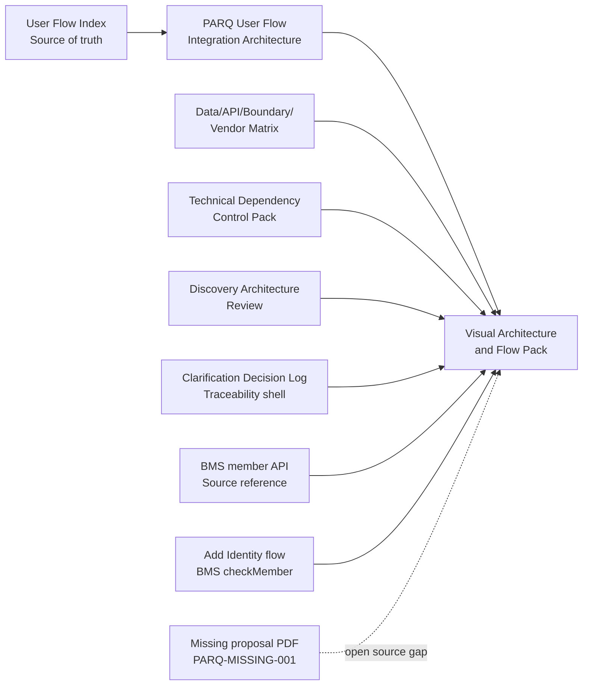

Owner: Simon  
Input files: all listed input files  
Output path: `03_Architecture/PARQ_Visual_Architecture_and_Flow_Pack.md`  
Status: Draft / traceability visible  
Downstream consumer: Quinn, PARQ, Libra, Simon  
Open questions:
- `MASTER_INDEX.md` records `[Proposal] The PARQ integration.pdf` as missing.
- `PARQ_Clarification_Decision_Log.md` is a traceability shell and records the BMS Option B non-blocking login decision; missing proposal/standalone clarification source remains open.
- Current app checks BMS member in Sign-up and Add / Remove identity flow; PARQ to-be login member check is now selected as Option B non-blocking refresh.

## 1. High-Level PARQ to One Bangkok Context Diagram

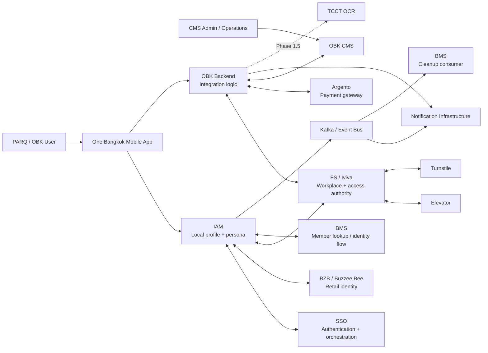

Owner: Simon  
Input files: `PARQ_Data_API_Context_Boundary_Vendor_Matrix.md`, `PARQ_Technical_Dependency_Control_Pack.md`  
Output path: `03_Architecture/PARQ_Visual_Architecture_and_Flow_Pack.md`  
Status: Draft / context baseline  
Downstream consumer: Quinn, PARQ, Libra  
Open questions:
- Named owners for SSO, IAM, FS/Iviva, BZB, Argento, CMS, Kafka/Event Bus, BMS, Notification, Elevator, Turnstile, and TCCT OCR are not confirmed.
- Exact SIT/UAT/PVT endpoints, credentials, and readiness dates are not available in repository files.
- BMS login refresh is non-blocking for app entry. Exact endpoint/payload, timeout/circuit-breaker, previous-permission cache/source, and rare conflict support path remain open.

## 2. System Boundary Diagram

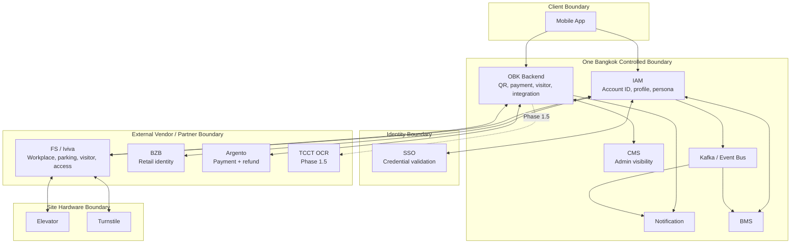

Owner: Simon  
Input files: `PARQ_Data_API_Context_Boundary_Vendor_Matrix.md`, `PARQ_Technical_Dependency_Control_Pack.md`, `AGENTS.md`  
Output path: `03_Architecture/PARQ_Visual_Architecture_and_Flow_Pack.md`  
Status: Draft / boundary baseline  
Downstream consumer: Quinn, PARQ, Libra  
Open questions:
- CMS Phase 1 seed account scope and compensating controls are not confirmed.
- FS outage behavior for online elevator and turnstile validation is not confirmed.
- TCCT OCR is deferred and lacks environment/API detail in repository files.

## 3. Integration Dependency Map

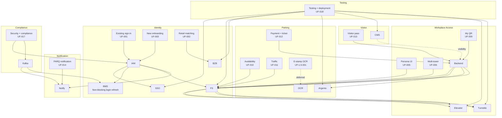

Owner: Simon  
Input files: `PARQ_User_Flow_Integration_Architecture.md`, `PARQ_Technical_Dependency_Control_Pack.md`  
Output path: `03_Architecture/PARQ_Visual_Architecture_and_Flow_Pack.md`  
Status: Draft / dependency grouping baseline  
Downstream consumer: Quinn, PARQ  
Open questions:
- FS service ownership is not split by function in repository files.
- Traffic SLA, parking freshness threshold, and hardware validation readiness are open.
- Phase 1.5 OCR and rate configuration ownership remains open.

## 4. Data Ownership / Persona Flow View

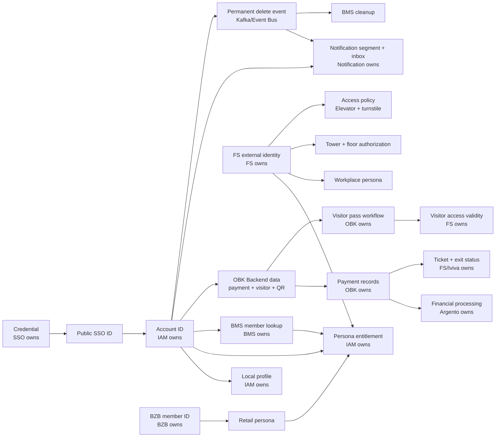

Owner: Simon  
Input files: `PARQ_Data_API_Context_Boundary_Vendor_Matrix.md`, `PARQ_Technical_Dependency_Control_Pack.md`  
Output path: `03_Architecture/PARQ_Visual_Architecture_and_Flow_Pack.md`  
Status: Draft / data ownership view  
Downstream consumer: Quinn, PARQ, Libra  
Open questions:
- Field-level PII and consent mapping is incomplete.
- Profile overwrite rules need approved field-level policy.
- QR single-use/replay behavior remains unconfirmed.

## 5. Priority Sequence Diagrams

### 5.1 Existing PARQ User Sign-In

```mermaid
sequenceDiagram
    autonumber
    participant U as User
    participant App as Mobile App
    participant IAM as IAM
    participant SSO as SSO
    participant BMS as BMS
    participant FS as FS/Iviva
    participant BZB as BZB

    U->>App: Start sign-in
    App->>IAM: GET /identity/validate
    IAM->>SSO: POST /user/exists
    SSO-->>IAM: Identity result
    App->>IAM: POST /auth/login
    IAM->>SSO: POST /oauth/token
    alt Credential invalid
        SSO-->>IAM: Auth error
        IAM-->>App: Login failed
    else Credential valid
        SSO-->>IAM: Token + Public SSO ID
        IAM->>IAM: Resolve Account ID + persona
        IAM->>BMS: Non-blocking member check / Workplace refresh
        alt BMS unavailable or timeout
            BMS-->>IAM: No refresh result
            IAM->>IAM: Continue login; use existing Workplace permission if detectable
        else Member found and eligible
            BMS-->>IAM: Member data / fs identity candidate
            IAM->>IAM: Create/update fs external identity and persona if allowed
        else No member or rare bound-to-other-account
            BMS-->>IAM: No member / conflict-like state
            IAM->>IAM: Continue login; mark support/audit path if conflict-like
        end
        IAM->>FS: Resolve fs external identity metadata
        alt FS metadata missing
            FS-->>IAM: No workplace entitlement
            IAM-->>App: Workplace unavailable / support path
        else FS metadata valid
            FS-->>IAM: Tower, floor, FS member UID
            IAM->>BZB: Lookup retail identity
            alt BZB conflict
                BZB-->>IAM: Different Account ID conflict
                IAM-->>App: Conflict resolution required
            else Match or no match
                BZB-->>IAM: Retail match result
                IAM-->>App: Account ID + persona entitlements
            end
        end
    end
```

Owner: Simon  
Input files: `PARQ_User_Flow_Integration_Architecture.md`, `PARQ_Technical_Dependency_Control_Pack.md`  
Output path: `03_Architecture/PARQ_Visual_Architecture_and_Flow_Pack.md`  
Status: Draft / priority sequence baseline  
Downstream consumer: Quinn for later SIT planning inputs  
Open questions:
- What are exact BMS timeout/circuit-breaker and previous-permission cache/source rules?
- What support/audit path applies if BMS returns rare member-bound-to-other-account during login?
- Is BZB failure blocking for workplace sign-in?
- What are exact FS/BZB timeout and retry rules?

### 5.2 New PARQ User Onboarding

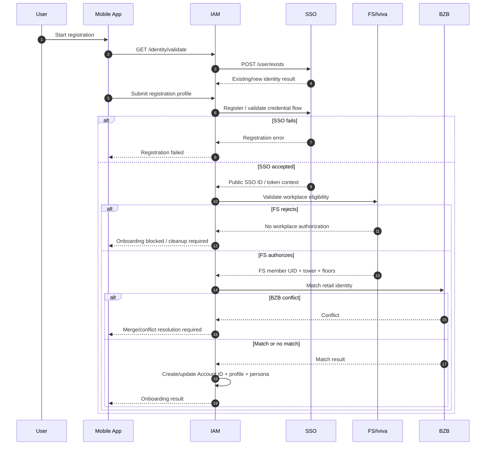

Owner: Simon  
Input files: `PARQ_User_Flow_Integration_Architecture.md`, `PARQ_Technical_Dependency_Control_Pack.md`  
Output path: `03_Architecture/PARQ_Visual_Architecture_and_Flow_Pack.md`  
Status: Draft / priority sequence baseline  
Downstream consumer: Quinn, PARQ  
Open questions:
- Which profile fields are protected from overwrite?
- What cleanup is required for incomplete registration states?

### 5.3 Retail Account Matching / BZB Conflict

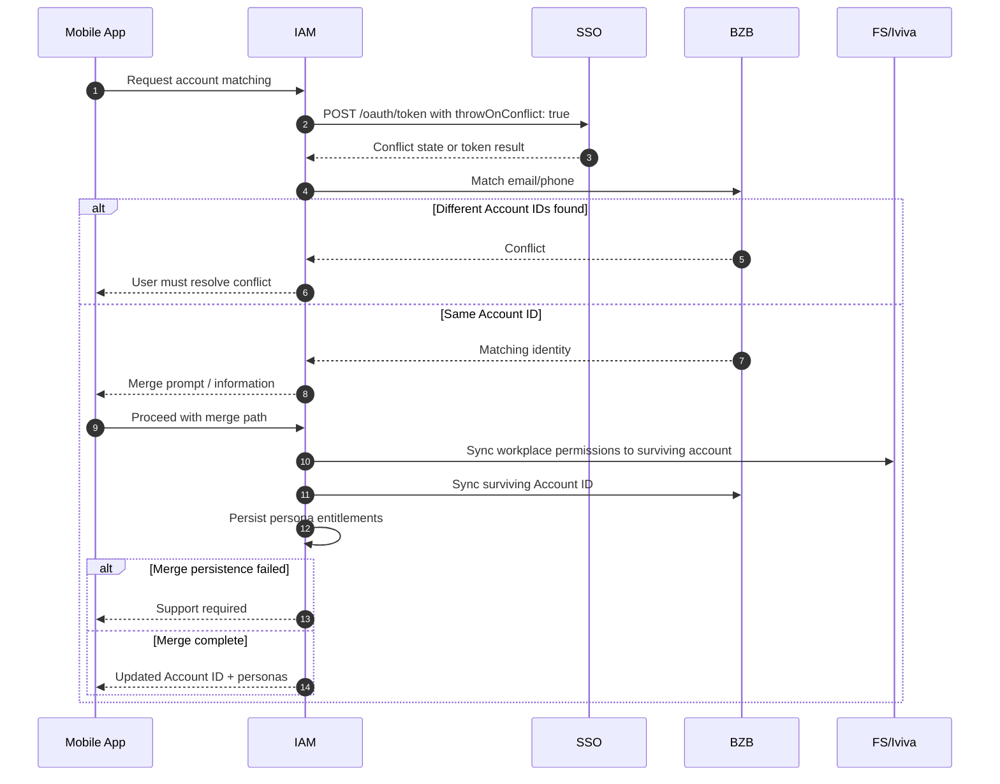

Owner: Simon  
Input files: `PARQ_User_Flow_Integration_Architecture.md`, `PARQ_Technical_Dependency_Control_Pack.md`  
Output path: `03_Architecture/PARQ_Visual_Architecture_and_Flow_Pack.md`  
Status: Draft / priority sequence baseline  
Downstream consumer: Quinn, PARQ  
Open questions:
- Who owns manual correction after incorrect completed merge?
- What audit proves merge decision and surviving Account ID?

### 5.4 Parking Payment and Ticket Sync

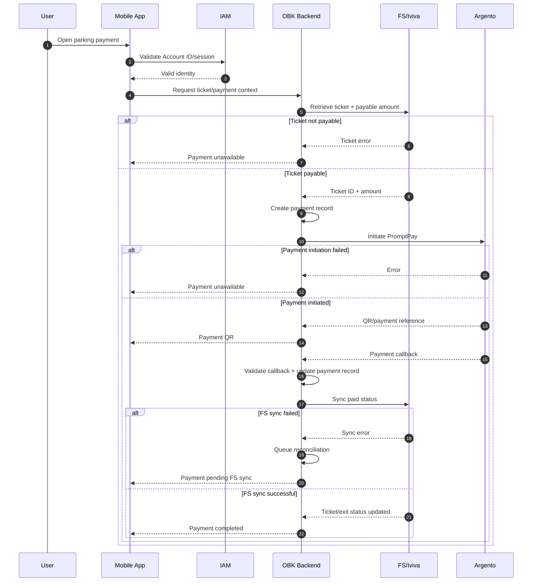

Owner: Simon  
Input files: `PARQ_User_Flow_Integration_Architecture.md`, `PARQ_Data_API_Context_Boundary_Vendor_Matrix.md`, `PARQ_Technical_Dependency_Control_Pack.md`  
Output path: `03_Architecture/PARQ_Visual_Architecture_and_Flow_Pack.md`  
Status: Draft / priority sequence baseline  
Downstream consumer: Quinn, PARQ  
Open questions:
- What is the idempotency key for payment initiation and callback?
- What is the reconciliation schedule and refund support flow?

### 5.5 Visitor Pass Management

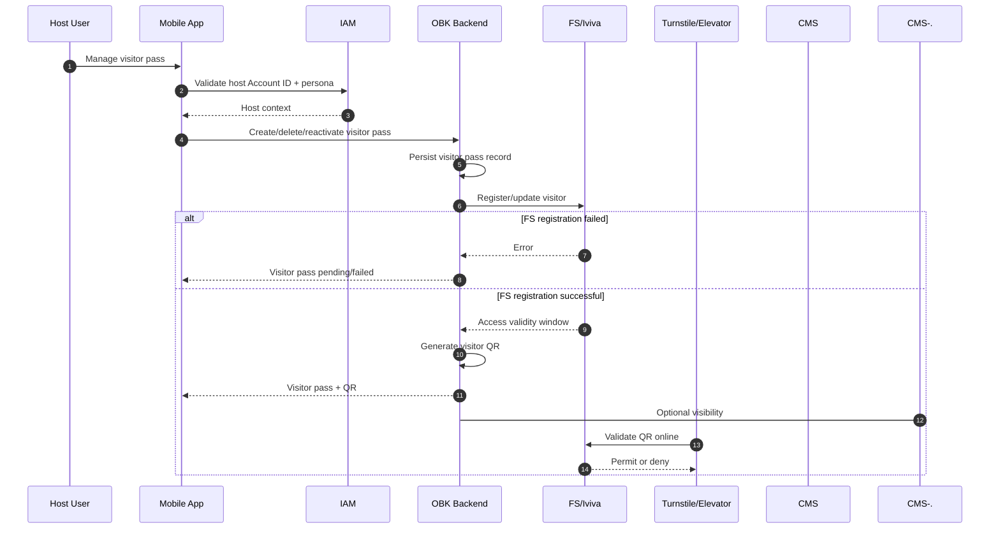

Owner: Simon  
Input files: `PARQ_User_Flow_Integration_Architecture.md`, `PARQ_Data_API_Context_Boundary_Vendor_Matrix.md`, `PARQ_Technical_Dependency_Control_Pack.md`  
Output path: `03_Architecture/PARQ_Visual_Architecture_and_Flow_Pack.md`  
Status: Draft / priority sequence baseline  
Downstream consumer: Quinn, PARQ  
Open questions:
- Which visitor PII fields are collected and retained?
- Is visitor QR single-use or reusable within the validity window?
- What CMS visitor pass operations are in Phase 1 support scope?

### 5.6 Elevator Call

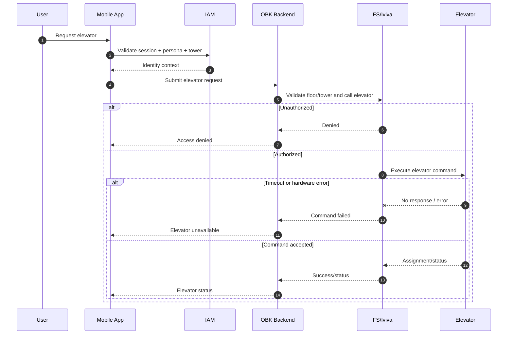

Owner: Simon  
Input files: `PARQ_User_Flow_Integration_Architecture.md`, `PARQ_Technical_Dependency_Control_Pack.md`  
Output path: `03_Architecture/PARQ_Visual_Architecture_and_Flow_Pack.md`  
Status: Draft / priority sequence baseline  
Downstream consumer: Quinn, PARQ  
Open questions:
- What is the elevator timeout and retry policy?
- What is site fallback if FS/elevator is unavailable?
- Who owns tower/floor mapping for hardware validation?

### 5.7 Turnstile Access

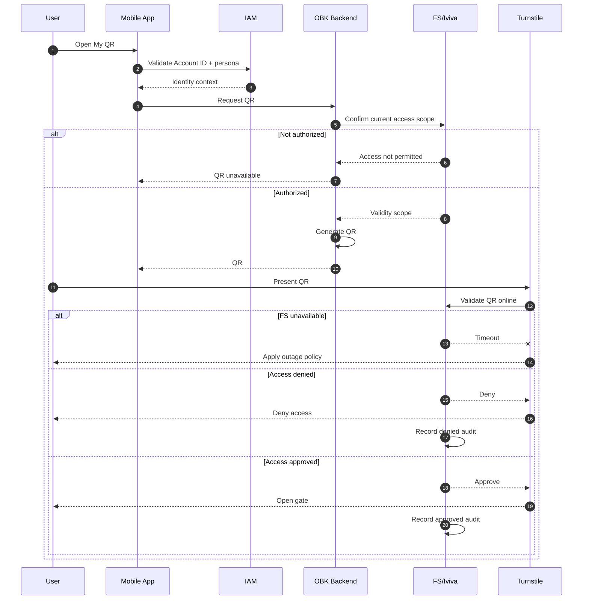

Owner: Simon  
Input files: `PARQ_User_Flow_Integration_Architecture.md`, `PARQ_Technical_Dependency_Control_Pack.md`  
Output path: `03_Architecture/PARQ_Visual_Architecture_and_Flow_Pack.md`  
Status: Draft / priority sequence baseline  
Downstream consumer: Quinn, PARQ  
Open questions:
- What is turnstile outage policy when FS online validation is unavailable?
- What is audit retention owner for approve/deny events?
- Is QR token single-use or reusable within validity window?

### 5.8 Account Deletion and Cleanup

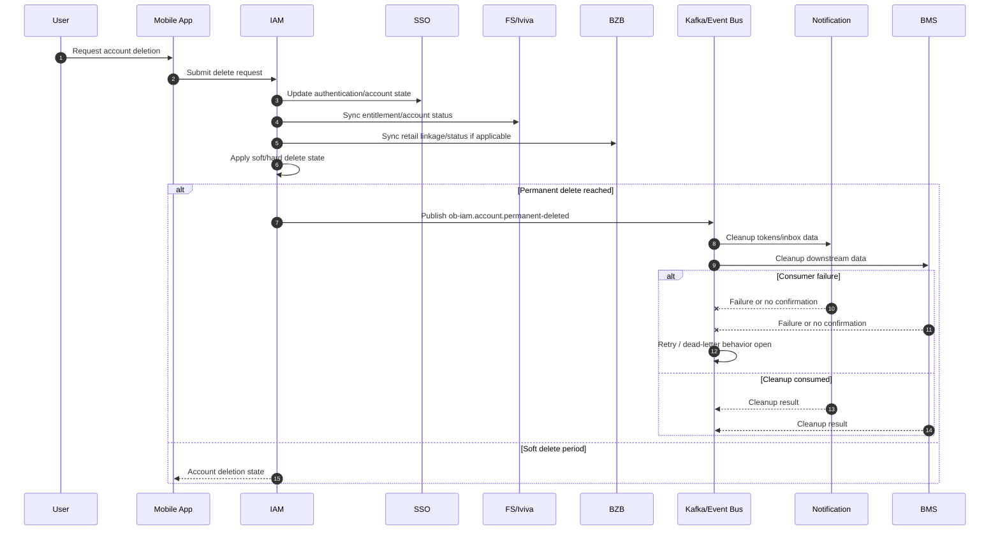

Owner: Simon  
Input files: `PARQ_User_Flow_Integration_Architecture.md`, `PARQ_Data_API_Context_Boundary_Vendor_Matrix.md`, `PARQ_Technical_Dependency_Control_Pack.md`  
Output path: `03_Architecture/PARQ_Visual_Architecture_and_Flow_Pack.md`  
Status: Draft / priority sequence baseline  
Downstream consumer: Quinn, PARQ, Libra  
Open questions:
- Who owns the deletion orchestration order and retry policy?
- What is the Kafka topic schema, dead-letter behavior, and replay control?
- Which FS, BZB, Notification, and BMS records are deleted or retained?

## Visual Risk Summary

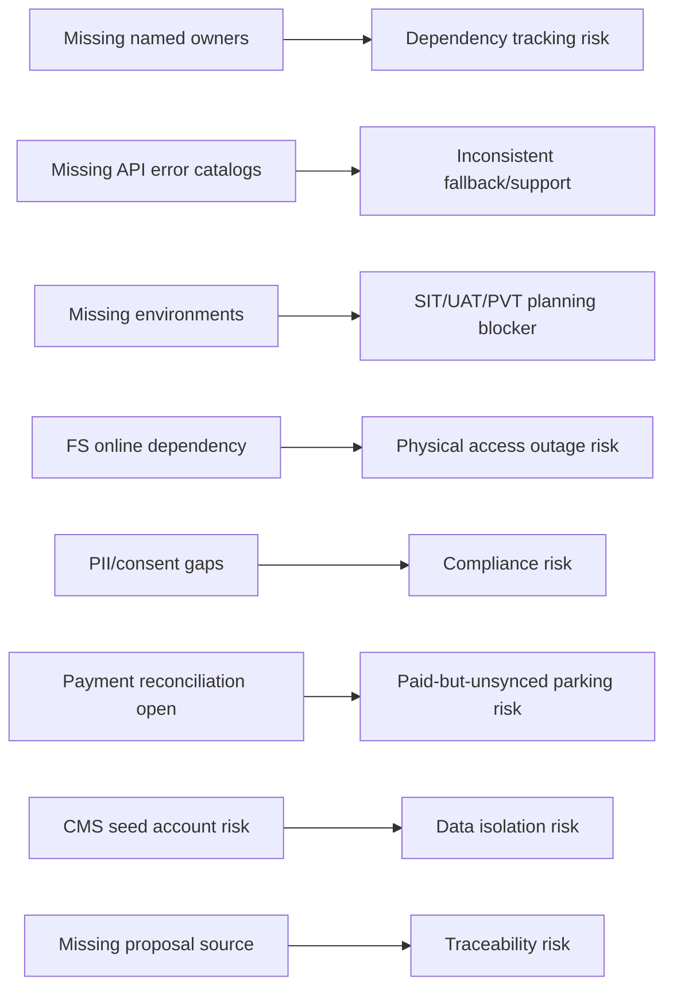

Owner: Simon  
Input files: `PARQ_Technical_Dependency_Control_Pack.md`, `MASTER_INDEX.md`, `PARQ_Clarification_Decision_Log.md`  
Output path: `03_Architecture/PARQ_Visual_Architecture_and_Flow_Pack.md`  
Status: Draft / risk visualization baseline  
Downstream consumer: Quinn, PARQ, Libra  
Open questions:
- Confirm named owners, API contracts, SLAs, environments, test data, hardware readiness, PII/consent mapping, and operational runbooks.
